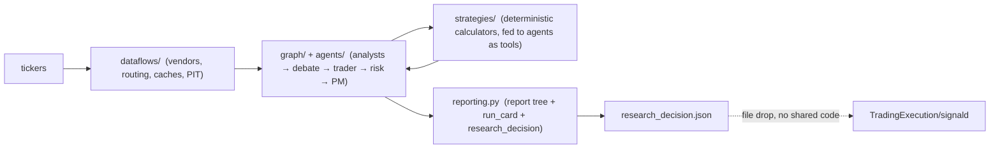
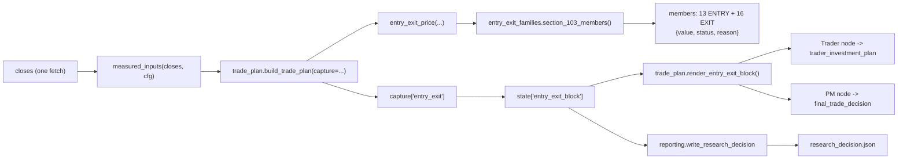

# MASTER DESIGN — TradingAgents (fork of `TauricResearch/TradingAgents`)

*A single, current, evidence-grounded description of what this project IS today:
its structure, its contracts, and the reasoning behind them. Every count, module
name and line reference below was read off the working tree at commit
`e91b2a7` on 2026-10-01, not remembered from training. Where a claim rests on
inference rather than a read it is marked `[INFERENCE]`.*

*Companion docs: `docs/master_design_original.md` is the earlier
capabilities recap (kept for provenance; its counts are ~3 weeks stale — this
file supersedes it). `docs/AGENT_ONBOARDING.md` is the operating runbook and
the live dated changelog; `CHANGELOG.md` is the release record.*

---

## 0. How to read this document

| If you want | Read |
|---|---|
| The one-paragraph mental model | §1 |
| The rules that must not be broken | §2 (the invariants) |
| How a run actually flows, node by node | §6 |
| Where a number comes from | §7 (data) → §8 (strategies) → §9 (tools) → §11 (report) |
| What is deliberately missing or parked | §18 |
| Where the long-form docs are | §19 |

---

## 1. What this project is

A **multi-agent LLM financial research system**. It takes one or more tickers,
runs a team of AI sub-agents (four analysts → a bull/bear research debate →
a trader → a three-way risk debate → a portfolio manager) over real market
data from many vendors, and emits a written, machine-auditable research report
plus a machine-readable decision artifact.

**It is analysis-only.** It never places an order, never connects to a broker,
and never executes anything. Every output is advisory. The only component in the
workspace that can turn a decision into an order is a *different* program
(`TradingExecution/signald`, §16), which reads this repo's artifact as a file
and is forbidden by construction from importing this repo's code.



**Stack.** Python ≥3.10 declared (`pyproject.toml:9`; the repo runs
`py -3.12` everywhere), LangGraph for orchestration, LangChain for the model
and tool plumbing, vendor REST APIs for data, OpenAI-compatible LLM providers
for the agents, pytest for a hermetic suite.

**Scale at `e91b2a7`.** 404 test modules; 6,286 passing tests (6 skipped);
67 modules in `dataflows/`; 160 in `strategies/` (+ 3 YAML skills); 235
`@tool` functions across 18 `*_tools.py` modules; 329 config keys, 289 env
overrides, 114 `enable_*` gates.

---

## 2. Design principles (the invariants)

These are the constraints the codebase is actually built to hold. Each is
enforced by something, not merely stated.

1. **Advisory, never executable.** No research output can emit an order. The
   hard gates gate *analysis* (they can set `risk_halt`), not money.
   Enforced by: `tradingagents/execution_contract.py:26-27` ("this repo emits
   it and never acts on it"), the absence of any broker client, and the
   executor's own order-path rule (`signald/engine.py:1`).

2. **No fabrication, ever.** A measured value is produced by a deterministic
   function; a value that cannot be measured renders `unavailable` /
   `None` + a reason / `NO_DATA_AVAILABLE` — never a plausible default, and
   never `0` where `NA` is meant. Enforced by: the `@tool` contract
   (`docs/api_reference.md` §6.4) and by tests such as
   `tests/test_entry_exit_families.py` (a member is `None` **iff** its status
   is `NO_SOURCE`).

3. **Point-in-time discipline.** Decisions bind to an `effective_trading_date`;
   news and price reads are filtered to the as-of window; `pit_registry`
   masks anything dated after the as-of; backtests fill at the next bar, never
   at the signal bar's close, and a fill is always at a price the bar actually
   offered - a stop gapped through fills at `min/max(trigger, open)`, never at
   the trigger itself, a limit-locked bar executes nothing at all, and both
   legs pay slippage. Enforced by `dataflows/effective_date.py`,
   `dataflows/date_window.py`, `dataflows/pit_registry.py` and the
   `tests/test_window_integrity.py` / `test_news_lookahead` /
   `test_backtest_fill_semantics` suites.

4. **Deterministic where possible.** Technical, valuation, risk, sentiment and
   factor reads are pure functions over vendor data. The LLM is only ever
   allowed to reason over the computed numbers. Enforced by: rule 1 of
   `docs/AGENT_ONBOARDING.md` §0 (compute as tools, feed the agents) and the
   `test_calc_agent_wiring` gate.

5. **Downgrade-only guardrails.** A stabilizer may cap a rating or soften it
   toward Hold; it may never upgrade. Enforced by
   `strategies/decision_guardrail.py` and its property test.

6. **Off by default, and bit-identical when off.** Optional behaviour lives
   behind a gate; a gate-off run must be byte-identical to the run before the
   feature existed, and that is regression-tested. The two notable exceptions
   shipped ON: `enable_computed_context` and `risk_audit_enabled`.
   See `docs/gate_registry.md` §7 for the rule.

7. **Hermetic tests.** The suite mocks vendor transports; no test touches the
   network or the operator's `.env` gates (`dataflows/config.reset_config()`
   restores `SHIPPED_DEFAULTS`, not the ambient `DEFAULT_CONFIG`).

8. **One producer per number.** A given quantity has exactly one function that
   computes it; every consumer reads that result rather than re-deriving it.
   This is what §11's "the §103 object is assembled once and read
   structurally" is an instance of.
   Enforced by: `strategies/forecast_registry.py` for **forecast keys** (one
   AUTHORITATIVE producer per key, every `implementation_ref` resolved against
   the live tree at test time). For **measured inputs** it is today only
   *detected* — `strategies/metric_reconcile.py`'s tool→metric index,
   `data_quality.disagreement_flag`, and the report verifier's basis ledger —
   and the enforcement is specified in
   `docs/design_metric_authority_registry.md` (**BUILT 2026-10-06**; its P4
   gate, `enable_metric_authority`, is owner-approved and ships off).

---

## 3. The workspace: three repositories

The unit of work is the parent directory `TradingNew/`, which is itself a git
repo root (`trading_web/` lives in it).

| Path | Git root | Role |
|---|---|---|
| `TradingAgents/` | its own | The research engine: dataflows, agents, graph, strategies, reporting, CLI, batch, pipeline, 43 scripts. |
| `TradingExecution/` | its own | The `signald` executor daemon: mandate-gated, order-capable, deliberately shares **no code** with the engine. |
| `TradingNew/` (root) | parent repo | Holds `trading_web/` — the FastAPI + React operator console — and the two sibling repos as directories. |

Interaction between engine and executor is a **text/file contract**: the engine
writes `research_decision.json`; the executor discovers it by globbing a watch
directory (`run_daemon.cmd`: `--watch "..\TradingAgents\reports"`). The two
repos share a **published schema**, not a library — see §16.

---

## 4. Layer map (`TradingAgents/`)

| Path | Contents | Count at `e91b2a7` |
|---|---|---|
| `tradingagents/dataflows/` | Vendor adapters, routing, caches, calendars, PIT, schema | 67 modules |
| `tradingagents/agents/` | Analyst/researcher/trader/risk/manager nodes, `schemas.py`, `toolsets.py`, `utils/` | 12 role factories |
| `tradingagents/graph/` | LangGraph assembly, conditional routing, propagation, reflection | 9 modules |
| `tradingagents/strategies/` | Deterministic calculators (the "compute" layer) | 160 modules + `skills/` (3 YAML) |
| `tradingagents/reporting.py` | Report tree, consolidated report, `run_card.json`, `research_decision.json` | 1 module |
| `tradingagents/default_config.py` | Shipped defaults + the env override map | 1,532 lines |
| `cli/`, `batch.py`, `pipeline.py` | Operator entry points | — |
| `scripts/` | 43 standalone argparse CLIs | 43 |
| `tests/` | The hermetic suite | 404 `test_*.py` |
| `Strategies/` | The owner's formula-library specs (the `§N` catalogs, §8) — owner-owned | 30+ `.md` |
| `docs/` | Guides, designs, plans, score docs | 65 top-level `.md` |

---

## 5. Data layer — `tradingagents/dataflows/`

The only place in the system that touches the network. 67 modules; ~22.7k LOC.

### 5.1 Vendors and routing

**24 routed vendors** are registered in the `VENDOR_METHODS` dict
(`dataflows/interface.py:445-701`, 51 methods); the canonical name list is
`VENDOR_LIST` (`:707`):

`alpha_vantage, benzinga, cboe, congress, eodhd, federal_reserve, finnhub,
finra, fmp, fred, fx, gdelt, massive, moomoo, newsapi, patentsview, polymarket,
sec_edgar, seekingalpha, stockdata, tiingo, treasury_fiscal, twelve_data,
yfinance`.

Four further adapters are **direct but not routed** — `alpaca`, `reddit`,
`stocktwits`, `float_shares` — because their auth or rate model does not fit
the fallback chain (`docs/developer/12-data-providers.md:150-161`).

**Routing flow** (`interface.route_to_vendor`, `:741`):

1. Resolve the category (`get_category_for_method`) and the configured vendor
   string (`get_vendor`: `tool_vendors[method]` wins over
   `data_vendors[category]`, else `"default"`).
2. A `none`/`off`/`disabled` value returns the `DATA_DISABLED:` sentinel — an
   explicit off switch, not an error.
3. Build the chain. **The configured chain is the only chain**: if the config
   names vendors, unlisted ones raise `ValueError`; there is no silent
   fallback to vendors the operator did not ask for.
4. Optional market routing (`enable_market_routing`, default **False**):
   `market_for_symbol(symbol)` classifies US/CA/EU/JP/KR/TW/CN by exchange
   suffix, then `resolve_market_priority(market, market_source_priority, …)`
   reorders the chain for that market.
5. Cache lookup, then the vendor loop. Each vendor call is wrapped per
   exception type (`VendorRateLimitError`, `VendorNotConfiguredError`,
   `NoMarketDataError`, generic) so one vendor's outage degrades rather than
   aborts.
6. All-fail behaviour: `NO_DATA_AVAILABLE:` for a lookup that returned nothing,
   `DATA_UNAVAILABLE:` for a category in `OPTIONAL_CATEGORIES` (`:389-432`) —
   which includes the core categories, so a total vendor outage degrades to
   sentinels instead of raising — and otherwise the first typed error.

`gap_fill(primary, secondary)` (`market_router.py:153`) supplements missing
fields (`volume_ratio`, `pe_ratio`, `high_52w`, …) without overriding what the
primary returned, and `caliber_consistency` (`:129`) refuses to blend adjusted
and raw price series silently.

### 5.2 Robustness machinery

| Component | File | Contract |
|---|---|---|
| Circuit breaker | `vendor_breaker.py` | Per-`(market, vendor)`; 3 failures trips it (`DEFAULT_MAX_FAILURES=3`), 300 s cooldown, half-open probe on the first call after cooldown; failing `allow_call` never raises. |
| Negative capability cache | `vendor_breaker.py` | `mark_capability_absent` / `capability_available`, TTL 900 s. `vendor_skip_reason(vendor, capability)` returns `"absent"` or `"breaker"`. Wired at the vendor layer for FMP/Massive/Finnhub so a remembered 401/403 is not re-fetched every call. |
| Vendor cache | `vendor_cache.py` | Two layers (memory + `<data_cache_dir>/vendor_cache/<sha256>.json`), versioned keys (`_CACHE_VERSION`), TTL 21600 s, `news_data` skipped by default. **A range ending today is never cached** (`_ends_today`) so a forming intraday bar cannot freeze. |
| News cache | `news_cache.py` | `CoalescingCache` — owner-wait coalescing so N concurrent requesters produce one fetch. |
| Effective date | `effective_date.py` | Weekends/holidays → previous session; before the region's close → previous session; after → current. `should_skip_all_closed` gates the nightly driver, with `--force-run` as the escape hatch. |
| PIT registry | `pit_registry.py` | Append-only per-symbol JSONL keyed `(symbol, as_of)`; `read_as_of` masks anything dated later; also carries the Alpha158/360 next-day label and the universe-membership survivorship guard. |
| Market data validator | `market_data_validator.py` | `build_verified_market_snapshot` renders the verified OHLCV row and flags `(insufficient history: N/MIN)` where stockstats would silently use a truncated mean. |

### 5.3 The honesty envelope

Every routed read can be returned as a typed `VendorResult`
(`dataflows/schema.py:26-59`), whose fields are the metadata that lets a
consumer decide whether to trust a number:

```
results, provider, warnings, extra, error_kind, fallback_from,
is_stale, stale_seconds, data_quality, missing_fields,
price_caliber, volume_unit, absence
```

`data_quality ∈ {fresh, stale, partial, unknown}`,
`price_caliber ∈ {adjusted, split_adjusted, raw, unknown}`,
`volume_unit ∈ {shares, board_lots, contracts, unknown}`,
`absence = {reason ∈ {unknown, no_data, rate_limited, not_configured, error}, source, retryable, detail}`.

The exception taxonomy (`dataflows/errors.py`): `VendorError` →
`NoMarketDataError` (carries symbol/canonical/detail), `VendorRateLimitError`,
`VendorNotConfiguredError` (also a `ValueError`). `VendorAbsence` is the
serialisable form.

---

## 6. Agent layer and graph

### 6.1 The compiled graph — 30 nodes by default

`graph/setup.py::GraphSetup.setup_graph` registers **30 nodes** for a default
run with 4 analysts (`20` in parallel-analyst mode; `32` with both
`enable_decision_packet` and `enable_evidence_symmetry` on).

**Analyst chain (sequential branch).** Names come from `ANALYST_NODE_SPECS`
(`graph/analyst_execution.py:24-57`):

- `Market Analyst` → `tools_market` → `Msg Clear Market`
- `Sentiment Analyst` → `Msg Clear Sentiment` — **no tool node**: the sentiment
  analyst prefetches its data into the prompt instead of calling tools.
- `News Analyst` → `tools_news` → `Msg Clear News`
- `Fundamentals Analyst` → `tools_fundamentals` → `Msg Clear Fundamentals`

In parallel mode all eleven are replaced by the single node `Run Analysts`.

**Debate roles.** `Bull Researcher`, `Bear Researcher`, `Research Manager`,
then `Trader`, then `Independent Risk Stances`, and the legacy risk debators
`Aggressive Analyst` / `Conservative Analyst` / `Neutral Analyst`, then
`Portfolio Manager` → `END`. Two nodes inject pre-debate independent stances:
`Independent Researcher Stances` and `Independent Risk Stances`.

**Structured-debate nodes** — `SD Bull`, `SD Bear`, `SD L1`, `SD Finalize`,
`SD Risk Aggressive`, `SD Risk Conservative`, `SD Risk Neutral`, `SD Risk L1`,
`SD Risk Finalize` — are **registered unconditionally**, as `_noop` placeholders
returning `{}` when `enable_debate` is off (`setup.py:418-425`). This keeps the
graph shape stable across the gate.

**Gated extras:** `Decision Packet` (`enable_decision_packet`) and
`Evidence Symmetry` (`enable_evidence_symmetry`).

**Routing.** `graph/conditional_logic.py` holds every edge decision:
`MAX_TOOL_ROUNDS = 8` bounds the analyst→tool→analyst loop; a separate
`should_continue_debate` alternates the two researchers and yields to
`Research Manager` at `count >= 2 * max_debate_rounds`; the risk walk goes
Aggressive → Conservative → Neutral and yields at
`risk_debate_state.count >= 3 * max_risk_discuss_rounds`. Both round counts
default to **1**.

### 6.2 `AgentState`

`agents/utils/agent_states.py::AgentState(MessagesState)`. **Native LangGraph
silently drops any key a node returns that is not declared on the schema** —
this is the single most expensive trap in the codebase, and every newer channel
carries a comment saying so. Enforcement: the `StateGraph(AgentState)` schema is
the whitelist, and `tests/test_dead_state_dedupe.py` asserts no node writes an
undeclared channel.

Declared channels include `company_of_interest`, `asset_type`,
`instrument_context`, `trade_date`, the four `*_report` channels,
`investment_debate_state`, `investment_plan`, `debate_state`,
`structured_risk_state`, `trader_investment_plan`, `risk_debate_state`,
`final_trade_decision`, `pm_decision`, `past_context`, `risk_context`,
`portfolio_context`, `computed_decision_context`, `entry_exit_block`,
`quant_scorecard`, `decision_packet`, `decision_packet_closes`,
`prompt_metrics`, plus `messages`. Only `messages` (`add_messages`) and
`prompt_metrics` (`merge_prompt_metrics`) declare reducers; everything else is
last-write-wins.

### 6.3 Run lifecycle

```
propagate(ticker, trade_date, asset_type)          graph/trading_graph.py:624
  └─ _run_graph                                     :918
       ├─ prepare_initial_state                     :701   ← the SINGLE pre-graph producer
       │    past_context + track record, instrument_context,
       │    risk_context (enable_risk_governor),
       │    quant_scorecard (enable_quant_scorecard),
       │    computed_decision_context + entry_exit_block (enable_computed_context),
       │    decision_packet_closes (enable_decision_packet),
       │    portfolio_context
       ├─ graph.invoke(...)  |  graph.stream(stream_mode="values") when debug
       └─ finalize_run                              :852   ← strategy overlays, risk_gate,
                                                             position_contract, memory log
```

`enable_computed_context` (default **True**) is the one context gate that ships
on. It gates exactly two channel writes — `computed_decision_context` and
`entry_exit_block` — which is why turning it off is what makes the Phase A–E
advisory block disappear from the Trader, the PM and the risk debators.

### 6.4 Decision-side components

| Component | File | What it enforces | Default |
|---|---|---|---|
| Decision guardrail | `strategies/decision_guardrail.py` | Post-PM **downgrade-only** stabilizer + confidence cap. Can hold or move toward Hold, never up. | OFF |
| Risk governor | `strategies/risk_governor.py` | Deterministic `PASS`/`WARN`/`REJECT` from a limits registry; a `REJECT` sets `risk_halt`. Also exposed as a what-if tool. | OFF |
| Structured debate | `agents/utils/structured.py`, `strategies/debate_claim.py`, `strategies/debate_score.py` | Two tiers. **L1** is deterministic: claim verification with statuses `valid`/`violated`/`abstain`/`unverified`/`qualitative`, a severity triage, a weighted per-round score (`0.6*evidence + 0.25*novelty + 0.15*constraint_ok`) and a **dimensioned rubric** (`l1_rubric`) over the same six names L2 scores — four measurable, two `None` + reason. **L2** is the LLM judge (`L2JudgeDimensionedRubric`) — one blind, anonymised, order-rotated judge model shared by **both** sections. The two tiers' values are kept in separate dicts and never averaged. Termination precedence: hard-abort > hard cap > consensus exit > plateau. | OFF |

`graph/signal_processing.py::process_signal` is deliberately tiny: it maps the
final text to a rating (`Buy`/`Overweight`/`Hold`/`Underweight`/`Sell`, else
`REVIEW`). `graph/reflection.py` produces 2–4 sentences of post-trade critique
for the memory log.

---

## 7. Strategy layer — `tradingagents/strategies/`

160 modules, 64,720 lines, 159 calculators + the package initializer. This is
the "compute, don't narrate" tier: pure functions over data the caller already
has, with no fetching of their own.

| Group | Count | Representative modules |
|---|---|---|
| entry/exit & swing | 29 | `trade_plan`, `entry_exit_price`, `entry_exit_families`, `entry_ceiling`, `entry_target`, `execution_price`, `exits`, `swing`, `contract`, `relative_strength`, `compression`, `knife_guard`, `extended_indicators` |
| value-dip | 4 | `value_dip`, `fundamental_floors`, `normalized`, `normalized_fcf` |
| risk, sizing & book | 14 | `book_risk`, `risk_sizing`, `size`, `risk_governor`, `liquidity_risk`, `covariance_models`, `tail_risk`, `triadic_stress` |
| valuation, credit & options | 20 | `dcf`, `reverse_dcf`, `scenario_dcf`, `cycle_dcf`, `ratios`, `credit_spread`, `options_math`, `fixed_income` |
| factor research (qlib/alpha) | 12 | `factor_expressions`, `signal_analysis`, `alpha_zoo`, `alpha_eval`, `alpha_health`, `cross_section` |
| portfolio construction | 12 | `portfolio`, `portfolio_optimizer`, `portfolio_strategy`, `rotation`, `sector_rank`, `cross_section` |
| sentiment & behaviour | 11 | `sentiment`, `sentiment_research`, `sentiment_score`, `news_score`, `reflection`, `journal` |
| scores | 13 | `quant_scorecard`, `score_engine`, `trade_score`, `technical_score`, `fundamental_score`, `momentum_score`, `regime_score`, `risk_score`, `event_state` |
| audit/honesty | 16 | `report_disclosure`, `invalidation_ledger`, `hash_chain_audit`, `decision_packet`, `falsification`, `prediction_ledger`, `trial_ledger` |
| statistical | 10 | `statistical`, `statistical_kalman`, `conformal`, `calibration`, `bootstrap`-family |
| misc | 18 | `regime` (2,287 lines — the largest), `regime_state`, `skills`, `typed_state`, `llm_cost`, `monitor` |

**Signatures worth knowing** (all keyword-only where the calculator is
composed from measured pieces):

- `trade_plan.build_trade_plan(*, ticker, price, setup, tranche, be_rule,
  targets, trail, valuation_ceiling, expected_return_ceiling, rr_ceiling,
  valuation_price, technical_price, tranche_price, execution_spread,
  execution_impact, execution_slippage, liquidity_status, max_stop_fraction,
  name_cvar, cvar_budget, mae_samples, closes, high, low, fair_value,
  rr_multiple, config, capture)` → the markdown plan card; fills
  `capture["entry_exit"]` with the structured object. `:65`
- `entry_exit_price.entry_exit_price(*, price, … , closes, high, low,
  fair_value, rr_multiple, config)` → the complete §103 ENTRY/EXIT object. `:38`
- `score_engine.combine(components, *, weights, min_coverage, bands)` →
  `{score, coverage, floor, components, present, withheld, label, basis}`. `:141`
- `book_risk.portfolio_cvar(returns_by_name, weights, alpha)` `:61`,
  `component_var` `:301`, `drawdown_gate` `:212`.
- `risk_sizing.risk_quantity(entry, stop_loss, equity, risk, …) -> float` `:88`.
- `dcf.compute_dcf(historical_fcf, *, rf, beta, erp, growth, years, shares,
  cash, debt) -> dict | None` `:71`.
- `size.composite_position_size(*, confidence, odds, stop_dist_pct,
  risk_per_trade, max_position_pct, kelly_fraction, annualized_vol, target_vol,
  liquidity_scalar, portfolio_action, uncertainty_discount)` `:70`.

### 7.1 The `§N` convention — where those numbers come from

`§N` is a citation into **the owner's formula-library markdown**, not a global
spec. Two catalog families carry them, and the same number means different
things in each:

- `Strategies/*.md` — the entry/exit and strategy libraries. `Strategies/entry_exit.md`
  (3,088 lines) literally numbers its sections `# 100. A practical composite
  EntryPrice`, `# 101. A practical composite ExitPrice`, `# 102. The most
  important distinction for your system`, `# 103. Recommended complete
  Entry/Exit object`. So `§100` = the composite entry price, `§103` = the
  complete object, and `§8`–`§42` are the individual entry/stop/target
  constructions.
- `Strategies/scores/*.md` — one numbered catalog per score engine. Here
  `§103` means e.g. "Sector-relative performance" in `market_score.md`,
  "Distance from low" in `technical_score.md`, "Conditional Event Return" in
  `event_score.md`. **The citing document's own catalog disambiguates.**

These files are **owner-owned**: report staleness, do not edit.

### 7.2 Deliberately unwired modules

- `strategies/universe_factors.py` (901 lines) — 11 underscore-private
  producers, **zero callers anywhere outside its own test**. The leading
  underscore is deliberate: it is exempt from the wiring gate precisely because
  the wiring round has not happened. Documented in `docs/scores/SecondaryScores.md` §4.4.
- 12 modules are reachable only from `scripts/` or `tests/`, not from the
  running graph: `alpha_health`, `backtest_engine`, `config_robustness`,
  `domain_bundles`, `factor_dispersion`, `market_tradability`, `monitor`,
  `quant_baseline`, `tail_risk`, `triadic_stress`, `typed_state`,
  `universe_factors`.
- `strategies/factors.py::fama_french_5_factor:518` is public and `__all__`'d but
  referenced only inside its own module — wiring it needs a caller and a design
  decision.

---

## 8. Tool surface and the wiring contract

### 8.1 The chain

`docs/AGENT_ONBOARDING.md` §0 rule 1b defines the contract; the code is:

```
strategies/<calc>.py                       the deterministic function
  → @tool in agents/utils/<x>_tools.py     the LLM-facing wrapper
  → agents/utils/agent_utils.py __all__    the single public re-export surface
  → agents/toolsets.py                     membership in a named tool list
  → agents/analysts/<a>.py bind_tools(...) the agent that may call it
  → that agent's system_message            a "cite it before any X claim" line
  → graph/trading_graph.py _create_tool_nodes   the ToolNode that executes it
```

Worked example — `get_swing_set`:

| Hop | Cite |
|---|---|
| Calculator | `strategies/swing.py:457` `swing_report(...)` |
| `@tool` | `agents/utils/analysis_tools.py:465-466` |
| Module `__all__` | `analysis_tools.py:13462` |
| `agent_utils` re-export | `agent_utils.py:142` (import) / `:340` (`__all__`) |
| Toolset | `agents/toolsets.py:272` (inside `market_tools()`, `:234-370`) |
| Binds it | `agents/analysts/market_analyst.py:26`, `:356` |
| Prompt line | `market_analyst.py:84` |
| ToolNode | `graph/trading_graph.py:363` |

**Invariant:** `toolsets.py` is the single source of truth — the analyst's
`bind_tools` list and the `ToolNode` both read `analyst_toolset(key)`, so they
cannot drift (`toolsets.py:1-17`; asserted by
`tests/test_tool_binding_single_source.py`).

### 8.2 Inventory — 235 tools over 18 modules

| Module | `@tool`s |
|---|---|
| `analysis_tools.py` | 162 |
| `moomoo_extra_tools.py` | 13 |
| `value_dip_tools.py` | 13 |
| `market_position_tools.py` | 9 |
| `news_data_tools.py` | 7 |
| `quant_formula_tools.py` | 6 |
| `benzinga_tools.py` | 5 |
| `quant_adds_tools.py` | 5 |
| `fundamental_data_tools.py` | 4 |
| `analyst_data_tools.py` | 2 |
| `market_data_validation_tools.py` | 2 |
| `alpaca_tools.py`, `analyst_revision_tools.py`, `core_stock_tools.py`, `macro_data_tools.py`, `momentum_tools.py`, `prediction_markets_tools.py`, `technical_indicators_tools.py` | 1 each |
| **Total** | **235** |

### 8.3 Gates that keep it honest

- `tests/test_calc_agent_wiring.py::test_public_calc_reachable_or_whitelisted`
  — every public function in `strategies/*.py` and `dataflows/*.py` must be
  referenced outside its own module, or be in the audited `LEGACY_WHITELIST`.
- `…::test_module_reachable_or_whitelisted` — same, per module.
- `…::test_tool_bound_to_agent_surface`, `…::test_bound_tool_has_prompt_guidance`.
- `tests/test_doc_binding_claims.py` — the `docs/api_reference.md` "Bound to"
  column must equal the real toolset objects.
- `tests/test_prompt_signature_contract.py` / `test_prompt_trigger_contract.py`
  — the prompt's advertised argument arity must match, and every bound tool must
  be *triggered* ("use before X claim"), not merely mentioned.
- `tests/test_tool_argument_shape.py` — no LLM-facing tool may ask the model to
  transcribe a complex list/dict argument.

---

## 9. The score system

Nine engines, one registry, one snapshot per run.

### 9.1 Registry

`strategies/quant_scorecard.py` is the ownership map and the single producer of
the engines' numbers on the research surface (`quant_scorecard(ticker,
trade_date, cfg)` `:501`). Its tables:

- `ENGINE_GATES` (`:78`) — 9 gates, printed order: fundamental, technical,
  momentum, regime, risk, sentiment, news, event, trade.
- `ENGINE_SECTIONS` (`:140`) — `{engine: analyst report section | None}`:
  fundamental→fundamentals, technical→market, momentum→market,
  sentiment→sentiment, news→news, event→news; regime/risk/trade are
  report-level by decision, not by omission.
- `COMPOSITE_ENGINES` (`:85`) — `(fundamental, technical, regime, risk)`.
  Sentiment, news and event are **reported but never fed into `trade_score`**.
- `ENGINE_TOOLS` (`:92`), `STATE_DISABLED`/`STATE_MEASURED`/`STATE_NA` (`:172-174`),
  `engine_state()` (`:189`).

### 9.2 The engines

| Engine | Calculator | Scale |
|---|---|---|
| `FundamentalScore` | `fundamental_score.py:252` (panel), `:861` (ticker leaf) | 0–100, `RESEARCH_ONLY`, no band table; sub-scores FQS/FGS/VS/FRS |
| `TechnicalScore` | `technical_score.py:363` | 0–100 over 9 categories; trend 20 / momentum 18 / relative strength 12 / price structure 12 / volume 10 / breakout 10 / mean reversion 8 / volatility 5 / breadth 5 |
| `MomentumScore` | `momentum_score.py:644` | 0–100 over 8 families; declared `NORMALIZATION_METHOD='z'` |
| `RegimeScore` | `regime_score.py:265` | 0–100 **market-environment**, not per-name; `RESEARCH_ONLY` |
| `RiskScore` | `risk_score.py:521` | 0–100 **inverted** — 100 = low risk; reports uncertainty = 1 − coverage |
| `SentimentScore` | `sentiment_score.py:467` | 0–100 over 10 categories; unit-scale normalised (`SCALE_UNIT='unit'`); emits a confirmation quadrant |
| `NewsScore` | `news_score.py:1371` | 0–100 over 11 components; 5 components are absent by default and print `NA` + reason |
| `EventScore` | `event_state.py:591` | family occurrence/imminence readouts; **no aggregate composite by decision** |
| `TradeScore` | `trade_score.py:293` | the 4-engine composite; `ENGINE_WEIGHTS = {fundamental .40, technical .25, regime .15, risk .20}`, `COMPOSITE_MIN_COVERAGE = 2` |

### 9.3 Aggregation

The shared kernel is `strategies/score_engine.py`:
`combine(components, *, weights, min_coverage, bands)` (`:141`) computes
`Σ(w·v)/Σ(w over present)` — the weight is renormalised over **present**
components only — and returns `coverage = Σ(w present)/Σ(w total)`. Below the
floor the score is **withheld** (`None` with a reason), never `0` and never a
neutral `50`.

The distinction that has bitten before: **`floor` is a component COUNT,
`coverage` is a weight FRACTION** (`docs/scores/ScoreContextContract.md`).

`align` (`:68`) maps a raw value to a 0–100 favourable contribution via a
clamped ramp, an inverted ramp for `direction='lower_better'`, or a band table
walked top-down for non-monotonic inputs. `None` in → `None` out.

### 9.4 How the numbers reach the verdict

They do **not** depend on tool-calling discretion. `agents/utils/report_hygiene.py`
provides `engine_score_block`, `MANDATORY_ENGINE_RULES` (names all nine engines
and forbids inventing/discretion/`0`-for-`NA`), `scorecard_context_block` and
`engine_report_section`, wired into all four analyst prompts. The snapshot is
built once per run (`graph/trading_graph.py:651`) into `state['quant_scorecard']`.

---

## 10. Decision and reporting output

### 10.1 The report tree

`reporting.write_report_tree(final_state, ticker, save_path, config=None, *,
emit_run_artifacts=True)` (`reporting.py:1924`) writes:

```
<TICKER>_<YYYYMMDD>_<HHMMSS>/
  1_analysts/   market.md sentiment.md news.md fundamentals.md
  2_research/   bull.md bear.md manager.md [structured_debate.md]
  3_trading/    trader.md
  4_risk/       aggressive.md conservative.md neutral.md
                [or a single verdict.md when risk_compact_report]
                [structured_risk_debate.md]
  5_portfolio/  decision.md
  complete_report.md
  run_card.json            (+ research_decision.json, tool_evidence.json,
                            alpha_ledger.jsonl, jev_verdict.json,
                            verify_flags.json  — each behind its own gate)
```

`emit_run_artifacts=False` (used by `scripts/rebuild_complete_report.py`)
re-renders the markdown only and leaves the run-scoped records untouched — a
rebuild deliberately cannot invent an artifact the original run did not write.

### 10.2 The consolidated report

Header + TOC + sections joined by `---`, section order verbatim:

`## I. Analyst Team Reports`, `## II. Research Team Decision`,
`## III. Trading Team Plan`, `## IV. Risk Management Team Decision`,
`## IVa. Computed Decision Context (advisory)` (when non-empty),
`## IVb. Quant / LLM risk disagreement (advisory)`,
`## IVc. Engine score detail (advisory)`, `## V. Portfolio Manager Decision`.

The TOC (`_build_toc`) takes the last `## ` line of each section as the team
and each `### ` line as the role; embedded agent content is demoted to H4+ by
`_shift_down(text, levels=3)` so only team/role markers match.

`reporting._looks_truncated` (`:99`) is a conservative mid-sentence heuristic
that flags an LLM section cut at `max_tokens`; the marker is explicit and never
hidden. It deliberately returns `False` for a trailing digit (a complete
measured value) and for a short bold verdict line. The PM branch runs the check
on the raw LLM decision only, before the computed audit appendages, so their
lowercase tails cannot false-positive.

### 10.3 `research_decision.json` — the machine artifact

Written by `reporting.write_research_decision` (`:583`), rules owned by
`tradingagents/execution_contract.py` (`SCHEMA_VERSION = "1.2.0"`).

Top-level keys: `schema_version`, `ticker`, `effective_date`, `rating`,
`direction`, `thesis`, `rationale`, `recommended_allocation_pct`, `position`,
`entry_exit`, `data_quality`, `price_caliber`, `invalidations`,
`guardrail_reason`, `risk_gate{verdict, reasons}`, `security_signal`,
`portfolio_action`, `combined_action`, `gated`, `binding_constraint`,
`action_basis`, `binding_reason`, `disclosure{sources_used, sources_empty}`,
plus the envelope (`produced_at`, `expires_at`, `idempotency_key`, `producer`,
`opportunity_score`, `net_beta`, `confidence`, `risk_context`) and the seal
(`artifact_sha256`, `decision_hash`).

`position` = `{target_notional, entry_price, stop_loss, take_profit, size_pct_book}`.
`entry_price` is §100's **final** entry price; the contract's G1 stop anchor is
the fallback only when no final was measurable — they are genuinely different
numbers (e.g. FNF 2026-09-30: anchor 41.16 vs final 40.68).

### 10.4 The §103 entry/exit object — a worked example of invariant 8

The block that the Trader, the PM, the consolidated report and the artifact all
show is assembled **once** and read structurally everywhere. Nothing regexes
rendered markdown to recover it.



Rules that hold at every member:

- A member is `{"value", "status", "reason"}`; `status == "NO_SOURCE"` **iff**
  `value is None`.
- Members that cannot be produced are `None` **with a reason**, never defaulted.
  Three pairs are absent by decision: momentum (no calibrated score→price map —
  the owner's Phase-2 decision, the same one that keeps momentum out of
  `entry_ceiling`), fair value (the card measures one at run setup; absent when
  no fair value was measured), and event exit (needs the forward calendar).
- A proxy basis travels with its number: `(proxy)` ATR off closes, `close-proxy`
  support off closes.
- **A level on the wrong side of the entry is refused, not printed.** Every stop
  must sit below the entry, every target above it, and §10's support entry at or
  below the reference price; a failing level keeps its formula and gains
  `refused: <level> is not below the entry <entry>`. The guard covers the whole
  §103 stop set and the whole **target** set — including the DCF-derived
  `fair_value_target` (added 2026-10-05, when the fair-value wiring first made
  that row reachable: VST's 12.98 against an entry of 140.46 is refused rather
  than printed as a target). The break-even stop is
  exempt by construction (§56 moves the stop *up* once the trade is in profit).

### 10.5 The decision-disclosure block

Gated by `enable_report_attribution` (default OFF); appends a computed block
headed `### Decision disclosure (computed, advisory)` to `5_portfolio/decision.md`
with invalidation conditions, consensus (supporting/opposing), data quality,
falsification conditions, attribution weights (and what is missing), watch
conditions + next check, and the data sources used/empty.

---

## 11. Persistence, audit and verification

| Artifact | Writer | Gate | Shape |
|---|---|---|---|
| `risk_audit.jsonl` | `trading_graph._apply_strategy_overlays:1359` | `risk_audit_enabled` (ON) | `{ticker, verdict, reasons}`; SHA-256-chained (`hash_chain_audit.append`, `prev_hash` = hash of the previous raw line). Verify: `py -3.12 scripts/risk_report.py --verify-chain`. |
| `invalidations.jsonl` | `strategies/invalidation_ledger.py:38` | on use | `{ticker, date, ts, status: open\|rejected, conditions, note, source}`; `invalidate` flips matching rows and preserves history. |
| reflection ledger | `strategies/reflection.py::ReflectionLedger` | `enable_reflection` | `{analyst, ticker, trade_date, delta_r, ts}`; recency-decayed hit-rate with a 30-day half-life. |
| momentum journal | `strategies/journal.py:37` | on use | `{ts, ticker, date, price, pillars, pullback, session, exit_class, fomo, note}`. |
| full state log | `trading_graph._log_state:997` | always | `<results_dir>/<ticker>/TradingAgentsStrategy_logs/full_states_log_<date>.json` — the input of `scripts/decision_history.py`. |

**Report verifier.** `scripts/report_verify.py` (`--report-dir`, `--model`,
`--max-calls`, `--stem`) and the batch `--verify` flag write
`<report-dir>/verify_flags.json`. Claim statuses are verbatim `GROUNDED`,
`UNSUPPORTED`, `CONTRADICTED`, `MISQUOTED`, `INTERNAL_CONFLICT`; the stem-level
verdict is `PASS`/`FLAG`/`UNKNOWN`/`NUMERIC_ONLY`. Claims are grounded against
`tool_evidence.json` (the run's own evidence leaves) plus the run-card
scorecard. `scripts/verify_sweep.py` adjudicates across trees, treating
`{MISQUOTED, CONTRADICTED, INTERNAL_CONFLICT}` as CONFIRMED and `UNSUPPORTED`
as SUSPECT. The verifier is a **defect detector, not a gate** — onboarding rule
8 requires acting on its findings.

---

## 12. Configuration and gates

### 12.1 Mechanics

`tradingagents/default_config.py` (1,532 lines) holds:

- `_ENV_OVERRIDES` (`:10`) — 289 env-name → config-key rows.
- `SHIPPED_DEFAULTS` (`:512`) — 329 keys, the shipped configuration object.
- `DEFAULT_CONFIG = _apply_env_overrides(dict(SHIPPED_DEFAULTS))` (`:1374`) —
  what this machine runs.

`_coerce(value, reference)` (`:394`) casts an env string to the **type of the
existing default**: bools accept `true/1/yes/on` ↔ `false/0/no/off`, lists
accept a JSON array or comma-separated text, dicts accept JSON or `k=v,k=v`.
`_validate_env_override_targets` (`:469`) refuses an override aimed at a key
that does not exist — otherwise `"false"` would be stored as a *truthy string*.
`validate_config` (`:1377`) range-checks fractions, ordering and
sum-to-one constraints, and `default_config.py:1528` raises at import when the
shipped config violates them.

`SHIPPED_DEFAULTS` is a **different object** from `DEFAULT_CONFIG` because the
package loads a developer `.env` into the environment at import. Tests that
assert "ships off" read `SHIPPED_DEFAULTS`.

### 12.2 The gate registry

`docs/gate_registry.md` registers **134 rows**, of which **114 are `enable_*`
keys** (all of them) and **12 are inert** — declared and settable but read by
nothing: `enable_factor_model`, `enable_factor_proposal_loop`, `enable_tuner`,
`enable_value_dip`, `enable_threshold_gate`, `enable_risk_manager`,
`enable_skill_overlays`, `enable_trailing_exit`, `value_dip_regime_gate`,
`volume_share_vol_limit`, `enable_regime`, `enable_factors`.

**Adding a gate requires seven registration points** (`gate_registry.md` §8):
the `DEFAULT_CONFIG` key, the `_ENV_OVERRIDES` row, the registry doc row, the
`REGISTRY` entry in `tests/test_gate_env_toggles.py`, a test that fails when the
gate is ignored, a `.env.example` line, and a `docs/api_reference.md` §1.1 row.
Points 1–4 are machine-enforced; point 7 is regenerated by
`scripts/gen_api_reference_table.py --write` and checked by
`tests/test_api_reference_env_table.py`.

`.env.example` (582 lines) mirrors 327 unique env names — 298
`TRADINGAGENTS_*` plus the direct vendor keys — and is kept in sync by
`tests/test_gate_env_toggles.py::test_every_registry_env_var_is_documented_in_env_example`.

### 12.3 Flags that matter most

| Key | Default | Effect |
|---|---|---|
| `enable_computed_context` | **True** | Injects the Phase A–E deterministic block (regime gate, re-rating, trade-plan card, risk snapshot, drift hint) into Trader/PM/risk prompts. |
| `risk_audit_enabled` | **True** | The hash-chained audit ledger. |
| `vendor_cache_enabled` | **True** | 6-hour TTL vendor cache. |
| `enable_market_routing` | False | Per-market vendor priority + breaker + gap-fill. |
| `enable_decision_guardrail` | False | Downgrade-only PM stabilizer. |
| `enable_risk_governor` | False | PASS/WARN/REJECT + `risk_halt`. |
| `enable_position_contract` | False | Deterministic size/stop contract. |
| `enable_exits` | False | Exit/stop arithmetic and rebalance hints. |
| `enable_debate` | False | Structured, claim-verified debate nodes. |
| `enable_report_attribution` | False | Decision-disclosure block. |
| `enable_decision_audit` | False | Claim-vs-contract audit note. |
| `enable_pit_registry` | False | PIT snapshot registry. |

---

## 13. Entry surfaces

| Surface | Verbatim invocation | Notes |
|---|---|---|
| Console script | `tradingagents` | `pyproject.toml` `[project.scripts] tradingagents = "cli.main:app"` |
| Module CLI | `py -3.12 -m cli.main` | The fallback when the script is not on PATH |
| Non-interactive | `tradingagents analyze --symbol MSFT` | One typer subcommand, `cli/main.py:1489-1523` |
| Batch | `py -3.12 batch.py --symbols A B --workers 3 --depth deep` | Also `--date`, `--analysts`, `--vendor`, `--probe`, `--verify` |
| Pipeline | `py -3.12 pipeline.py ...` | Universe source → rank → top-N → batch |
| Scripts | `py -3.12 scripts/<name>.py` | 43 standalone argparage CLIs |
| Python API | `from tradingagents.graph.trading_graph import TradingAgentsGraph` | `propagate()` then `save_reports()` |

The interactive CLI's dashboard shows a Progress table (team → agent → status
with spinners), a Messages & Tools table (newest 12), the current report
markdown, and a footer with agent/LLM/tool/token/elapsed counters. Its prompts
are all skippable by environment variable (`TRADINGAGENTS_OUTPUT_LANGUAGE`,
`TRADINGAGENTS_RESEARCH_DEPTH`, `TRADINGAGENTS_LLM_PROVIDER`,
`TRADINGAGENTS_QUICK_THINK_LLM`, …) and forced in `--symbol` mode.

`batch.py` writes `batch_summary_<ts>.jsonl` with
`{symbol, date, rating, decision, report_dir, wall_seconds, depth, analysts,
vendor, llm_provider, deep_think_llm, quick_think_llm}`, a separate failure
JSONL, and a probe JSONL when `--probe` is set. It exits 0 only if every symbol
completed.

---

## 14. The execution boundary — `TradingExecution/`

A separate repo, 52 non-`__init__` modules across 9 packages
(`api, marketdata, mcp, order, risk, signals, sleeves, validation` + root).

`signald` is the daemon. Its loop (`signald/watch.py::WatchLoop`) discovers
`research_decision.json` recursively under the watch directory, keeps only the
newest per ticker when `latest_only`, and feeds it to
`signald/processor.py` → `signald/schema.py::parse_research_decision` (`:136`),
which validates, hash-pins the decision, and normalises it to a
`SignalContract`.

Modes: `signal` (notify only), `paper` (Alpaca paper, still requires
`--execute`), `live` (two independent opt-ins), `approval` (WAIT_FOR_APPROVAL).
The order path is unreachable unless the mode says paper/live **and** the caller
passed `execute=True` **and** a `GateDecision` returned `ALLOW`/`REDUCE`
(`signald/engine.py:1-22`). A mandate file (`mandate.json`) supplies allowed
symbols, per-order and total notional caps, cash reserve, daily trade count,
loss limit and the kill-switch path; the house risk gate
(`signald/risk/gate.py`) is the only component that can emit `ALLOW`.

**The contract between the repos** is
`contracts/research_decision.v1.schema.json`, present in both repos and
**byte-identical** (sha256 `c76abf8c…`). Top-level `required` is
`["ticker", "effective_date"]`; `additionalProperties: true` at both levels, so
either side tolerates the other's older or newer shape. The drift guard is
`TradingAgents/tests/test_execution_contract.py`, which loads the sibling repo's
copy and asserts semantic equality (and skips when the sibling is absent).

The boundary is stated in code, not just prose:
`execution_contract.py:26-27` — "`artifacts/research_decision.json` is advisory:
this repo emits it and never acts on it."

---

## 15. The web app — `trading_web/` (in the parent repo)

FastAPI backend + React 19 SPA. Entry: `uvicorn backend.main:app`,
`py -3.12 -m backend.main`, default bind `127.0.0.1:8000`.

**Auth.** First-run admin from env or a generated password written to
`data/admin_credentials.txt`; scrypt password hashing; an HMAC-SHA256 session
cookie with an 8-hour TTL; single-use per-user CSRF tokens sent only as
`X-CSRF-Token`; login lockout at 5 attempts / 300 s across username and IP;
`/api/audit` is admin-only; interactive docs disabled.

**Two allowlists gate everything it can run:**

- Jobs — `backend/capabilities.py:55-72` `ALLOWED_CAPABILITIES`, 16 names
  (`run_batch`, `run_pipeline`, `run_screener`, `run_value_score_screen`,
  `run_premarket`, `run_nightly`, `run_history`, `run_value_tools`,
  `run_action_report`, `run_capital_income`, `run_strategy_quality`,
  `run_risk_report`, `run_orderflow_eval`, `run_config_gate`,
  `run_rebuild_report`, `run_backtest`), membership-checked before enqueue and
  re-checked at dispatch.
- Raw commands — `backend/config.py:170-204` `RAW_ALLOWLIST`, 26 exact strings
  (`--help`/`-h`/`--version` and fixed `<script> --help` forms), executed with
  no shell.

**Screens (19 nav entries):** Dashboard, User guide, Run batch, Screener,
Value score, Value tools, Action report, Scripts, Pipeline, Pre-market,
Nightly, Watchlist, Timeline, History, Reports, Signals, Raw (read-only),
Config, Audit. 32 route decorators in `backend/main.py`.

**How it reads a report.** `capabilities.read_report_tree(report_path)` globs
`*.md` into `sections` and `*.json` into `artifacts` under the report directory
(path-defended by `resolve_under`). It renders the artifacts verbatim — which is
why a change to `research_decision.json` needs no web change as long as the
schema stays `additionalProperties: true`.

The app has **no broker path** (`place_order`/`submit_order`/Alpaca appear
nowhere in `backend/*.py`). It is a read-only viewer whose only write path is
launching research jobs that produce report artifacts.

---

## 16. Test architecture

- **404** `test_*.py` modules; **6,286 passing / 6 skipped** in the last full run
  (~14.6 min).
- Every test has a deadline: 180 s default with `--timeout-method=thread`
  (the only reliable method on Windows), 1800 s session cap (`pyproject.toml:78-83`);
  176 modules override it with a module-level
  `pytestmark = pytest.mark.timeout(N)` (30–600 s).
- Hermeticity is enforced by `tests/conftest.py`: `_isolate_config` resets to
  `SHIPPED_DEFAULTS`, clears the vendor cache and the breaker, and closes moomoo
  contexts at teardown; `_isolate_forensics` redirects the failure journal and
  tool-call log to a temp dir; `_dummy_api_keys` fills 14 provider keys with
  `"placeholder"`.
- Vendor calls are mocked at the seam (`route_to_vendor`, a vendor's `_get`, or
  `requests.get`).

**Gate tests** — repo-wide contracts rather than single features:

| Test | Contract |
|---|---|
| `test_calc_agent_wiring` | Every public calculator is reachable or whitelisted; every bound tool has prompt guidance |
| `test_dead_state_dedupe` | No node writes an undeclared `AgentState` channel |
| `test_doc_binding_claims` | `api_reference.md` "Bound to" equals the real toolset objects |
| `test_prompt_signature_contract` / `test_prompt_trigger_contract` | Prompt arg arity and "when to call" |
| `test_test_quality_gate` | Bans unfailable test shapes (`assert True`, `or True`, source-text pins, escape-to-skip) |
| `test_execution_contract` | The vendored schema matches the executor's published schema |
| `test_config_isolation` | `reset_config()` discards the operator's `.env` gates |
| `test_gate_env_toggles` | The gate registry doc is machine-true in both directions |
| `test_api_reference_env_table` | §1.1 lists exactly the env surface the config reads |
| `test_tool_binding_single_source` | A ToolNode executes exactly what `toolsets.py` allows |
| `test_vendor_signature_contract` | Every registered vendor adapter can bind the call shape |
| `test_window_integrity` | Look-ahead / date-window / data-integrity invariants |
| `test_report_hygiene` | Every analyst prompt appends the shared hygiene constant |
| `test_engine_ownership_map` | Tool binding == prompt fragment == report placement |

---

## 17. What the system explicitly does NOT do

- **No order placement, no broker connectivity, no execution.** The word
  "trading" in the name means analysis for trading.
- **No local model training or fine-tuning.** Models are provider-side.
- **No market-making / HFT / aggressive order-flow semantics.**
- **No live account data** beyond reading vendor market data and, optionally,
  read-only broker positions in the web portfolio view.
- **No fabricated numbers.** An unmeasurable value stays `unavailable`.

## 18. Known gaps, parked items and open decisions

These are real and current. They are listed so the next reader does not
rediscover them.

| Item | State |
|---|---|
| `technical_entry_price`, `execution_price` | **Wired 2026-10-05.** The technical anchor is the §103 close-series support level (`entry_exit_families.support_level`) - the same producer as the card's own `support_entry_price` row, so the two agree by construction. The execution price takes `liquidity_risk.spread_estimate` over the verified OHLCV bundle: one measured §74-§78 term, so it is a **spread-only floor** and the card names the absent `impact` / `slippage` rather than assuming them. |
| `valuation_entry_price` | **Held deliberately (2026-10-05), and this is the row to read.** The DCF fair value is measured and available, but it returns **0.10x of price for VST** (14.42 at 144.89) and 0.42x for KGC - arithmetically right, driven by VST's $20.1B debt and KGC's vendor beta of 3.40. Passed as `entry_target`'s valuation anchor or `entry_ceiling`, it would set the card's headline `final_entry_price` to the DCF value on every leveraged name. A semantics decision, not a plumbing one. |
| Two different entry ceilings for one name in one report tree | The Trader's post-proposal verification pass re-calls `get_trade_plan`, which re-fetches and re-derives. Reported; the fix is a semantic change to a contract the owner deliberately set — ask first. |
| `momentum_entry_price` / `momentum_target` | Need a calibrated score→price map — the owner's Phase-2 decision. Do not invent one. |
| `fair_value_price` / `fair_value_target` | **Wired 2026-10-05** via `analysis_tools.dcf_fair_value_per_share` - the same `_dcf_context` + `compute_dcf` as `get_dcf_valuation`, the same >5x data-quality guard, memoised per `(ticker, trade_date)` so the pre-graph card and every `get_trade_plan` call share one statement read. |
| `event_exit` | Needs the forward calendar in the pre-graph card. |
| `SEC-16` `IncrementalValue` | The gate for the whole `SEC-*` score board: **nothing is promotable before it exists**. Do not start unprompted. |
| `MomentumScore.NORMALIZATION_METHOD` | Owner-ratified (`MOM-2`, 2026-09-27). Do not flip. |
| MAE→card feed | **Parked by owner decision** (2026-09-28). The authoring half landed; the ledger still records no MAE. Do not reopen. |
| `get_ratios` SBC gap | Deliberately unfixed: aliasing would subtract a *quarter's* SBC from a TTM FCF. |
| `strategies/universe_factors.py` | 901 lines, 11 private producers, no caller. Deliberate. Do not "fix". |
| `resolved_peer_names` | Swallows a Finnhub `/stock/peers` failure — returns `[ticker]`, indistinguishable from "genuinely no peers". |
| `docs/scores/ScoreUniverse.md` §1 verdict column | Owner-owned; reported, never edited. |
| `docs/master_design_original.md` | Superseded by this file; its test/tool counts are stale. |
| Vendor-side failures (reported, not patched) | FMP `profile` 429s, Finnhub 403s, Massive auth 403s, Yahoo `Invalid Crumb`, Reddit RSS 429, Tiingo retry backoff (`dataflows/tiingo.py:135` uses `time.sleep(2 * (attempt + 1))`). |

---

## 19. Documentation map

### 19.1 Read in this order

1. **`docs/AGENT_ONBOARDING.md`** — the operating runbook: 10 permanent rules,
   the `py -3.12` requirement, environment gotchas, and the dated changelog
   (lines 488–3263, newest first — the live per-session record).
2. **This file** — the architecture.
3. `docs/developer/00-index.md`, which points at
   **`docs/developer/02-01-graph-workflow.md`** for a single `propagate()` call
   end to end.

### 19.2 Reference

| Doc | Covers |
|---|---|
| `docs/api_reference.md` | Config keys, tools, vendors; §1.1 env table is machine-checked; §6.4 is the no-fabrication contract |
| `docs/gate_registry.md` | Every gate: switch, fire site, proof (134 rows) |
| `docs/howto_end_to_end.md` | Complete runbook |
| `docs/EasyManual.md` | Non-technical manual |
| `CHANGELOG.md` | The release record |

### 19.3 Developer guides (`docs/developer/`, 14 files)

`00-index`, `01-topology`, `02-01-graph-workflow`, `02-graph-workflow`,
`03-dataflow-vendors`, `04-strategies`, `05-agents-tools`, `06-entrypoints`,
`07-persistence`, `08-development`, `09-massive-integration`,
`10-tests-layout`, `11-agent-decision-tools`, `12-data-providers`.

### 19.4 Design and plan specs

- Master/architecture: `master_design_original.md` (superseded),
  `master_implementation_plan.md`, `Conditional_Research_Overlays_Design.md`,
  `pre_market_review.md`, `review_parent_tauricradingagents.md`.
- `design_*.md` (37): integrations (yfinance, finrl, qlib, openbb, webull,
  fincept, hummingbot, ai_hedge_fund, myhhub, anthropic financial services,
  finnhub/yfinance/eodhd/moomoo unused-surface studies) and engines
  (`design_multi_agent_debate`, `design_decision_context`,
  `design_security_context`, `design_report_verification_llm`,
  `design_risk_calculations_agent_wiring`, `design_quant_engine_v2`,
  `design_institutional_value_dip_workflow`, `design_sector_rotation_screener`,
  `design_shadow_account`, …), plus `design_quant_formulas_research{,_round2,_round3}`
  and `design_fin_paper_survey_26.md`, plus `design_forecasting_libraries.md`
  (the forecasting-library landscape, the evidence on what is actually forecastable in equities,
  and the dependency-admission rule; plan: `implementation_plan_forecasting_libraries.md`),
  plus `design_metric_authority_registry.md` (the design + plan for a manifest
  naming **one canonical producer per *measured* metric** — the shape
  `strategies/forecast_registry.py` already uses for forecast keys, lifted to the
  measured inputs; the refusal semantics of `resolve_metric`; built 2026-10-06).
- `implementation_plan_*.md` (13) and `plan_*.md`, `execution_v1_emitter_plan.md`.
- `docs/paper_survey_26/`, `docs/research/scoring_round3/`,
  `remediation_{chatgpt,claude,gemini}.md`.

**The paper library — `Strategies/books/` (2026-10-04).** A second, wider pass over
the corpus that `design_fin_paper_survey_26.md` sampled: **all 4,372 papers** in
`E:\fin paper` (4,348 PDFs, 1997–2026) classified into **19 multi-label
categories**, every paper carrying an annotated sweep row (takeaway, candidate
repo surface, relevance grade), and one book document per category whose
learnings name an exact repo surface with a `shipped`/`partial`/`absent` status
checked against the live tree. `README.md` holds the taxonomy, method and limits;
`CORPUS_INDEX.md` the complete index; `evidence/<slug>.md` the per-category sweep
rows; `FINDINGS.md` the consolidated defect register (2 fixed, 5 awaiting an
owner decision, the rest triaged and marked `[verified]`/`[reported]`).
**`docs/design_fin_paper_survey_26.md` + `docs/paper_survey_26/` keep authority
over the 309 `26xx` papers they judged** — the books cover a superset, and the
overlap is named in `Strategies/books/README.md` §6.

**The second paper library — `Strategies/books2/` (2026-10-07).** The companion
brief set, written from a local harvest of the arXiv **`q-fin.GN` (General
Finance)** category: **3,095 records / 3,066 PDFs, 1997-2026**, cut into **28
topical briefs** (`networks_and_systemic_risk` through
`overfitting_and_research_integrity`), with 292 papers read in depth from the
PDFs and 429 distinct arXiv ids cited. This library is written for a **research
layer**: every take-away table aims at a calculator module, an agent tool, an
analyst prompt, a config gate, a score engine, a registry or the evidence
surfaces, and a finding whose only consequence is execution records `no
research-layer landing` rather than a fabricated path. `README.md` holds the
harvest, the per-category counts, the method and the limits, plus the twelve
findings that recur across independent slices; `FINDINGS.md` is the register
that triages all 390 take-away rows - four confirmed defects, nine owner
decisions, the eleven recorded absences, and the 47 rows the books backlog
already landed - with every row marked `[verified]` or `[reported]`. The same
harvest was read
independently for `nautilus_trader` under its own `strategies/books2/`; that set
is framed for an execution engine, and this one shares the corpus, not its
conclusions. `Strategies/books/` remains the companion set for the wider q-fin
crawl, and the two cross-reference each other where the categories overlap.

### 19.5 The score doc set (`docs/scores/`, 20 files)

`README.md` is the set's master design; `MASTER_PLAN.md` is the ordered work
order (Phases 0–7); `ScoreContextContract.md` defines the mandatory-engine
contract; `MEASUREMENT_FINDINGS.md`, `ScoreUniverse.md` and `momentum_score.md`
are **owner-owned — report, do not edit**; `SecondaryScores.md` is agent-authored.

**Primary sources of record (owner-owned, never edited):**
`docs/ScoreWeight/{fundamental,market,news_sentiment}.md` and the repo-root
`Strategies/*.md` + `Strategies/scores/*.md` catalogs. The `docs/scores/` set
interprets them: where they disagree, the specs govern the *intent* and the
documents govern what is *buildable*.

---

## 20. Changing this system safely

1. Read `docs/AGENT_ONBOARDING.md` §0 first — the 10 rules apply to every task.
2. Decide before you build: rule 7 requires a web search for any decision that
   changes behaviour or picks between approaches.
3. Check the wiring chain (§8.1) for any new calculator, and run
   `tests/test_calc_agent_wiring.py`.
4. Land the change and every doc it invalidates in the same commit — rule 9.
   A confirmed defect is fixed on sight, without asking — rule 10 — unless the
   fix would destroy user data or silently rewrite a decision contract the owner
   set.
5. Stage explicit paths, never `git add -A`, and never a bare `git commit`:
   this tree permanently carries the owner's staged-but-uncommitted files.
6. Verify behaviour on the real surface, not only in tests — the wrong-side
   price defect in §10.4 was found only on the first real rendering.

*This document is a snapshot. When the code moves, move it: it is subject to
the same doc-truth rule as every other file in `docs/`.*
