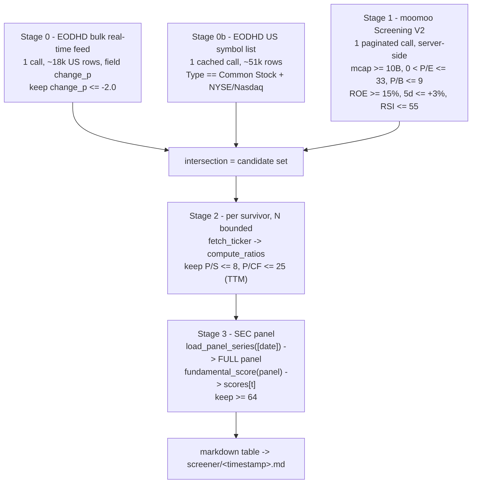

# Implementation plan — value screen → FundamentalScore filter

**Status:** the tool is written and committed; the **designed** live path has run end to end with OpenD
up (so the server-side Screening V2 stage is in play), and `--panel` is implemented and verified - on
disk offline, by two failing-first proofs, and against a real panel. No engine gate, config key or web
surface is added by this plan.
**Date:** 2026-09-24.
**Owner:** vince.
**Scope:** `scripts/value_score_screen.py` (new), plus a panel-mode addition to its scoring stage.

---

## 1. What this is for

The owner's broker panel (`High Profit & Growth`, Market = United States) applies five valuation
bounds. He wants the same list, then only the names **down on the day**, then the engine's
fundamental score over the survivors, keeping the top of that ranking:

```
Market Cap >= 10B      P/E TTM <= 33        P/B <= 9
P/S TTM <= 8           Price-to-Cash-Flow TTM <= 25
+ same-day move <= -2% (down 2% or more)
+ keep FundamentalScore >= 64
```

Two extra anchors were added by the owner on 2026-09-24: **ROE >= 15%**, **5-day change <= +3%**,
**RSI(14) <= 55**, and the exchange set **NYSE + Nasdaq**.

## 2. Locked decisions

| # | Decision | Source | Consequence |
| --- | --- | --- | --- |
| 1 | The **EODHD bulk real-time feed stays** as the day filter | owner, 2026-09-24 | one call covers the whole US market in real time; it is the only whole-market intraday source in the repo |
| 2 | **Stage 3's panel is the SEC EDGAR XBRL panel**, not the run's own cross-section | owner, 2026-09-24, following Q4 in `docs/scores/FundamentalScore.md` | `>= 64` becomes a market-relative percentile rather than a rank inside the screen |
| 3 | The five valuation bounds stay where they are cheapest: mcap / P-E / P-B server-side, P/S + P/CF client-side | design, §4 | no vendor here serves P/S or P/CF (see §4.4) |
| 4 | The owner's anchors are CLI flags, not constants | owner supplied values | the invocation *is* the record: `--roe-min 15 --chg5d-max 3 --rsi-max 55` |

## 3. The pipeline



| stage | mechanism | vendor cost |
| --- | --- | --- |
| 0 | `get_top_movers_symbols_eodhd(direction="losers", count≈4000, min_price=15)` | **1 call** |
| 0b | `get_exchange_symbols_eodhd("US")` | 1 cached call |
| 1 | `screen_value_dip_moomoo(...)` | 1 paginated call |
| 2 | `_fetch_fin_cached` then `compute_ratios` | N per-name, capped by `--limit` |
| 3 | `load_panel_series` then `fundamental_score` | **0** |
| out | `save_watchlist` | 0 |

Nothing here is bounded by a vendor threshold except Stage 2, and Stage 2 only sees what survives
six server-side anchors.

## 4. Stage specifications

### 4.1 Stage 0 — the day filter (one call, whole market)

`tradingagents/dataflows/eodhd.py::get_top_movers_symbols_eodhd` (`:408`) wraps one
`/api/real-time/US.US?ex=US` request returning ~18k US rows. Each row is
`{symbol, close, change_p}` with the `.US` suffix stripped and `change_p` as a **percent** (not a
ratio). Keep `change_p <= -2.0`.

Why this source and not another: moomoo's movers rank caps at 200 rows; Alpaca's batch endpoints
are comma-list but drop `prevDailyBar`, so no percent change surfaces; there is no FMP / Finnhub /
Tiingo / TwelveData batch quote in the repo; yfinance's free screener caps at `MAX_ROWS = 50`
(`tradingagents/dataflows/screener.py:49`).

### 4.2 Stage 0b — equity and exchange gate (one cached call)

The bulk feed carries **no name or type field**, so warrants, units and ETFs dominate a raw
decliner list. `get_exchange_symbols_eodhd("US")` returns the ~51,198-row US symbol list; keep
`Type == "Common Stock"` and `Exchange in {NYSE, NASDAQ}`.

This is also why the moomoo screen is called with `exchanges=None`: its own client-side exchange
gate costs one `get_stock_basicinfo` call **per row**, while this leg already carries the exchange
column for one cached call. Same set, N fewer calls.

### 4.3 Stage 1 — the server-side screen

`tradingagents/dataflows/moomoo.py::screen_value_dip_moomoo` (`:2282`) builds a Stock-Screening-V2
request tree evaluated server-side against real-time quotes. Its **defaults are value-dip anchors**,
every one of which is outside the owner's criteria and must be passed as `None` or it silently
narrows the list:

| parameter | function default | what we pass | why |
| --- | --- | --- | --- |
| `pe_max` | `30.0` | `33.0` | the panel's bound |
| `market_cap_min` | `1e9` | `10e9` | the panel's bound |
| `roe_min` | `0.12` | `0.15` | the owner's anchor (decimal fraction, see §4.3.1) |
| `chg5d_max` | `-0.05` | `0.03` | the owner's anchor; note the sign change below |
| `rsi_max` | `35.0` | `55.0` | the owner's anchor |
| `price_min` | `5.0` | `15.0` | keeps the bulk feed and the screen consistent |
| `pb_max` | `None` | `9.0` | the panel's bound |
| `dip_days` | `5` | `5` | the window `chg5d_max` is measured over |
| `exchanges` | `None` | `None` | Stage 0b does it for one cached call |

#### 4.3.1 Units (verified against the function's own docstring)

`roe` and `change_pct_5d` are **decimal fractions** (`-0.29 == -29%`); `rsi` is 0-100. The CLI
therefore takes ROE and the 5-day change in percent and converts: `--roe-min 15` becomes `0.15`.

**The sign of `chg5d_max` is a semantic change, and it is deliberate.** The function's default
`-0.05` means *already down 5% or more*; the owner's `+3` means *no more than +3% over five days*
— a "not extended" filter. Both are legal (the server applies `<=`); they select opposite names.

### 4.4 Stage 2 — the two ratios no vendor serves

`tradingagents/strategies/ratios.py::compute_ratios` (`:104`) is the **sole producer** of
`price_to_sales` (`market_cap / revenue`, `:200`) and `price_to_cash_flow`
(`market_cap / operating_cashflow`, `:201`). Confirmed absent everywhere else:

| candidate source | why it cannot serve P/S or P/CF |
| --- | --- |
| moomoo Screening V2 | rows carry `pe_ttm`, `pb`, `price`, `change_pct_5d`, `roe`, `rsi` — no P/S, no P/CF |
| EODHD screener | `Forbidden` (403) on the current plan (`docs/design_eodhd_unused_surface.md:367`) |
| Massive `/stocks/financials/v1/ratios` | 403 on the free plan; carries the field names but not the data |
| yfinance screener | P/E and market cap only, capped at 50 rows |

`compute_ratios` **never fabricates**: a ratio whose input is missing returns `None`. A `None`
bound **fails closed** here — the name is dropped and counted, never treated as a pass.

**P/CF needed a leg this path did not supply — fixed at the source on 2026-09-24.** `fetch_ticker`
pulled fundamentals, the balance sheet and the income statement but never called `get_cashflow`, so the
canonical items arrived **without** `operating_cashflow` and `price_to_cash_flow` was `None` for every
name. Measured that day over the deepest 30 decliners: market cap, P/E and P/B present 30/30, P/S 22/30,
**P/CF 0/30**. Because the gate fails closed, that one missing leg emptied the whole funnel.

The producer now fills two keys — `operating_cashflow` and `capex` — from the cash-flow statement, from a
**whitelist, only where a key is missing**, with provenance recorded as `get_cashflow`. That is narrower
than it first was: absorbing the payload into the merge like the other statements (even ordered first, so
`net_income`'s pinned provenance could not flip) moved AAPL's `total_debt`/`cash`, because `absorb` matches
rows by loose label aliases and a cash-flow statement also carries "Long-term debt" and "Cash" rows — it
reported *equity value is not positive: debt exceeds enterprise value* and failed six screens. Two keys
in, nothing else on the payload can reach the canonical dict and no pre-existing value can move. The
tool's own belt-and-braces fetch — cached for the run through the screener's `_CASHFLOW_CACHE`, parsed by
`statement_parsing._canonicalize` — stays, so the screen is correct against either engine revision. The
basis is the latest **annual** period, the same limitation the panel path carries (§7).

`market_cap` enters `compute_ratios` via `fin["market_cap"]`; when the parsed value is absent the
screener's own convention applies — inject the day-of cap and, client-side, drop only when a cap
**is** present and below the floor (`scripts/value_screener.py:2084-2092`).

### 4.5 Stage 3 — the score, on the panel

`scripts/score_panel.py` builds `data_cache_dir/panels/<date>.json` of `{ticker: {metric: value}}`,
one file per date, never re-fetching a date whose file exists. The fundamentals leg is SEC EDGAR
XBRL — one keyless `companyfacts` request per filer, read point-in-time — and the price leg writes
each name's `close`. Rows are assembled by `panel_row_from_fin` (`:437`), which delegates to
`peer_universe._panel_from_fin(..., include_score_metrics=True)` — **the same builder the four
sub-scores consume**, so the panel cannot disagree with the engine it measures.

The plan-mode scoring call is therefore:

```python
from scripts.score_panel import load_panel_series
from tradingagents.strategies.fundamental_score import fundamental_score

full = (load_panel_series([date], None) or {}).get(date) or {}   # universe=None keeps every name
scored = fundamental_score(full)
scores = scored["scores"]        # {name: composite or None}; None is "withheld", never 0
```

**The whole panel must be passed.** Passing only the candidates would re-create the defect this
change exists to fix: the composite is a tie-aware percentile **over the panel it is given**, so a
candidates-only panel ranks the candidates against each other again.

**The panel must be WIDER than the survivors, and that is a hard constraint.** `factors.category_scores`
refuses a peer set below `min_peers` — *"a z over a handful of names is noise, not a score"* — and the
four sub-score wrappers pass **`min_peers = 8`**. Measured on 2026-09-24 with the five names that
survived the ratio gates: at the engine default **nothing** is scored and every sub-score reports
`floor: None`; at `min_peers=5` FQS/VS/FRS score all five; at `min_peers=2` the composite appears
(FSLR 83.3, KGC 83.3, GEN 41.7, XYL 25.0, SNX 16.7). **The floor is not lowered** — it is the engine's
own guard against a percentile computed over a handful of names — so the panel is the whole **fetched
cross-section** (every name stage 2 pulled financials for, typically tens), and the survivors are read
out of it. A panel built from only the survivors cannot produce a composite at all, and a panel below
the floor now reports the engine's own reason per name (`peer set below the floor (5 < 8 names)`)
instead of rendering as "no reason recorded".

Cost: `fundamental_score` measured at **0.600 ms** for a 10-peer panel and 1.9 ms at 60 peers
(synthetic fixture, no I/O); a few thousand rows is sub-second. The panel itself is where the money
went, and it was paid once per date (§6).

### 4.6 Output

Ranked markdown via `value_screener.save_watchlist` into `screener/<timestamp>.md` (that directory
is gitignored at `.gitignore:225`). Columns: ticker, 1-day %, market cap, P/E, P/B, P/S, P/CF, the
four sub-scores **with their band labels**, and the composite.

**The default output is the qualifying set alone.** The `--score-min` cut is the owner's criterion, so
a name that scores below it is not listed at all; `--show-excluded` adds the below-cut table and the
withheld table for inspection. An empty result always states that nothing cleared the cut and names the
best few, so a threshold never returns silence — the failure mode that made the first three runs of this
tool unreadable.

## 5. Code changes required

1. **`stage_score` gains a panel mode** (`--panel <date>`), per §4.5.
2. **A name absent from the panel drops with a reason** and appears in the withheld column — never
   scored as 0. The panel's real gaps: a 20-F/40-F filer whose market cap is withheld (cover-page
   count is ordinary shares while the US price may be per ADS — measured on SIMO 2026-09-17:
   1 ADS = 4 ordinary, $34.0B derived against $8.1-8.6B real), and a pre-XBRL or IFRS filer with no
   eligible annual facts.
3. **No panel file for the date → fall back to the run's own cross-section and say so in the
   report header.** The denominator must never change silently.
4. `close` and the technical components ride along in panel rows; `factors.category_scores` already
   drops undeclared metrics and reports why, so nothing needs filtering on the way in.
5. `--ratio-source vendor|panel` (optional) per §7.

## 6. The panel prerequisite

```
py -3.12 scripts/score_panel.py --cost-only --symbols-file <us_common_stocks.txt>
py -3.12 scripts/score_panel.py --dates 2026-09-24 --symbols-file <us_common_stocks.txt> --rate-limit 10
```

- Universe: Stage 0b's `Type == "Common Stock"` + NYSE/Nasdaq set, or the free keyless
  `sp500_universe.fetch_sp500_universe` for a narrower panel.
- Cost: one keyless SEC request per filer against the published 10 req/s ceiling, so read
  `estimated_minutes` from `--cost-only` before committing; the price leg is one disk-cached fetch
  per name.
- It must not run in a report path (`docs/scores/IMPLEMENTATION_PLAN.md:290-293`).
- **Per-date caching is the contract**: a second invocation makes zero network calls, so every
  screen after the first build is free.

## 7. Open item — TTM fidelity

| | vendor `fetch_ticker` (current) | panel |
| --- | --- | --- |
| basis | **TTM** — `compute_ratios` prefers `*_ttm` keys, matching the panel's "TTM" labels | **annual only**; SEC XBRL has no TTM leg and the ratio block falls back to the annual figure |
| cost | N per-name fetches (N is tens after six server-side anchors) | free |
| market cap | parsed and cross-checked | `close × ` the EDGAR cover-page share count, withheld for 20-F/40-F |

**Recommendation: keep the vendor TTM path for the screen's ratios and use the panel only for the
scores.** The funnel keeps N small, and it leaves the market-cap logic where it already works.
`--ratio-source panel` remains available for a zero-call screen, in which case the report must
print that the ratios are annual while the criteria say TTM.

## 8. What the output says about itself

Printed in every report, because each line changes what the number means:

- The composite is **`RESEARCH_ONLY`** — an unvalidated combination. The four sub-scores are the
  **`ADVISORY`** output and are the ones with band tables.
- The composite is a **percentile with no band table**; the engine's own `basis` says "no band table
  is applied", and the nearest **published** sub-score edges are **60** and **65**. A `>= 64` cut is
  a research cut, not an engine boundary.
- **The percentile is panel-relative.** Market-wide only while the SEC panel is the source; the
  run-cross-section fallback is screen-relative, and the header says which was used.
- **Selection overlap** — the screen filters on four valuation factors (P/E, P/B, P/S, P/CF) that
  the composite also contains, so survivors are pre-selected on part of what the composite ranks.
- Neither layer reaches `opportunity_score` (owner decision Q1, `docs/scores/FundamentalScore.md`),
  and neither may gate a trade.
- Nothing in the list is checked for spread, depth or a session window; the pre-market and risk
  gates are separate reads.

## 9. Verification plan

1. **Offline, already green:** `--offline-demo` — 40 synthetic names, 40 scored, 15 kept at `>= 64`,
   `status: RESEARCH_ONLY`, sub-score bands printed, **zero vendor calls**.
2. **Offline proof for the panel mode — done.** A panel file on disk plus `--panel <date>`; the
   full-panel denominator is used and a candidate missing from it lands in `withheld` with the panel
   date in the reason. Zero vendor calls. Locked by four tests in `tests/test_value_score_screen.py`,
   the sharpest of which measures the mode's actual claim: the same candidate scores **17.95 over a
   40-name panel and 77.78 over a 10-name one**.
3. **Golden-path proof of the render path:** a synthetic `render()` call (already exercised once)
   so a column or format defect is caught before it costs a live run.
4. **Live — done 2026-09-24 on the designed path**, OpenD up, so Screening V2 supplies the candidate
   set: `decliners 287 -> candidates 16 -> passed the ratio gates 12`, three names clearing the cut
   (UHS 77.78, LOGI 77.78, THC 71.11) over **26 vendor calls** (1 bulk feed, 1 cached symbol list,
   1 paginated screen, 16 per-name financials, 6 cash-flow fallbacks, 1 peer-universe build).
5. **Failing-first discipline — done.** Forcing the panel branch off fails the ranking test with
   `KeyError: 'N07'`; removing the by-name refusal fails the withheld test with `KeyError: 'AAA'`.
   Both restorations byte-identical (sha256 `441d388cb723a706`).

## 10. Risks and unknowns

| risk | mitigation |
| --- | --- |
| The six anchors are jointly too tight and the funnel returns empty | that is a finding, not a bug. Loosen in the order RSI, P/S, ROE — **not** the day filter, which is what makes the list interesting |
| OpenD is not running, so the server-side screen is unavailable | `--no-moomoo` runs the EODHD-only path: the candidate set becomes the deepest `--limit` decliners and every ratio is gated client-side. The report labels it a **partial scan**; it is not the full screen |
| The fallback's candidate set is **size-biased** | measured 2026-09-24: of the deepest 30 decliners only about 5 cleared the $10B floor (SCTX $0.4B, ACAD $3.8B, BXC $0.6B were typical), so the fallback spends its per-name fetch budget on names the market-cap gate will reject. This is the strongest argument for the SEC panel: its derived market cap makes a **cheap client-side size filter** possible before any statement fetch |
| `chg5d_max` sign read the other way (§4.3.1) | printed in the report header; one flag flips it |
| Rate limits at 4 workers are real, not theoretical | measured on 2026-09-24: `fmp profile: status 429` repeatedly, Reddit RSS 429 on `r/stocks` and `r/investing`, Massive `403` entitlement on four snapshots and three `gainers` calls. Stage 2 is capped and the run is serial |
| Panel build is a multi-minute keyless SEC job | `--cost-only` first; run it outside report paths; per-date cache makes it once-only |
| A wrong market cap poisons every price-based ratio | inherited guard: withheld and named for 20-F/40-F, never derived |

## 11. Delivery state

| item | state |
| --- | --- |
| `scripts/value_score_screen.py` | written, ruff-clean, anchors parameterized, committed (`3a0e49f`, `cbc9f3b`) |
| render path with the owner's anchors | verified with synthetic data |
| live run, designed path (OpenD up) | **done 2026-09-24** — 287 decliners → 16 candidates → 12 past the ratio gates, 3 clearing 64, 26 vendor calls |
| `--panel` mode | **done** — loads the built panel via `load_panel_series`, scores the whole file, prints the denominator in the header, refuses absent names by name, labels a missing file; 4 tests + 2 failing-first proofs |
| SEC panel build | building the 287-name decliner population for 2026-09-24 — 0.5 min of SEC calls at 10 req/s, plus the prices leg |
| commit and push | pending for the `--panel` pass |
