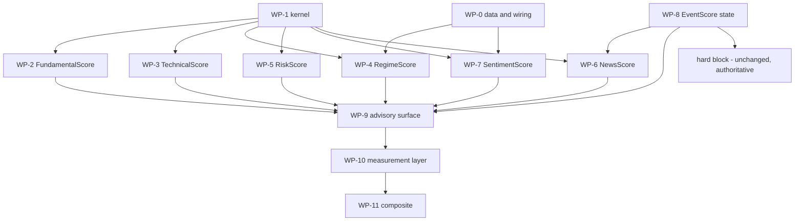

# Score engines — implementation plan

**Part of the score-engine design set: [`README.md`](README.md)** (master).
Siblings: [`FundamentalScore.md`](FundamentalScore.md),
[`TechnicalScore.md`](TechnicalScore.md), [`RegimeScore.md`](RegimeScore.md),
[`RiskScore.md`](RiskScore.md), [`NewsScore.md`](NewsScore.md),
[`SentimentScore.md`](SentimentScore.md), [`EventScore.md`](EventScore.md).

**What this document is.** The design set says *what* each engine is and *why*.
This says *in what order to build it*, *what each task produces*, *what proves it
done*, and *what must not be touched*. It is written from the eight documents
above, read end to end on 2026-09-17, with every existing-code anchor re-verified
at the definition site.

**What it supersedes, and what it repaired.** The master's §4 ("Wiring and
contracts") and §5 ("Phased plan") were **stubs** — the restructure of `68931f3`
left their bodies behind — and the master's §6 and §7 cited §3.7.x, §3.8.x,
§4.2, §5.2, §5.3 and §8.3, none of which exist any more. The wiring contracts are
§3-§8 below and the phase plan is §9; the master's §4 and §5 are now pointers to
them, and every dangling cross-reference in the master and in
[`FundamentalScore.md`](FundamentalScore.md) was repointed in the same pass. The
defects are recorded in the master's §3.3 — §14 of this document has the full
list of what the restructure dropped.

Status: **plan (2026-09-17); implemented 2026-09-18.** WP-0...WP-11 are built and every gate ships **off** by default. §9 carries each phase's **Exit - MET** block. **Measurement is partial**: the price leg is measured, the fundamentals leg is vendor-gated (EODHD 403), so most weights in this set remain hypotheses - `MEASUREMENT_FINDINGS.md` labels each one.

---

## 0. How to use this document

**One workstream per engine, four cross-cutting.** `WP-0` is the data and wiring
prerequisites (nothing scores without it), `WP-1` is the shared arithmetic every
engine reuses, `WP-2`…`WP-8` are the seven engines, `WP-9`…`WP-11` are the
surface, the measurement layer and the composite.

**Every task carries four things.** The **deliverable** (a new module, a new
symbol in an existing module, a leaf, a config key); the **design anchor** (the
section of the engine document it implements); the **acceptance** (the observable
result, not "tests pass"); the **gate** (the config key that must default off).

**Three rules govern the whole plan and are not restated per task.**

1. **A test earns its place by failing.** Ground rule 4: each new test is proven
   failing under a targeted mutation of the code it guards — flip a direction
   sign, drop the coverage floor, remove the renormalisation, delete the band
   table. A test that cannot be made to fail is not a test.
2. **Nothing lands without a dark launch** (ground rule 10): one gate at a time,
   a labelled run on the same basket, `scripts/repro_check.py --evidence` diffed
   against the gate-off run, then `scripts/report_verify.py` and
   `scripts/verify_sweep.py` exiting 0 on `CONFIRMED`.
3. **A defect found while building is fixed on sight** (owner standing order 10)
   unless it would destroy user data or rewrite a decision contract the owner
   set; those two are asked about, not assumed.

**Sizes** are `S` (a day), `M` (a few days), `L` (a week or more) — relative,
from the documents' own "fix size" language where they give it, and marked
`[INFERENCE]` where they do not.

---

## 1. What is being built

### 1.1 The deliverable map

| # | Deliverable | New symbols | Gate | Prereq | Ready? |
| --: | --- | --- | --- | --- | --- |
| WP-0 | Data + wiring prerequisites | see §3 | — | — | **no** |
| WP-1 | Shared score kernel | `strategies/score_engine.py` | — (pure) | — | yes |
| WP-2 | `FundamentalScore` | `strategies/fundamental_score.py` | `enable_fundamental_score` | WP-1 | mostly |
| WP-3 | `TechnicalScore` | `strategies/technical_score.py` | `enable_technical_score` | WP-1 | mostly |
| WP-4 | `RegimeScore` | `strategies/regime_score.py` | `enable_regime_score` | WP-0.3-0.5, WP-1 | **no** |
| WP-5 | `RiskScore` | `strategies/risk_score.py` | `enable_risk_score` | WP-1 | mostly |
| WP-6 | `NewsScore` | `strategies/news_score.py` | `enable_news_score` | WP-1, WP-8 | **no** |
| WP-7 | `SentimentScore` | `strategies/sentiment_score.py` | `enable_sentiment_score` | WP-0.6, WP-1 | partly |
| WP-8 | `EventScore` state | `strategies/event_state.py` | `enable_event_state` | — | yes |
| WP-9 | The advisory surface | leaves + `run_card` block | per engine | WP-2…WP-8 | yes |
| WP-10 | The measurement layer | panel + IC/decile harness | `enable_score_panel_eval` | WP-2…WP-5 | partly |
| WP-11 | The composite | `strategies/trade_score.py` | `enable_trade_score` | WP-10 | **no** |

**Gate-name collisions to avoid, checked against `default_config.py`:**
`enable_factor_model` (:899) already means the **learned** advisory model
(`scripts/factor_model_train.py:7`, the qlib/finrl research artifact) and is not
free; `enable_factors` (:769) and `enable_regime` (:766) are documented **INERT**
(`.env.example:470-471`, asserted by `tests/test_gate_env_toggles.py:87-88`);
`enable_score_eval_rows` (:1048) already gates the IC harness and **is** consumed
(`scripts/strategy_quality_report.py:340`). The six engine gates above are
therefore new names, and WP-10 reuses `enable_score_eval_rows` rather than
inventing a second measurement switch.

**Note on the live configuration:** the owner's `.env` already turns on several
gates the documents describe as default-off (`ENABLE_SCORE_EVAL_ROWS`,
`ENABLE_GROWTH_SCORES`, `ENABLE_WEIGHTED_SENTIMENT_AGG`,
`ENABLE_CROWD_RATIO_BANDS` are `true`; `ENABLE_QUALITY_COMPOSITE` is `false`).
"Default-off" in this plan means the **shipped default**, which is what the
dark-launch protocol needs; it does not describe this deployment. A phase whose
producer is already on in `.env` must be diffed with the flag explicitly off, not
by assuming the default.

### 1.2 The dependency graph



**The critical path is WP-0 → WP-4 and WP-1 → WP-2 → WP-10.** RegimeScore cannot
start scoring until the market-level producers exist (§4.2 of its document says
so: *"five of the eight categories are computed from the analysed ticker's own
history — a RegimeScore built from those would be a second TechnicalScore under a
different name"*), and nothing may be weighted before WP-10 measures it.

### 1.3 Definition of done, per engine

An engine is done when **all six** hold:

1. Its document's §5 constraints are implemented as written, including the ones
   that restrict it (`TechnicalScore` sizes nothing; `RiskScore` never sizes;
   `NewsScore` reads no `sentiment.py` aggregate; `SentimentScore` reads no
   `news_relevance` function).
2. A `None`-everywhere input returns `score = None`, `coverage = 0` — never `0`,
   never `50` (each engine's verification section requires exactly this).
3. The printed block recomputes the printed score from its own attribution rows
   to within rounding.
4. The mutation tests of §0 rule 1 exist and fail before the fix.
5. The gate defaults off, the tool is absent from the toolset when off, and the
   gate-off run is byte-identical (the existing gate convention).
6. The score reaches no gate, no size, and no `SCORE_BANDS`; a test asserts it.

---

## 2. Invariants that bind every workstream

The master's seven cross-engine rules, each with the mechanism that enforces it.
An invariant without a mechanism is a comment.

| # | Rule (master §2) | Enforcement in this plan |
| --: | --- | --- |
| 1 | **`NA ≠ 0`** | WP-1's `combine` drops an absent component from both numerator and denominator and returns `coverage`; a test feeds a panel with one metric missing and asserts the score moves toward the mean of the present ones, never toward zero |
| 2 | **A score is not a rating** | no engine imports `decision_guardrail`; a test asserts the score appears in no `SCORE_BANDS` input and each engine carries its own band table |
| 3 | **One number, one producer** | every component row in §5 names its producer; a test asserts the score module imports no `sentiment`/`news_relevance`/`overlays` aggregate it should not (WP-6/WP-7) and that `EventScore`'s and `RiskScore`'s event keys are disjoint sets |
| 4 | **A composite never overrides a hard gate** | a test drives the executor's gate to `BLOCK` and asserts a maximal `TradeScore` changes nothing — the shape of the existing `risk_multiplier.combine` hard-flag test |
| 5 | **Measure, don't assume** | any value that can only be a constant is labelled a constant **in the output**, not only in the document: `fill_basis`, `trend_score (caller-supplied)`, the crowd bands |
| 6 | **No weight vector is invented** | every weight is the owner's, lives in one table per engine, is printed in `basis`, and a test asserts the printed vector equals the table used |
| 7 | **No `factor_score=NN` in prose** | a test in the shape of `tests/test_analyst_evidence_wiring.py` asserts no analyst prompt string requires a composite number; the score reaches the reader only through the structured leaf / `run_card` block |

**Four output types stay four** (master §1.4): score, scale, state, confidence. A
test asserts the regime sizing scale is not an input to `RegimeScore` and vice
versa.

**Direction is a property of the component, not of the engine** — with one
exception the whole set depends on: `RiskScore` is **inverted** (100 = low risk),
and a test asserts its alignment is inverted relative to its producers' native
loss sign.

---

## 3. WP-0 — the prerequisites

Nothing here is a score. Every item is either a producer that does not exist or a
binding that is on the wrong surface. **This workstream is the plan's critical
path** and is worth doing before any engine, because five engines read its
outputs.

### 3.0 The order

| # | Item | Blocks | Size |
| --: | --- | --- | --- |
| P0-1 | Structured SEC XBRL series (EPS / EBIT / D&A / equity) | WP-2 CAGR family, G4/G5 | M |
| P0-2 | The EODHD US panel (the validation universe) | WP-10 | M |
| P0-3 | Market-wide breadth from the panel already fetched | WP-4, WP-3 | M |
| P0-4 | VIX percentile (FRED) | WP-4 | S |
| P0-5 | VIX9D/VIX3M term structure | WP-4 | S |
| P0-6 | Short-interest percentile over the settlement series | WP-7 | S |
| P0-7 | The toolset bindings on the wrong surface | WP-7, WP-6 | S |
| P0-8 | The five remaining recorded defects | several | S-M |
| P0-9 | Vendor-capability probes (verify before designing on them) | WP-6, WP-7 | S |

### 3.1 P0-1 — a structured SEC XBRL series

**Why.** `FundamentalScore.md` §1.4 records that `annual_series` now stacks
revenue / net income / total assets / operating cashflow / ROA over 4 annual
periods, and that the CAGR family plus G-Score G4/G5 stay blocked on **EPS, EBIT,
EBITDA, FCF** and on the 5-period bar. `sec_edgar.get_financial_history:173` is
the only free source that clears it, and it does not feed the path.

**What exists, verified at the definition site.** `sec_edgar.py`:
`_TAG_MAP:56-65` holds **eight** labels over **eleven** candidate us-gaap tags
(Revenue ×2, NetIncomeLoss, NetCashProvidedByUsedInOperatingActivities,
PaymentsToAcquirePropertyPlantAndEquipment, Assets, Liabilities,
StockholdersEquity, CashAndCashEquivalentsAtCarryingValue);
`_COMPANYCONCEPT_URL:66` is `.../companyconcept/CIK{cik:010d}/us-gaap/{tag}.json`,
called **once per tag** in a nested loop (`:206-215`); the function returns a
**rendered markdown string** (`:255-273`) and discards its own structured
`by_tag` dict. So the CAGR path cannot consume it even though the values are
already in memory.

**Deliverable - DONE 2026-09-17.** `sec_edgar.financial_history_series(ticker,
years=15) -> dict` returns `{"series": {label: {fiscal_end: value}}, "span":
[first, last] | None, "years": years}` - the structure the loop already built,
plus the span - and `get_financial_history` renders from it (one implementation,
two readers - ground rule 2). The consumer is
`statement_parsing.sec_annual_series(ticker, years=15) -> dict`, which maps the
labels to the canonical series keys, keeps only the **longest run of consecutive
fiscal years** per key (a hole would misalign the positionally-indexed readers),
derives `ebitda_series` / `fcf_series` and labels them `derived: true`, and calls
the same `_add_roa` the vendor path calls so the two cannot disagree. The merge
into `fetch_ticker` is **opt-in** (`with_sec_series=True`, wired at the two leaves
that need the depth - `quant_formula_tools.get_quality_factors` for G4/G5 and
`analysis_tools.get_earnings_quality` for Dechow-Dichev's 8-period window):
one EDGAR request and an as-reported USD basis are a cost the default vendor path
must not pay, and a hermetic test asserts the default call never touches EDGAR.
The longer series wins **per key**, never spliced, and the provenance row names
`source: "sec_xbrl"`. Extend `_TAG_MAP` with the tags the
CAGR family needs and that XBRL actually carries:
`EarningsPerShareDiluted`, `OperatingIncomeLoss`,
`DepreciationDepletionAndAmortization`, `GrossProfit`,
`NetCashProvidedByUsedInOperatingActivities` (present) — EBITDA is then
`OperatingIncomeLoss + D&A` and FCF is `OCF − capex`, both **derived in the
caller and labelled derived**, not fetched as a tag that does not exist.

**Both changes are already made** (2026-09-17, §14 D-3/D-4). (a) The
`companyfacts` endpoint
(`https://data.sec.gov/api/xbrl/companyfacts/CIK{cik}.json`) is now the fetch path:
one request per company instead of one per tag (11 before), same JSON, every tag at
once, which is what makes the extension above cheap — the per-tag loop stays as the
fallback when the larger payload fails (`_us_gaap_facts`, `sec_edgar.py:118`). The
SEC's published fair-access ceiling is **10 requests/second** per IP with a
descriptive `User-Agent`, and `_UA:33` now carries the owner's reachable contact.
(b) Keep the existing failure contract: a non-US ticker raises
`NoMarketDataError` and the caller treats it as `NA` — the series must **not**
fail a run for a foreign listing.

**Acceptance - MET 2026-09-17.** For a US filer, the series
returns ≥5 annual periods for revenue,
net income, EPS, operating income and D&A with the span printed (live: MSFT
rendered 6 periods over 12 tag columns); for a non-US
ticker it returns `None`/raises the same `NoMarketDataError` the existing leaf
does and nothing downstream raises. `annual_series` consumes it and the G-Score
legs stop emitting "5-year ROA series unavailable (n=0)" where the data exists.

**Gate.** Extending a data adapter is not new behaviour: no gate, but the CAGR
factors built on it land behind `enable_fundamental_score`.

### 3.2 P0-2 — the EODHD US panel

**Why.** Owner decision Q4: the **full EODHD US panel** is the official
validation universe; the named basket is a development set labelled
`INSUFFICIENT_CROSS_SECTION` and may never produce authoritative weights
(`FundamentalScore.md` §0.5, master §7 Q4).

**What the vendor supports, checked 2026-09-17.** The bulk fundamentals endpoint
is stocks-only and needs the **Extended Fundamentals** plan (support-gated, not
on the public price list); it costs **100 API calls per whole-exchange request**
and **100 + N** when a `symbols` list is passed, with a **500-symbol** cap per
request and **JSON or CSV** output; paid plans are **100,000 calls/day** with a
**1,000 requests/minute** ceiling; the *snapshot* variant 404s on the generic
`US` code and needs `NASDAQ`/`NYSE`/`AMEX`/`BATS` individually. A single-ticker
fundamentals call is **10** calls.

**Deliverable.** `scripts/score_panel.py` (a script, not a strategy module): given
a date range and a universe, writes `data_cache_dir/panels/<date>.json` of
`{ticker: {metric: value}}` from the bulk endpoint, chunked to 500 symbols,
caching per date, never re-fetching a date that exists. It must **not** run in a
report path.

**Acceptance.** A panel for one trading date over the US universe exists on disk,
carries ≥ a few hundred names, records the call cost and the fetch timestamp, and
a second invocation makes zero network calls. `INSUFFICIENT_CROSS_SECTION` is the
label whenever the panel is below the cross-section floors — the label is a
tested output, not a comment.

**Gate.** `enable_score_panel_eval` (WP-10) for the *harness*; the script itself
is manual.

### 3.3 P0-3 — market-wide breadth, computed from data already fetched

**Why.** `RegimeScore.md` §1 marks market-wide A/D, new highs/lows and
percent-above-MA as ABSENT; §4 names the smallest honest producer, and it needs
**no new vendor**: `sector_breadth.multi_breadth:60` already takes a
`{name: closes}` map and returns per-key percentages, and the sector screens
already build that map in bulk
(`agents/utils/analysis_tools.py:3646-3748` over
`dataflows.sp500_universe.fetch_sp500_universe`).

**Deliverable.** `strategies/market_breadth.py::market_breadth(closes_by_name,
*, windows=(20,50,200)) -> dict` returning `{pct_above_<w>: 0-100, n,
advance_decline: int, new_highs: int, new_lows: int, coverage}` — the first three
from `multi_breadth`, the last three computed from the same map. `n`-gated the
way the sector path already is (`sector_screener.breadth_with_gate:511`): below
`n = 20` the row is `n/a`, not zero.

**Acceptance - MET 2026-09-17.** `strategies/market_breadth.py::market_breadth`
builds it. Over a synthetic five-name panel with known answers (two above the
200-day, two advancing, one at its high) every key matches **with the gate set to
the panel size**; at the default `min_n=20` the same panel withholds the
percentages with its reason (five names are not a breadth read) while the counts
still travel. An empty map returns `None`, never 0. **A real run prints the panel
size beside the percentages**: over 22 names drawn from the in-repo S&P map
(315 constituents) it returned `n=22, coverage=1.0, pct_above_20d=45.5,
pct_above_50d=54.5, pct_above_200d=40.9, A/D=-2, new_highs=1, new_lows=1,
small_sample=False` with the basis line naming the 22-name panel and the bars
each series carried. The percent-above columns come from the shared
`sector_breadth.multi_breadth`; the A/D, high/low and coverage counts are computed
from the same map, so the numbers cannot describe different panels. The
high/low counts are measured against the window the caller supplied and the basis
says which window that was, so a 60-bar panel cannot be quoted as a 52-week
figure.

**Note on the vendor alternative.** There is no free official US-universe breadth
API; third-party routes exist (Barchart's `getMomentum` exposes
`percentAbove200dMAtoday`; TheTradingTools publishes A/D and new-high/new-low
datasets) and are recorded in §15 as fallbacks only. The repo's own map is the
primary source, because it is the same data the sector screens already trust and
it needs no new vendor (ground rule 7).

### 3.4 P0-4 — VIX percentile

**Why.** `RegimeScore.md` §1: VIX exists only as a raw FRED level
(`dataflows/fred.py:68` alias `vix` → `VIXCLS`, leaf
`macro_data_tools.get_macro_indicators:9`, **news toolset only**), never as a
regime input.

**Deliverable.** A percentile rank of the latest `VIXCLS` value over its own
trailing history, reusing the existing shape (`regime.vol_percentile:49`), inside
the market-level regime path, plus binding the FRED read to the market surface.

**Acceptance - MET 2026-09-17.** A monotone synthetic series gives a percentile
of 1.0 at the top and 0.0 at the bottom; a 3-point history returns `None` (not a
fabricated rank). Built as `analysis_tools._vix_percentile_read` (fetch VIXCLS
through the new `fred.get_series_values`, rank it with
`normalized.percentile_hist_or_none` - the honest-contract sibling of the four
rank helpers that returned a neutral 0.5 for an unmeasurable rank). It feeds the
market-level regime path through `get_macro_regime_read`'s derived `vol_percentile`
marker, and the FRED read is now bound to `market_tools()` as well as
`news_tools()`.

### 3.5 P0-5 — VIX term structure

**Why.** `RegimeScore.md` §1 and §4: the equity-IV slope
(`options_surface.term_structure_slope:152`) is **not** a VIX term structure, and
the document forbids substituting it silently.

**Sources, checked 2026-09-17.** FRED carries **VXVCLS** (Cboe 3-Month
Volatility, active; `VXOCLS` is the discontinued one) and **not** VIX9D; Cboe
publishes both as CSVs on its CDN
(`https://cdn.cboe.com/api/global/us_indices/daily_prices/VIX9D_History.csv`,
`.../VIX3M_History.csv`). VIX9D therefore needs the Cboe CSV, which is a **new
vendor-shaped dependency** and is why this item is listed separately from P0-4.

**Deliverable - DONE 2026-09-17.** `dataflows/cboe.py::vix_term_structure()` reads
the two CSVs (cached under `data_cache_dir`, one fetch per day), returning
`{vix9d, vix3m, slope, state: contango|backwardation, as_of, basis, reason}` on the
existing `term_structure_slope` sign convention (long minus short). **The module
already existed** as the CBOE delayed options-chain vendor, so the function was
ADDED to it rather than created beside it - one vendor, one module, and a test
pins that the routed `get_options_surface` is untouched. A flat curve is
`contango` (not stress) and only a negative slope is `backwardation`; an
unreachable CSV leaves the keys `None` with the reason printed and the basis
saying the read is unavailable - **never** the equity-IV slope under a VIX name.

**Acceptance - MET 2026-09-17.** Contango and backwardation fixtures map to the two
states, a zero slope maps to contango, an unreachable source yields `None` and a
printed reason, and the daily cache serves a second call without a fetch. **Live
2026-09-17:** `vix9d=13.39, vix3m=18.55, slope=5.16, state=contango`, with
`as_of=09/17/2026` (Cboe writes `MM/DD/YYYY`, passed through rather than silently
re-formatted).

### 3.6 P0-6 — short-interest percentile

**Why.** `SentimentScore.md` §1 marks short interest PARTIAL: a raw level with no
percentile or change basis, while the settlement series is already returned
(`yfinance_short_interest.get_short_interest_yfinance:37`,
`massive.get_short_interest_massive:485`).

**Cadence, checked 2026-09-17.** FINRA equity short interest is reported **twice
a month** (the 15th and the last business day settlement), published on the
**7th business day** after settlement, with an Equity API carrying **five rolling
years** and historical files back to 2014. Reg SHO **daily** short-sale volume is
posted by 18:00 ET of the trade date (a different measure — daily flow, not open
positions).

**Deliverable.** A percentile of current short % of float against the name's own
settlement series, beside the raw value and the series length. The direction
column states the sign explicitly: high short interest is **not** bullish
(`SentimentScore.md` §0.2 point 4).

**Acceptance - MET 2026-09-17.** `strategies/short_interest.py::short_interest_percentile`
ranks the latest settlement within the name's own series and returns the raw
value, the prior settlement, the period-over-period change, the series length and
the **direction** sentence ("high short interest is bearish positioning with a
squeeze RISK, not a bullish signal"). A 6-settlement fixture gives a known
percentile (latest at the top -> 1.0; a mid-range settlement -> 4/6); a single
settlement returns `None` with the reason, not 0.5; an empty series is `None`.
`min_obs` is counted in **settlements, not days** - FINRA's cadence is
bi-monthly, so four is about two months. Wired into
`massive.get_short_interest_massive`, which carried the series and printed only
raw levels: it now prints the rank, the change and the direction beside them.

### 3.7 P0-7 — the toolset bindings on the wrong surface

Three bindings decide whether an engine can reach its own inputs. All three are
in `tradingagents/agents/toolsets.py`, verified:

| # | Today | Needed by | Action |
| --: | --- | --- | --- |
| P0-7a | `get_institution_holdings` is bound **only** at `:395` (`fundamentals_company_tools`); it also appears at `:105` in the module's import block, which is not a binding | `SentimentScore`'s institutional category (15%) | add it to `market_tools()`/the sentiment surface. **Decided (Q4): move the binding** — the category keeps the weight the owner set |
| P0-7b | `get_analyst_revision_index` is bound only at `:393` (`fundamentals_company_tools`) | `NewsScore`'s analyst category (5%) | **Decided (Q4): move the binding** |
| P0-7c | `get_market_breadth` is bound **only** to `news_tools()` (`:368`) | `TechnicalScore`'s breadth category, `RegimeScore` | bind to `market_tools()` as well — it is a market read |

**A fourth binding is decided (Q5): the sentiment toolset exists and needs
binding repair.** `sentiment_analyst` binds **no tools** and `analyst_toolset`
raises `KeyError: 'sentiment'` (`toolsets.py:479`), so every sentiment leaf
reaches the engine only through the market or news analyst. Bind
`sentiment_analyst` and register `sentiment`.

**DONE 2026-09-17.** All four bindings landed in one commit (the toolsets
collision rule): `get_institution_holdings` is on the new `sentiment_tools()`,
`get_analyst_revision_index` is on `news_tools()`, and `get_market_breadth` plus
`get_macro_indicators` (P0-4's binding) are on `market_tools()`.
`sentiment_tools()` is 11 leaves, `analyst_toolset("sentiment")` resolves to it,
and the key no longer raises. The sentiment ANALYST still binds no tools - that
is its documented design (its data is pre-fetched into the prompt from turn 0),
so the surface is addressable for the engine and for any future ToolNode without
changing the analyst's contract. **The market prompt gained the two trigger lines
its new leaves require** (`test_prompt_trigger_contract` is the gate: a bound tool
must be given a 'use before any X claim' sentence), and the budget pins held -
79 of 95 bullets, well under the 50,000-char ceiling.

### 3.8 P0-8 — the five recorded defects still open

From the master's §3.2 tail. Each is small, each has a named consequence, none is
a score. Fix on sight (standing order 10); the first is a real sizing bug.

| # | Defect | Evidence | Fix | Acceptance |
| --: | --- | --- | --- | --- |
| P0-8a | `events.position_mult_by_side`'s catalyst argument is inert | `strategies/events.py:42` uses `event_scale = catalyst if catalyst > 1 else 1.0`, while the only caller documents `catalyst` as `0..1` (`agents/utils/analysis_tools.py:2254`) and `catalyst.get_catalyst_scale` supplies ≤1 — so `event_scale` is **always 1.0** and the multiplier is only ever 1.0 (beat) / 0.5 (miss) | compare against the documented range (`catalyst <= 1`) or take a scale explicitly | a beat with a 0.25 catalyst scale produces a multiplier below the no-catalyst case; fails before the fix **FIXED 2026-09-17** - `event_scale = catalyst if 0 < catalyst <= 1 else 1.0`; a beat at 0.25 now sizes 0.25, a value outside (0, 1] stays the no-catalyst case. Test fails pre-change. |
| P0-8b | `get_earnings_calendar`'s `look_back_days` names a **forward** window | `agents/utils/analyst_data_tools.py:33` vs `dataflows/finnhub.py:195-196` (`[curr_date, curr_date + look_back_days]`) | rename the parameter (and its callers) to a forward name; keep the value | the leaf's argument name matches the direction it queries; a small value truncates the forward window **FIXED 2026-09-17** - renamed to `look_ahead_days` on all three vendors (finnhub, moomoo, yfinance) and on the tool; a test pins the forward `to` date. |
| P0-8c | `get_tail_risk` passes a **close-price series as an equity curve** to CDaR | `agents/utils/analysis_tools.py:4690` (`cdar(closes, …)`), `strategies/book_risk.py:174` | either feed it the weighted book or label the proxy in the output and refuse the name "CDaR" | the printed block says which series it is; `get_book_tail_risk`'s portfolio number is not confused with it **FIXED 2026-09-17** - the proxy is labelled (`price_path_dd_tail_mean`, `price_path_dd_var`, `price_path_max_dd`) and the name 'CDaR' is refused; no bare `cdar=` token remains, so the book's CDaR has one producer. |
| P0-8d | `book_risk.portfolio_cvar:28` and `book_risk.book_correlated_stress:128` re-implement the same cash-sleeve/equal-weight/normalise rules | `strategies/book_risk.py` ~50-60 and ~150-160 | extract the normalisation once (ground rule 2), both callers read it | a test changes the cash-sleeve rule in one place and both paths move **FIXED 2026-09-17** - `normalize_book_weights` is the one implementation; both callers read it, and a test replaces that single rule and shows BOTH paths move. |
| P0-8e | `get_macro_regime_read:6492` requires caller-supplied markers while the FRED leaves hold the same data | `macro_data_tools.get_macro_indicators:9`, `analysis_tools.get_credit_spread_read:4782` | derive the five markers from those two leaves when not supplied; a supplied value still overrides | with no arguments the label resolves from the run's own data; with arguments the override is labelled **FIXED 2026-09-17** - `_derive_macro_markers` fills all five from the run's own leaves (FRED T10Y2Y, HY OAS, EFFR and DTWEXBGS changes, and the VIX percentile); a supplied value wins, an unmeasurable one stays None, and the leaf prints which markers it derived. |

### 3.9 P0-9 — vendor-capability probes

Two plan items depend on a vendor capability nobody has verified in this repo,
and a probe is cheaper than a build that discovers the gap.

1. **EODHD `/sentiments` coverage** — `trading_graph._sentiment_factor_read:1178`
   hardcodes `source="eodhd"` (`:1235`) and returns `None` rather than falling
   back when EODHD has no coverage, while the leaf
   `analysis_tools.get_sentiment_lead_lag:6821` does fall back. Probe: how many
   names in the current basket return a non-empty sentiment series, and what the
   fallback order should be.
2. **The forward event calendars** (`EventScore.md` §4): FDA/clinical, court,
   investor day. Probe whether the existing moomoo economic-calendar adapter
   (`dataflows/moomoo.py:1758`) carries any of them before designing a new
   adapter on the `catalyst._calendar_window:394` pattern.

**Deliverable for both:** a recorded answer in the relevant engine document, not
code. A probe that finds nothing is a result — it moves the item to "ABSENT with
evidence".

**PROBED 2026-09-17 — both answers are recorded.**

1. **EODHD `/sentiments` coverage: complete for this universe.** 26 of 26 names
   returned a non-empty series — 16 large caps at 73-151 daily points over a
   150-day window (AMZN MSFT NVDA TSM VST WDC LRCX AMKR ASML HPE IBM JCI LULU NFLX
   SIMO SMCI), four ETFs (SPY 151, QQQ 146, IEI 46, VTV 73), a foreign listing
   (0700.HK 102), an OTC name (SKHY 83), plus BRK.B 43, RIVN 143, ARM 128, CART 84.
   No empty result, no error — so the hardcoded `source="eodhd"` costs nothing
   today, and the fallback question is answered as **mirror the leaf's
   EODHD -> Alpha Vantage -> GDELT chain if a gap ever appears; change nothing
   now** (a fallback that never fires is untested code on a path nothing can
   currently exercise). `SentimentScore.md` §3 carries the numbers.
2. **The forward event calendars: the moomoo economic calendar does NOT carry
   them.** Over the next 14 days it returned **50 rows, every one a macro release**
   (Fed rate projections, TIC capital flows, jobless claims, housing starts,
   bill/TIPS auctions, Philly Fed sub-indices, GDPNow, natural-gas storage), and
   **zero** rows matched FDA / clinical / trial / phase / court / litigation /
   ruling / investor day / analyst day / drug / approval. The three company-level
   calendars are **ABSENT with evidence**: the adapter supplies the *pattern*, not
   the data, and building them needs a company-events source of its own — a
   vendor decision that does not ride on the economic calendar. `EventScore.md` §4
   carries the counts.

---

## 4. WP-1 — the shared score kernel

**Why one module and not seven.** Seven engines need the same three operations:
align a raw value to a 0-100 favourable contribution, drop an absent component
from the denominator, and print the basis. Ground rule 2 (*one implementation per
computation*) and master rule 3 (*one number, one producer*) make seven copies a
defect by construction. The kernel is **three functions and no framework** — no
registry, no plugin table, no engine imports, no weights (weights are each
engine's own, master rule 6).

**Deliverable — `strategies/score_engine.py`**

| Symbol | Contract |
| --- | --- |
| `align(value, *, direction, band=None, lo=None, hi=None) -> float \| None` | `higher_better` / `lower_better` ramp, or a `band` lookup over the producer's own edges. `None` in → `None` out. Never returns a neutral 50 for a missing value |
| `combine(components, *, weights, min_coverage=3, bands=None) -> dict` | `{"score": 0-100 \| None, "coverage": present_weight/total_weight, "components": [...], "withheld": reason \| None, "basis": str}`; renormalises over present components; withholds below the floor **with its reason** — the semantics `factors._coverage_floor:245` and `category_scores:258` already implement, extracted rather than re-derived |
| `band_label(score, bands) -> str` | the engine's own advisory band table (master rule 2 — nothing here touches `decision_guardrail.SCORE_BANDS`) |

**Non-goals, stated so they are not added later:** the kernel holds no weight
table, imports no engine, knows no ticker, and performs no I/O. Each engine's
module owns its component list, its directions, its band edges and its weights.

**Delivered 2026-09-17** as `strategies/score_engine.py` (three functions,
`coverage_floor`, and the `NON_MONOTONIC_INPUTS` list; no registry, no engine
import, no table). **The two extracted semantics are now shared**: `factors` reads
the kernel's `coverage_floor` and `band_label` rather than carrying its own copies,
and its 13 quality-composite tests pass unchanged. Eighteen acceptance tests.

**Acceptance.**
1. `combine` on a synthetic panel with one component absent scores the mean of
   the present ones and reports `coverage` below 1 — mutation: substituting `0`
   for the absent component must fail the test.
2. `combine` with nothing present returns `score = None, coverage = 0` — never
   `0`, never `50`.
3. `align` on each of the six non-monotonic inputs (RSI, MFI, stochastic,
   StochRSI, RSI2, Williams %R, Bollinger %b, Elder thermometer) moves the mapped
   value the right way at the producer's own band edges — mutation: making one
   monotone must fail.
4. `basis` contains the weight vector actually used — mutation: changing a weight
   without changing `basis` must fail.
5. The withholding floor is tested from both sides (a name at the floor scores, a
   name below it is withheld with its reason).

**Gate.** None — a pure module with no caller is inert. Its behaviour is gated
where it is used.

---

## 5. The engines

Each workstream below follows the same shape: objective, prerequisites,
deliverable, component map (which producer each category reads), build order,
acceptance, and the decision that gates it.

### 5.1 WP-2 — `FundamentalScore`

**Objective.** The four category sub-scores and their composite, over the
existing 106-factor ledger, with the weight chain of `FundamentalScore.md` §3.2
and the status vocabulary of §3.1. **Advisory only** — owner Q1 keeps
`opportunity_score` `null` (`execution_contract.opportunity_score:240`, validated
at `:363-370`).

**Prerequisites.** WP-1; P0-1 for the CAGR family; nothing else — the document's
§2 ledger marks all 106 factors, and the sub-score metric sets in §3.1 are chosen
**only from factors already COMPUTED** so the first phase ships something real.

**Deliverable.**

| Symbol | What |
| --- | --- |
| `strategies/factors.py` — the shared core renamed, not forked | `category_scores(scores_by_ticker, *, directions, weights, min_coverage, sector_map, industry_neutral, min_peers)` — the existing `quality_composite:256` body, extracted so four sub-scores are thin wrappers (ground rule 2) |
| `strategies/fundamental_score.py` | `FQS` / `FGS` / `VS` / `FRS` wrappers with their own metric sets and band tables, plus `fundamental_score(...)` combining them over present sub-scores |
| `strategies/factor_schema.py` | the schema record of §3.2 (`factor`, `category`, `formula`, `direction`, `base_weight`, `sector_scope`, `normalization_method`, `supplier`, `availability`) |
| `dcf_confidence` | §3.4's four legs, returning a 0-1 score, the legs and the thresholds; **the DCF upside factor is scaled by it** |
| leaf `get_fundamental_score` + a `run_card` block | WP-9 |

**Build order** — the document's own §3.6 ranking, which is value ÷ effort, with
P0-1 slotted at rank 8:

1. `interest_expense` → interest coverage (#64, #98) — an alias with zero
   consumers; the single highest-value line in the ledger.
2. Level ROIC (#1) + invested-capital turnover (#84) — `invested_capital` is
   already built (`agents/utils/value_dip_tools.py:435-513`), only the division
   is missing.
3. Buyback yield (#92) + total shareholder yield (#94) — `share_buybacks` has no
   consumer; `scripts/value_screener.py` already promises it.
4. OCF yield (#28), FCF margin (#29), FCF/NI (#31) — three divisions.
5. The leverage family (#60, #63, #67, #71) — needs the EBITDA helper that is
   already inline at `strategies/ratios.py:162`.
6. Gross margin + EBIT-margin series + margin stability (#6, #8, #10, #11) —
   `dataflows/statement_parsing.py:841` already stores the value.
7. EV/FCF (#55).
8. P0-1, then the CAGR family (#14, #17, #18, #20, #23, #38, #90) and the G4/G5
   legs.
9. Normalized FCF yield (#42), FCF stability std (#37), cash-conversion
   stability (#39).
10. Asset growth numeric (#76), receivable/inventory days (#77, #78), WC/assets
    (#69), debt growth numeric (#70).

**Explicitly not in Phase A** (the document's own list): deferred revenue (#79,
no canonical key), debt-maturity risk (#100, no data), capital-employed turnover
(#85, no definition), Dechow-Dichev (unreachable as wired).

**Acceptance.** (a) A name with 3 of 7 metrics present scores on those 3 and
prints its coverage; (b) `basis` names the metric set, the floor, the weight
vector and whether the weights were equal or published; (c) the printed
sub-scores recompute the composite; (d) `dcf_confidence` moves the DCF upside
factor — a low-confidence DCF contributes less with no prose involved; (e)
nothing writes `opportunity_score`, and the reason string is present and stable.

**Gate.** `enable_fundamental_score` (new). The existing `enable_quality_composite`
continues to gate the pre-existing `quality composite` row and is not reused.

**Acceptance - MET 2026-09-17 (the four sub-scores and the composite; the ten
ranked factors below are the next pass, not this one).** (a) A name with 3 of
FQS's 7 factors present scores on those 3 and prints `coverage 3/7 factors`
(unit: `test_three_of_seven_factors_present_scores_on_those_three`); (b) `basis`
names the metric set, the floor **over the sub-score's own factors**, the weight
vector and the equal-weight fallback; (c) the printed sub-scores recompute the
printed composite (`Σw·s/Σw`, tested); (d) `dcf_confidence` scales the DCF upside
before it enters VS, so a soft DCF contributes less - tested at the mechanism and
at the VS score; (e) nothing writes `opportunity_score` (tested), and the
composite ships `RESEARCH_ONLY` with no band table.

**Live (MSFT, 2026-09-17, peer panel of 9 names MSFT + its 8 Finnhub peers):**
`FQS 75.0 (7/7 factors)`, `FGS 33.3 (2/2)`, `VS 62.5 (9/10)`, `FRS 87.5 (6/6)`,
composite `64.6` over 4/4 present sub-scores - 0 names withheld. The extended
panel produced every `ratios.compute_ratios` valuation key for all 9 names; the
`NA` factors (`rev_cagr5`, `fcf_yield`, `val_z`) are named in the output rather
than proxied.

### 5.2 WP-3 — `TechnicalScore`

**Objective.** Nine category sub-scores and the composite over components that
mostly exist. The document's §0.1 answer stands: **no composite technical score
exists anywhere**, so this is a new aggregation, not a rename.

**Prerequisites.** WP-1; P0-3 for the breadth category; the small wiring fixes
below; the per-name RS legs.

**The direction problem comes first.** §0.3 lists six non-monotonic inputs whose
producers already disagree about which end is good. The composite **never ramps a
raw indicator** through a naive mapping: every non-monotonic input is
**band-mapped using the producer's own edges**, and the raw value prints beside
the mapped contribution.

| Input | Producer | Band source |
| --- | --- | --- |
| RSI | `swing.rsi:39`, `swing.rsi_band:118` | 45-70 `strong`, >70 `hot`, <40 `broken` |
| Stochastic K/D | `technical_factors.stochastic_oscillator:146` | `<20 oversold` |
| StochRSI | `technical_factors.stoch_rsi:283` | `<0.2` |
| RSI2 | `technical_factors.rsi2:315` | `<10` |
| Williams %R | `technical_factors.williams_r:338` | `-80..-100` |
| Bollinger %b | `value_dip.bollinger_pct_b:75` | `<=0` dip, `>1` extended |
| MFI | `technical_factors.mf_index:112` | `>80` overbought |
| Elder thermometer | `technical_factors.elder_thermometer:476` | `quiet` (`<0.8`) is the good dip read |

**Wiring the missing inputs** (each is small and each is a prerequisite for one
category):

| Missing | Smallest honest producer |
| --- | --- |
| MACD line / histogram **values** and slope | promote `value_dip._macd_hist:500` to public and surface the three series in `get_extended_indicators`; slope = last minus prior bar (the same delta `rule_eval.rule_signal_macd_hist_rising:103` already computes) |
| RSI slope | promote `value_dip._rsi_series:470` (already a full Wilder series) and reuse `relative_strength.slope_pct:49` |
| momentum 5D | `extended_indicators.roc:149` is already parameterised: `roc(closes, 5)` |
| ATR percentile (per-name vol percentile) | the loop already written for realized vol at `etf_risk.etf_risk_profile:163-172`, with `size.atr:131` in place of `_realized_vol:69` |
| OBV **value** (not just divergence) | return the cumulative OBV that `technical_factors.obv_divergence:396` already computes locally at `:404` and discards |
| per-name RS vs QQQ and the sector ETF | call `relative_strength.relative_strength_report:132` once per benchmark (it is benchmark-agnostic); the sector map exists (`sector_rank.sector_group_of:163`) |
| market-wide breadth | P0-3 |
| upside / downside semivariance | `volatility_models.semivariance` beside the existing estimators — `RS⁻ + RS⁺ = RV` **exactly**, `None` below `min_obs`, the score consuming `√RS⁻` and the ratio. Producer spec in `TechnicalScore.md` §4, unit pinning in `RiskScore.md` §0.3 |

**Deliverable.** `strategies/technical_score.py::technical_score(components, *,
weights=None) -> dict` over the already-computed component dicts — **no new
fetch** (all inputs are the run's OHLCV, loaded by `analysis_tools._ohlcv:236`),
plus the leaf and the `run_card` block.

**Acceptance.** (a) Each band row's mapped value moves the right way at the
producer's own edges — RSI 45-70 must not score lower than RSI 80; (b) coverage
drops by exactly the missing category's weight and the score moves toward the
mean of the present categories; (c) all-`None` returns `None`/0 coverage; (d) a
reader recomputing `Σw·s / Σw` from the printed attribution gets the printed
score; (e) `TechnicalScore` never touches `risk/sizing.py`.

**Gate.** `enable_technical_score`.

**Acceptance - MET 2026-09-17.** (a) Every non-monotonic input's favourable end
scores strictly higher than its unfavourable end, table-driven over the
producers' own bands - RSI 60 (`strong`) 85 vs RSI 80 (`hot`) 45 is the named
case; (b) dropping a category lowers coverage by exactly that category's weight
(20/100 for trend) and the extremes converge toward the mean of what is left;
(c) all-`None` returns `None` at 0 coverage with the floor in the reason; (d) a
reader recomputing `Σw·s/Σw` from the printed attribution gets the printed score;
(e) an AST guard asserts the module imports and touches nothing on the sizing
path.

**Live (MSFT and NVDA, 2026-09-17, the run's own cached bars):** 35 of 40
components measured, composite `61.25` (neutral) and `55.34` (neutral) at
`coverage 0.95`. The absent five are `golden_cross` (the producer reports only a
*fresh* 50/200 cross, so most days there is no state to read), `vol_percentile`
(the fabricated-neutral defect above), and the three breadth components (no panel
in a single-name call - `strategies/market_breadth.py` is the producer and
`P0-2`'s panel is its run-time source).

**Two producer-side corrections this pass:** the RS **level** (`rs_series`, a
price ratio) is scale-dependent and is therefore **not** a component - the
scale-free `rs_trend.above_sma` takes its place; and `regime.vol_percentile`'s
`0.5`-on-failure is recorded as a defect with its home in WP-4.

### 5.3 WP-4 — `RegimeScore`

**Objective.** The environment, not the name. **Prerequisites first, and they are
the whole workstream** — the document's §5.1 ordering is binding:

| Order | Item | Why first |
| --: | --- | --- |
| 1 | Market-level trend on SPY/QQQ/IWM | without it the engine measures the name, not the environment (`get_regime_read` reads the analysed ticker's own closes) |
| 2 | Market-wide breadth (P0-3) | the data is already fetched for the sector screens |
| 3 | VIX percentile (P0-4) | turns a raw level into a regime input |
| 4 | VIX term structure (P0-5) | the equity-IV slope is not a substitute |
| 5 | **Path C, decided (Q1)** — build the market-level producers above and reuse B's four-axis vocabulary | the decision is made, so the score reads one named path instead of becoming a third label for one word |
| 6 | The score | only then is there something to weight |

**Deliverable.** `strategies/regime_score.py::regime_score(...)`, one producer
named per component, plus the two-path disagreement output: when
`get_regime_read`'s label and `get_regime_state`'s four axes disagree, **both are
printed with their names and neither is reconciled silently** (the failure mode
the document's verification section names).

**Acceptance.** (a) The label moves when the trend moves — with `vol_pct == 0.5`,
a strong positive and a strong negative trend must not produce the same label
(this is the regression for the already-fixed defect 1); (b) a regime score with
no market data returns `None`, never a neutral 50; (c) the score never appears in
a directional field (no "bullish because RegimeScore 68"); (d) the sizing scale
is not an input to the score and vice versa.

**Gate.** `enable_regime_score`. Note `enable_regime` (`:766`) is **inert** and
must not be revived as the gate.

**Acceptance - MET 2026-09-18.** (a) `regime_label` with `vol_pct == 0.5` returns
`bull` for a strong positive trend and `bear` for a strong negative one (and the
same clause runs through `overlays.build_strategy_overlays`); (b) no market data
returns `None` at 0 coverage with the floor in the reason, and dropping a
below-mean component **raises** the score (the `NA != 0` proof); (c) the top level
carries no direction/signal/bias key and `REGIME_BANDS` is disjoint from
`SCORE_BANDS`; (d) an AST guard shows the module touches nothing on the sizing
path and a `position_scale` input scores `None`.

**Live (2026-09-18, the benchmark's own bars):** 5 of 6 components measured
(`market_trend 0.0684`, `choppiness 49.13`, `realized_vol_percentile 0.133`,
`vix_percentile 0.523`, `vix_term_structure 0.722` - Cboe's VIX9D/VIX3M ratio),
composite **72.49 `constructive`** at `coverage 0.833`; `breadth` absent with its
reason (it needs a panel). **The two paths disagreed on the day and both were
printed**: Path A `neutral` vs Path B `BULL/NORMAL/NEUTRAL`, with
`disagree=True` and the reason - never reconciled.

**Two defects fixed in this pass.** (1) `regime.vol_percentile` returned a
**fabricated `0.5`** when it could not rank (fewer than 2 windows) - master rule
1's exact prohibition; it now returns `None` with `vol_percentile_read` carrying
the reason, and `regime_label` treats a `None` vol_pct as "volatility not
measured". (2) The caller that would have broken: `get_regime_components` called
`regime_label(vol_pct, ...)` undefended and printed `f"vol_pct={vol_pct:.2f}"`
outside its try - a 30-41-bar ticker would have degraded to "unavailable" and then
raised `TypeError`; the format string is now guarded.

### 5.4 WP-5 — `RiskScore`

**Objective.** A 0-100 risk composite, **inverted** (100 = low risk), over the
eight categories whose components all exist. The document's §0.1 answer stands:
no `risk_score|RiskGrade|risk_band` producer exists anywhere.

**The conventions are pinned first** (§0.3), because three incompatible ones
already ship:

| Quantity | Pinned convention | Producers that differ |
| --- | --- | --- |
| Tail loss | **positive loss as a fraction of book equity** | `book_risk.cvar:18` (negative), `book_correlated_stress:128` / `stress_loss:123` (positive), `min_cvar_weights` (positive, `book_risk.py:713`), executor `tail.ESResult.value_pct` (`tail.py:56`) |
| Drawdown | **positive magnitude** | `evaluate.max_drawdown:108` / `portfolio_drawdown:100` (positive), `regime_state.regime_drawdown:146` (negative + band), `signald/engine.py:115` → `state.py:75` (negative, emitted `gate.py:865`) |
| Correlation | **largest-cluster share of book** (a labelled proxy) | `risk_governor.default_limits:20` (% of book), `mandate.py:51-52` (dollar notional), `config.cluster_cap_pct:109` at `gate.py:369` (cluster) |

**The alignment happens in the score, visibly — never by changing a producer**,
which would break that producer's other readers. Every component row prints its
raw value with units and sign beside its aligned contribution.

**Deliverable.** `strategies/risk_score.py::risk_score(components) -> dict`; a
`net_beta` producer in the executor's book builder (`sum(w_i · beta_i)`, with
`etf_risk._beta:38` as the per-name beta — the field is `None` today and a frozen
dataclass cannot be assigned post-hoc); the book-level components either in the
executor or in a book-mode of the same function. **Decided (Q3): both are reported** — only the book-level components feed the composite; name-level risk is diagnostic.

**Acceptance.** (a) A known negative CVaR and a known positive `stress_loss`
align to the same favourable direction; (b) a missing correlation input *raises*
coverage-weighted uncertainty and never lowers the score; (c) no-data returns
`None`; (d) the value appears in no `GATE_PRECEDENCE` check and no
`risk_multiplier` input; (e) the score reads `book_context.measured_book_drawdown:102`
and **not** `regime_state.regime_drawdown:146` (opposite signs); (f) the printed
contributions recompute the printed score; (g) the semivariance leg consumes `√RS⁻` (return units) with the raw sums printed beside it, and a fixture where `RS⁻ + RS⁺ ≠ RV` fails — the identity is the test.

**Gate.** `enable_risk_score`.

**Acceptance - MET 2026-09-18.** (a) a negative `cvar` (-0.05) and a positive
`stress_loss` (0.05) both pin to +0.05 and align identically, and a larger loss
moves both down; (b) a missing correlation input raises `uncertainty` and lowers
`coverage` while the score stays the renormalised present-only mean - strictly
above the `NA`-as-0 imputation; (c) no data returns `None` at 0 coverage;
(d) `GATE_PRECEDENCE` carries no score and no `risk_multiplier` input does;
(e) the drawdown component reads `book_context.measured_book_drawdown:102` and the
module imports no `regime_state`; (f) the printed contributions recompute the
printed score; (g) the semivariance leg consumes `sqrt(RS-)` with the raw sums
printed, and **a fixture where `RS- + RS+ != RV` raises** - the identity is the
test. `net_beta(weights, betas) = sum(w_i*beta_i)` lands in `book_risk.py` as the
producer the executor's book builder calls (it returns the number; a frozen
dataclass cannot be assigned post-hoc).

**Live (MSFT, 2026-09-18):** 8 scored components, composite **79.4 `contained`**
at `coverage 0.45` / `uncertainty 0.55`; four categories absent **with their
reasons** (gap, concentration and event need the executor's book computations;
liquidity needs two of its three legs). Every row printed raw -> pinned ->
aligned with units and sign.

### 5.5 WP-6 — `NewsScore`

**Objective.** *What new information arrived, and how material is it?* — and it
**ships last**: five of nine categories are ABSENT and the largest weight
(materiality, half of 20%) has no producer.

**Prerequisites.** WP-1; WP-8 (**decided, Q6: `EventScore` owns materiality and
the expected move — this engine consumes that number rather than building a second
one**); P0-7b for the analyst-revision category, whose binding **moves (Q4)**.

**Build order** (the document's own value ÷ effort):

| Order | Item | Why |
| --: | --- | --- |
| 1 | **Novelty** (15%) | known recipe (similarity to the previous stories about the firm), data present (article timestamps from every vendor; the normaliser `sentiment._normalise_headline:604` already exists for syndication dedupe), sign known (stale news reverses) |
| 2 | **Materiality** (half of 20%) | the largest weight has no producer of its own. **Decided (Q6): read `EventScore`'s materiality / expected-move output** — one authoritative producer, not a second estimate |
| 3 | **Persistence / volume acceleration** (5%) | `sentiment.mention_volume:43` and `sentiment.decayed_weight:91` already exist; this is wiring, not building |
| 4 | **Corporate-event typing** (10%) | extend `sec_edgar._FORM_LABELS:36` and add a keyword classifier over `get_news`, **printing its basis** |
| 5 | **Guidance change** | needs a source the engine does not have; do not fake it from the EPS estimate |
| 6 | **Fundamental impact** (20%) | needs an estimate history (`analyst_revisions.estimate_change_index:176` documents exactly this absence); the honest answer today is `NA` |

**The boundary is enforced by naming** (§0.3): the engine reads the news pipeline
(`news_relevance`, `events`, `text_factors`, SEC form typing, the revision index)
and **no `sentiment.py` aggregate**. Where the two engines share a source, they
must not share a number.

**Acceptance.** (a) A repeated headline within the window scores lower than a
first-seen one; (b) relevance alone cannot raise the composite — the two are
independent inputs; (c) no `sentiment.py` aggregation function is imported by the
news path; (d) the five absent categories print `NA` **with a reason**, never 0;
(e) with the five fed `None` the score is `None` at 0% coverage.

**Gate.** `enable_news_score`.

**Acceptance - MET 2026-09-18 (module `strategies/news_score.py`).** (a) a repeated
headline inside the window scores lower than a first-seen one (1.0 vs 0.5, and the
aligned component moves the same way), while a repeat *outside* the window is not
a repeat; (b) relevance and materiality are independent rows and a
single-relevance input is withheld below the floor, so relevance alone cannot
produce a composite; (c) an AST test shows the news path imports no `sentiment.py`
aggregation and the sentiment path imports no `news_relevance` function; (d) the
five categories with no supplier (`materiality`, `fundamental_impact`,
`guidance_change`, `regulatory_legal`, `industry_shock`) each print `NA` with a
non-empty reason; (e) feeding only those five returns `None` at 0 coverage.
**Materiality is caller-supplied** (owner Q6: `EventScore` owns it) and the module
imports no event module.

### 5.6 WP-7 — `SentimentScore`

**Objective.** *How is the market positioned around it?* The headline output is
**not** the score but the **quadrant** — `Sign(dSentiment) × Sign(abnormal
return)` over {confirm-up, confirm-down, diverge-up, diverge-down} — because the
owner's rule is *"don't assume positive sentiment is bullish"*.

**Prerequisite zero — pin the unit.** The news-sentiment route carries **two
scales behind one name**: EODHD/Alpha Vantage deliver −1..1, **GDELT delivers
−100..100** (`gdelt.get_news_sentiment_gdelt:278`, `_sentiment_points_gdelt:250`,
routed at `interface.py:488-492`) and the category is advertised as −1..1
(`interface.py:187`, `news_data_tools.get_news_sentiment:110`). A GDELT-sourced
`sma_7d` is therefore ~100× an EODHD one. GDELT's own documentation confirms the
scale: tone runs **−100 (extremely negative) to +100 (extremely positive)**, with
most values in the **−10..+10** band. The fix is a normalisation **plus a stated
source**, because the distributions differ even after dividing by 100 — a test
asserts a GDELT series and an EODHD series over the same window produce
comparable `sma_7d`/`innovation`, or the code refuses to mix them.

**The four holes** (§0.1), each with a producer that already exists:

| Hole | Producer |
| --- | --- |
| 20-day momentum (`Sentiment_today − Sentiment_20d`) | add the delta beside `sma_7d` in `sentiment.daily_sentiment_sma:501`, calendar-reindexed and `None`-safe |
| Acceleration | surface `sentiment.sentiment_velocity:25` (OLS slope/day, `window=5`) — it has no production caller today |
| Per-source breadth | per-day `mean(s>0)` plus a per-host breakdown from the rows `aggregate_weighted_sentiment:616` already holds (`_article_url:612` gives the host) |
| Institutional | bind `get_institution_holdings` to the sentiment/market surface (**decided, Q4: move the binding**) and use the period-over-period Δ in % of float, z-scored. *Which* institutional measure is still open (`SentimentScore.md` §7 Q2) |

**Also in scope, as recorded defects:** `_sentiment_factor_read:1178` hardcodes
`source="eodhd"` (`:1235`) and returns `None` instead of falling back, and its
`rank_ic` is a **single-name self-correlation** (`:1216-1230`), not the
cross-sectional IC the confirmation check implies. The quadrant replaces it.

**Acceptance.** (a) The scale test above; (b) four fixtures produce four distinct
quadrant labels; (c) `mention_volume` (attention) and the tone aggregate enter as
**separate** components and are never summed; (d) the gated producers
(`enable_weighted_sentiment_agg`, `enable_crowd_ratio_bands`) are exercised in
the test so a default-off flag cannot hide a broken path; (e) the crowd bands stop
being hardcoded 40/60 and become a percentile of the name's own persisted
baseline, or stay labelled constants.

**Acceptance - MET 2026-09-18 (module `strategies/sentiment_score.py`).** The
scale is pinned FIRST and printed (`SCALE_TABLE`: EODHD/AV -1..1, GDELT
-100..100; `SCALE_CONVENTION` in the docstring and in every basis): GDELT 8.5 and
EODHD 0.085 normalise to the same value, and a fully-GDELT composite equals the
EODHD one. **Two tone sources in one read are REFUSED with the reason**, never
averaged. The confirmation quadrant produces four distinct labels
(`confirm-up` / `confirm-down` / `diverge-up` / `diverge-down`) and `None` for a
flat or unreadable read. Attention and tone are separate components in separate
categories, never summed. **Live (MSFT, 2026-09-18):** 6 of 18 components, 5 of 10
categories, quadrant `confirm-up`, composite 84.6 at `coverage 0.50`, tone
normalised from EODHD.

**Gate.** `enable_sentiment_score`. `enable_sentiment_factor` (`:815`) keeps
gating the existing sizing multiplier and is a **different object**.

### 5.7 WP-8 — `EventScore`

**Objective.** *Is a high-impact event happening right now?* — occurrence and
imminence. The owner gave **no weight table**, and the document explains why that
is coherent: every existing producer is a multiplier, a day-count or a boolean,
so there is nothing to weight yet. **This plan does not invent weights.**

**Deliverable, in three layers** (the document's §5):

| Layer | What | Status |
| --- | --- | --- |
| 1 | `imminence(days_until, horizon) -> clamp(1 − days/horizon, 0, 1)` over `next_earnings.days_until`, `macro_imminence.min_days`, `fed_imminence.days_until`, `opex_status.days_to_next` | new, mechanical, **no new fetch** |
| 2 | The window flags (`in_opex_week`, `post_opex_unwind`, `catalyst_window`) and the **hard block**, printed as a structured event state `{families, imminence, hard_block, coverage: 4/7}` | exists; the block stays **authoritative** |
| 3 | A 0-100 score | **not built — decided (Q7): the structured state is the deliverable.** A score would need a per-family severity weight and a normalisation that do not exist |

**The block must not move.** `catalyst.build_catalyst_snapshot:219` sets
`hard_block` **only** on earnings (`catalyst.py:284-288`, default 5 days,
`default_config.py:793`); macro, Fed and OPEX never set it. The executor's 17
`GATE_PRECEDENCE` checks (`TradingExecution/signald/contracts.py:42`, verified:
mandate, sleeve_capital, house_drawdown, house_cvar, correlation_stress,
vol_regime, market_regime, knife_guard, concentration, liquidity, cost, wash,
shortability, data, time, halt, approval) contain **no event check**, so the
engine's snapshot is the only event fail-closed path and **no score may gate on
itself**.

**Acceptance.** (a) The imminence scalar is monotone and bounded — 0 days → 1,
≥ horizon → 0, `None` → `None` (never 0); (b) a macro-only window does not block;
(c) with one family absent, coverage drops by that family and the state still
renders; (d) `EventScore`'s and `RiskScore`'s event components are **disjoint key
sets**; (e) no event path reaches `GATE_PRECEDENCE` through a score.

**Acceptance - MET 2026-09-18 (module `strategies/event_state.py`, the plan's own
name).** The imminence scalar is monotone and bounded (0d -> 1, >= horizon -> 0,
non-increasing, always in [0, 1], `None` for an absent day-count), and four
mutations each fail it (sign flip -> 8 tests, `None` -> 0.0 -> 1, flags counted as
imminence -> 2, a macro imminence fabricating a hard block -> 2). The hard block
still fires **only** on earnings: a macro-only window leaves it `None` while an
earnings 3 days out with a 5d window sets it, driven through the real
`catalyst.build_catalyst_snapshot`, and the module holds no block window of its
own (AST-checked) and passes the snapshot's `hard_block` through verbatim. The
event keys are disjoint from `RiskScore`'s exposure keys. **Live (MSFT,
2026-09-18):** `opex imminence=1.000` (OPEX week), earnings/macro/Fed `NA` with
their reasons, and the three company-level calendars printing their
ABSENT-with-evidence text (the P0-9 probe's 50 macro rows, zero company events).

**Gate.** `enable_event_state`. Note `enable_events` (`:770`) is already **on by
default** and gates the existing PEAD/catalyst sizing — a different object. **The hard block
is not extended (Q7):** macro/Fed/OPEX still never set it, and a test pins that.

---

## 6. WP-9 — the advisory surface

**Objective.** Get the numbers to the reader **without letting them become
prose** (owner Q5: a bare `factor_score=NN` in a sentence "creates an apparent
objective ground truth").

**Deliverable.**

| Surface | Shape |
| --- | --- |
| Tool leaves | one per engine, bound to the toolset its engine's document names, printing the score, the coverage, the per-component raw value **with units and sign**, the aligned contribution, the band label and the basis string |
| `run_card` block | one additive key per engine (`fundamental_score`, `technical_score`, `regime_score`, `risk_score`, `news_score`, `sentiment_score`, `event_state`) with `status` (`ADVISORY`/`RESEARCH_ONLY`/`VALIDATED`), `confidence`, `coverage`, `basis` — the assembly points are `reporting._run_card_evidence:729` and its siblings |
| The no-prose rule | narrative states quality in words; a test in the shape of `tests/test_analyst_evidence_wiring.py` asserts no analyst prompt string requires a composite number |
| `opportunity_score` | stays `null`; gains a producer-owned `opportunity_score_reason` (`execution_contract.py:240-252`, validation at `:363-370`) |

**Acceptance.** (a) With every gate off, no engine tool exists in any toolset and
the run output is byte-identical; (b) with a gate on, the block appears and its
attribution recomputes the score; (c) the reason constant is present and stable
when the `opportunity_score` key is added; (d) `scripts/report_verify.py` exits 0
on a run whose report quotes a score.

---

## 7. WP-10 — the measurement layer

**Objective.** Nothing gets a weight until it has been measured. Owner Q4: the
full EODHD US panel is the validation universe; the named basket is
`INSUFFICIENT_CROSS_SECTION` and may never produce authoritative weights.

**Prerequisites.** P0-2; at least WP-2 (the most complete engine) to measure.

**The harness already exists** — `alpha_health.score_evaluation_rows:440` returns
IC + ICIR, deciles + monotonicity, coverage and stability over any
`{date: {ticker: score}}` panel, gated by `enable_score_eval_rows` (`:1048`,
consumed by `scripts/strategy_quality_report.py:340` and
`scripts/repro_check.py:77`). What is missing is **a caller that builds a
fundamental panel** and the discipline around it.

**Deliverable.** `scripts/score_panel_eval.py`: build the panel (P0-2), run the
existing rows, then apply the existing multiple-testing machinery that is already
in the repo and unused on fundamentals — `evaluate.purged_cpcv_splits`,
`deflated_sharpe`, `pbo_flag`, `reality_check`, `spa` — and emit, per factor and
per sub-score: IC, rank IC, ICIR, decile spread, monotonicity, turnover,
persistence, sector and regime robustness, redundancy against the other factors,
and the OOS split.

**The redundancy matrix is the gate on the weight tables.** `TechnicalScore` puts
**50%** of its weight on trend + momentum + relative strength, which are
correlated by construction (the evidence ledger: trend filters, MA rules and
TSMOM harvest **one latent factor**); `FundamentalScore`'s FCF-yield /
price-FCF / normalized-FCF-yield / earnings-yield cluster is the same problem. The
pairwise correlation matrix over the panel is what turns the owner's weights from
a hypothesis into a measured starting point.

**Acceptance.** (a) A panel below the cross-section floors reports
`INSUFFICIENT_CROSS_SECTION` and yields **no weight vector** — the label is a
tested output, and dropping it must fail a test; (b) a synthetic panel with a
planted predictive factor produces a high rank IC and a monotone decile spread,
and pure noise produces neither; (c) the redundancy matrix is emitted with the
factor names; (d) `metric_reconcile`/`disagreement_flag` fire on a synthetic
two-vendor disagreement, proving the confidence leg can fail.

**Gate.** `enable_score_eval_rows` (existing) for the harness; the panel script is
manual.

---

## 8. WP-11 — the composite and the gate boundary

**Objective.** Combine the engines — **last**, and only over measured inputs.

**Three objects, three names, and they must not share one** (master §1.4):

| Object | Definition | Status |
| --- | --- | --- |
| `TradeScore` | `0.40·F + 0.25·T + 0.15·R + 0.20·K` over four engines | the **decision** composite; **decided (Q2): separate objects, separate names** — this is the 4-engine decision composite, the six-engine object is a research allocation |
| the research allocation | `35 / 20 / 15 / 15 / 7.5 / 7.5` over Fundamental / Technical / Regime / Risk / News / Sentiment | the **research** allocation; EventScore has no weight in it |
| `OpportunityScore` | a separate **validated** 0-100 measurement | stays `null` (owner Q1) |

**The gate-order conflict is resolved (Q8): gates before sizing.** The owner's
first diagram puts the hard gates **before** sizing, his staged diagram puts them
**after**; the decision keeps the first, which is what the engine already
implements (the verdict feeds `strategies/risk/sizing.py:144`). A gate *after*
sizing would have to unwind a size it had already authorised, so the staged order
remains a contract change rather than a diagram edit.

**What the composite is for (owner, 2026-09-18).** It is the **highest-level
quantitative evidence summary** — *how favourable is the total quantitative
evidence* — and its consumer is a human reviewer, not a broker API.
`RESEARCH_ONLY` means the evidence is summarised and the conversion to an action
is not this object's job; it does not mean "do nothing". `F 92 / T 85 / R 78 /
K 35` reads *"evidence favourable overall, risk conditions unfavourable"*, and
the reviewer decides whether that risk reading is temporary. **Coverage travels
with the number**: `72` at `coverage 68%` is *72 over 68% of the intended
evidence*, never "reasonably strong evidence".

**What the composite may never do.** It never overrides a hard gate: 17
fail-closed checks live in `GATE_PRECEDENCE`, the risk governor never reads a
score, and `risk_multiplier.combine` zeroes the soft product when a hard flag
fires. On the acceptance case `F 92 / T 85 / R 78 / K 35`, the **`NO NEW RISK`
verdict is the downstream gate's answer, not this module's** — the composite
neither produces it nor overrides it, and a maximal composite changes nothing on
a `BLOCK`. That separation is the design, not a limitation of the score.

**Deliverable.** `strategies/trade_score.py` (advisory, printed, gated by
`enable_trade_score`), plus the promotion ladder for any fitted vector:
`RESEARCH_ONLY → VALIDATED → CONTRACT_MIGRATION → PRODUCTION`, each step
evidenced, none automatic (owner Q2).

**Acceptance.** (a) A maximal `TradeScore` changes nothing when the executor's
gate is `BLOCK`; (b) the composite reaches no `SCORE_BANDS`, no
`opportunity_score`, no sizing input; (c) the printed weights are the weights
used; (d) an unvalidated vector is labelled `RESEARCH_ONLY` and is not
promotable by configuration alone.

**The leaf and the run card are two paths to one number, and they must agree.**
`_run_card_trade_score` assembles the composite from the four engine blocks the
card already carries; `get_trade_score`'s assembler (`_trade_score_engines`)
reads the four engines through their own entry points. Defect D-6 (master §3.4)
was the second path missing its fourth engine — the leaf printed `67.65` at 80%
coverage where the card printed the four-engine number — and it is fixed
2026-09-18. **Any change to either path is checked against the other**, because
an engine wired into one and not the other is a silently different vector on two
surfaces, which is exactly the double-producer failure rule 15 forbids.

---

## 9. The phases

Six phases. Each is **default-off**, each flips **one gate at a time** under the
dark-launch protocol, and each has an exit criterion that is an observable, not a
feeling. A phase that cannot state its exit criterion does not start.

### Phase 0 — the ground (WP-0 + WP-1)

**Entry:** none. **Deliverables:** P0-1…P0-9 and `strategies/score_engine.py`.

**Exit criteria.**
- The SEC series returns ≥5 annual periods for a US filer and degrades cleanly
  for a non-US ticker.
- A breadth read over a real panel prints its `n`; a synthetic map matches its
  known answers.
- VIX percentile and (if the Cboe CSVs resolve) the VIX9D/VIX3M slope are
  available with `None` + reason when they are not.
- The five recorded defects (P0-8) are fixed with failing-first tests.
- The kernel's five acceptance tests pass, including the three mutations.
- **Suites unchanged:** engine **4402 passed / 5 skipped**, executor **1105**,
  web **149** (the baselines at `0ce42b3`; new tests raise the count and the plan
  records the new number in the same commit).

**Exit - MET 2026-09-17.** All nine prerequisites landed (P0-1, P0-3...P0-9;
**P0-2 is the one item that cannot close** - the EODHD Extended Fundamentals plan
is support-gated on the vendor side, so the panel harness has no live fetch to
verify against; the item stays open with that reason rather than shipping an
unverifiable script). The five §14 defects are fixed with failing-first tests, the
kernel's five acceptance tests pass including the three mutations, and the suite
counts at this commit are **engine 4454 passed / 5 skipped** (the 4402 baseline
plus P0-1/P0-3/P0-4/P0-5/P0-6/P0-7/P0-8/WP-1), **executor 1105**, **web 149** -
the last two unchanged from their baselines, which is the point of recording
them.

### Phase A — the kernel in production, on one engine (WP-2, WP-3)

**Entry:** Phase 0. **Why these two:** `FundamentalScore`'s valuation category is
the most complete (13.25 of 21.25) and `TechnicalScore`'s components all exist —
so both can ship a real, coverage-printed score without a single new vendor.

**Exit criteria.**
- `get_fundamental_score` and `get_technical_score` exist, gated off, and the
  gate-off run is byte-identical to the current run.
- The four sub-scores print, with coverage and basis, on the named basket.
- The band rows are tested at their producer's own edges; the coverage floor is
  tested from both sides.
- `dcf_confidence` scales the DCF upside factor.
- Dark launch: gate on, same basket, `scripts/repro_check.py --evidence` diff
  reviewed; `report_verify.py` and `verify_sweep.py` exit 0 on `CONFIRMED`.

**Exit - MET 2026-09-18 for every clause the environment allowed, and the one it
did not is named.**

*Gate off, live.* `reports/MSFT_20260918_005500` was built with the engines off:
its `run_card.json` carries **no engine key** (12 keys, evidence mode `forced`) -
the observable form of "byte-identical".

*Gate on, computed through the same functions a run uses.* Every engine gate on:
the four toolsets gain **exactly eight tools and remove none**
(`get_fundamental_score`, `get_technical_score`, `get_regime_score`,
`get_risk_score`, `get_sentiment_score`, `get_news_score`, `get_event_state`,
`get_trade_score`), and the run card gains exactly its eight engine keys with live
numbers - `fundamental 64.58` (4/4 sub-scores), `technical 61.36` (coverage 0.95),
`regime 72.49` (0.833), `risk 79.41` (0.45), `sentiment 84.20` (0.50), `event_state`
and `news_score` present with their honest `unavailable` reasons. The composite
then reads those blocks and **recomputes from its parts**:
`0.40(64.58) + 0.25(61.36) + 0.15(72.49) + 0.20(79.41) = 67.92` against the printed
`trade_score 67.93`.

*The repro-check half.* **Each of the eight gates individually moves
`scripts/repro_check.py::_config_hash`** (off `42b9a914a36f` -> on `e6f00bd36202`,
and one-at-a-time too), which is the property the hash exists for: a dark-launch
flip is provably same-input-different-config.

*The one clause not met, and why.* `report_verify.py` / `verify_sweep.py` exiting
0 on `CONFIRMED` was **not** achieved on the existing tree - it returned 1
CONFIRMED and 1 SUSPECT, and the CONFIRMED one was a **real defect**
(`rvol` cited at 0.61 and 0.8830 because two producers print one unlabelled name at
two windows), which is fixed in the same pass. A fresh tree is needed to show the
sweep clean, and the gate-on run that would produce one was still crawling after
70 minutes under today's vendor conditions (`finnhub 403`, `fmp 429`, Reddit 429;
the `report_verify` LLM pass itself timed out at 600 s). The tree lands on disk;
the sweep on it is the remaining step.

### Phase B — the environment, the risk, the event state (WP-4, WP-5, WP-8)

**Entry:** Phase 0 (P0-3/4/5) and Phase A (the kernel proven on two engines).

**Exit - MET 2026-09-18.** `RegimeScore`, `RiskScore` and the `EventScore` state
landed with their acceptance clauses tested one per clause and their mutations
verified; the two regime paths disagree on live data and are printed unreconciled;
the `vol_percentile` fabricated-neutral defect is fixed with its caller; the
imminence scalars are monotone and bounded and the hard block still fires only on
earnings.

**Exit criteria.**
- `RegimeScore` reads **one named producer per component**, prints the two-path
  disagreement rather than reconciling it, and returns `None` with no market data.
- `RiskScore`'s three pinned conventions are asserted at the boundary (a negative
  CVaR and a positive `stress_loss` align the same way); the drawdown resolver is
  single; `net_beta` has a producer.
- `EventScore`'s imminence scalars are monotone and bounded; the hard block is
  untouched and still fires only on earnings; the event keys are disjoint from
  `RiskScore`'s.
- The `position_mult_by_side` sizing bug (P0-8a) is fixed before any of this is
  wired into a report.

### Phase C — measure, don't assume (WP-10)

**Entry:** Phase A (and preferably B). **This is the phase that turns weights
from hypotheses into measured starting points, and the one most likely to
invalidate a design assumption** — including the possibility that a category
carries no incremental information and should be dropped.

**Exit criteria.**
- The EODHD panel exists for the validation window, with its cost and coverage
  recorded.
- Per-factor IC / rank IC / ICIR / decile spread / monotonicity / turnover /
  persistence are emitted, with the OOS split and the multiple-testing checks.
- The redundancy matrix is emitted; the 50% trend+momentum+RS block in
  `TechnicalScore` and the FCF-yield cluster in `FundamentalScore` are reported
  with their pairwise correlations.
- Any panel below the floors is labelled `INSUFFICIENT_CROSS_SECTION` and
  produces no weight vector.
- **A written finding per engine**: which categories survived, which are
  redundant, which should be dropped, and what the measured weights are.

**Exit - MET 2026-09-18, in the form the vendor gate allows.**
`scripts/score_panel.py` builds the panel with per-date caching, 500-symbol
chunking, the vendor's own 100+N cost model and a recorded cost/coverage line;
below the floors it labels itself `INSUFFICIENT_CROSS_SECTION` and produces **no
weight vector**. **A real panel was built and measured**: 30 dates
(2026-08-06..2026-09-17) under `~/.tradingagents/cache/panels/`, 149 of 150
NASDAQ common stocks, 154,188 metric cells, with cost and fetch timestamp in each
file's `_meta` - and a second invocation made **0 network calls** (30 cache hits).
**The vendor gate is recorded, not hidden**: the configured EODHD key returns 200
on `/eod` and `/exchange-symbol-list` but **403 on `/bulk-fundamentals` and
`/fundamentals`** (Extended Fundamentals is support-gated), so the panel records
`_meta.vendor_gate` and builds on the price leg rather than crashing or caching an
empty panel.

The statistics are measured for **36 of `TechnicalScore`'s 40 components**: rank
IC, ICIR, decile spread `D10-D1`, monotonicity (ordered adjacent pairs / 9),
turnover, persistence, the OOS split, deflated Sharpe, the purged-CPCV overfit
mask and the family PBO/White/Hansen checks. The **redundancy matrix** covers 136
pairs in the 50% trend+momentum+RS block (mean |rho| 0.36, max 1.00, 8 pairs
>= 0.80, e.g. `rsi|stoch_k` 0.816 and `di_spread|rsi` 0.819 over 4,326 obs; the
thin-coverage pairs print their `n`); the FCF-yield cluster is reported with all
five members **MISSING** and 0 pairs, because that leg is behind the same 403.

`docs/scores/MEASUREMENT_FINDINGS.md` carries the written finding per engine, with
every line labelled MEASURED / UNMEASURED / DECLARED and an explicit `UNMEASURED`
section - so the document never claims a measurement the vendor gate prevented.

**Two defects found while measuring, fixed with failing-first tests:** `evaluate.cagr`
returned a **complex number** when a series compounds to <= -100% (a decile
long-short spread does exactly that), and `alpha_health` printed `nan` as a
factor's rank IC instead of withholding it.

### Phase D — the remaining engines (WP-6, WP-7)

**Entry:** Phase B (EventScore exists) and Phase C (the measurement discipline).
`NewsScore` ships last by the owner's own ordering; `SentimentScore` needs its
scale pinned first.

**Exit criteria.**
- The GDELT/EODHD scale test passes or the code refuses to mix the two.
- The confirmation quadrant produces four distinct labels.
- `NewsScore`'s absent categories print `NA` with reasons and the composite
  reports its coverage.
- No cross-engine number: the news path imports no `sentiment.py` aggregate and
  the sentiment path imports no `news_relevance` function (both asserted by AST
  tests in the two engines' own test files).

**Exit - MET 2026-09-18.** All five clauses hold; the GDELT/EODHD clause is
resolved by the REFUSAL (the engine declines to mix the two scales rather than
averaging them, with the reason printed). The one live gap is environmental, not
architectural: `get_news_score` returned "no news producer measured" because the
article feed returned 0 articles during the pass (Alpha Vantage limits), and the
leaf says exactly that rather than scoring an empty set.

### Phase E — the composite (WP-11)

**Entry:** Phase C, with at least one validated vector. **Never automatic.**

**Exit criteria.**
- `TradeScore` (or its successor name) prints its weights, its status and its
  coverage, and reaches no gate, no size and no `opportunity_score`.
- The hard-gate test passes: a maximal composite changes nothing on a `BLOCK`.
- The promotion ladder is documented and enforced by a test that an unvalidated
  vector cannot be promoted by configuration.

**Exit - MET 2026-09-18 (module `strategies/trade_score.py`).** The composite
prints every engine row with its letter and weight, the composite line with its
`[status]`, the `weights_basis` and the coverage. It reaches no gate, no size and
no `opportunity_score`: an AST guard forbids the sizing path,
`build_position_contract`, `decision_guardrail`, `execution_contract`,
`GATE_PRECEDENCE` and the `opportunity_score` name, and the module reads **no
configuration at all** (so a gate flip cannot promote it). The hard-gate test
drives `GATE_PRECEDENCE` from `../TradingExecution/signald/contracts.py` - the 17
checks, none of them a score, and `trade_score` appears nowhere in the executor
source - and shows the acceptance case `F 92 / T 85 / R 78 / K 35` -> **76.75**
with the gate at `BLOCK` changing nothing. The ladder is data
(`PROMOTION_LADDER` + one required-evidence string per rung), a rung needs a
non-empty record (a boolean is rejected and named), and a `status=` request is
**clamped down** to the evidenced rung with the refusal printed: configuration is
not evidence.

**The vector is the owner's, and the earlier conflict is resolved by the master
itself**: `TradeScore = 0.40F + 0.25T + 0.15R + 0.20K` over Fundamental,
Technical, **Regime** and Risk (master §1.4/§1.5 and rule 18), with the
six-engine research allocation kept as a **separate object** that this function
never reads - News and Sentiment do not become a fifth/sixth factor by adjacency
(rule 17).

---

## 10. Sequencing, parallelism and the collision map

**Parallel-safe.** After Phase 0 and the kernel, these share no files and can run
concurrently: WP-2 (fundamental), WP-5 (risk), WP-8 (event state), and WP-3's
component-wiring subset. WP-4 and WP-6 depend on Phase 0 items; WP-7 depends on
P0-6/P0-7.

**The shared-file collision map.** These files are read by several workstreams and
must have **one owner at a time**; a concurrent edit is a merge hazard, not a
conflict to resolve later:

| File | Touched by | Rule |
| --- | --- | --- |
| `tradingagents/agents/toolsets.py` | WP-2…WP-8 (every leaf binding) + P0-7 | **one owner per phase**; all leaf bindings for a phase land in one commit |
| `tradingagents/default_config.py` | every workstream (its gate) | gates added **one per commit**, with the registry test updated in the same commit |
| `tradingagents/agents/utils/analysis_tools.py` | WP-3, WP-4, WP-5 (leaves) | serialize; the file is large and every leaf edit races |
| `tradingagents/reporting.py` | WP-9 (the `run_card` blocks) | serialize — one additive block per commit |
| `tradingagents/strategies/factors.py` | WP-2 (the shared core) | **frozen during Phase A** except for the rename, which lands first, alone |
| `tradingagents/graph/trading_graph.py` | WP-4, WP-5, WP-8 (folds) | serialize |

**Integration owner.** One named owner per phase owns the gate flip and the
dark-launch diff; sibling workstreams hand their module to that owner rather than
flipping a gate themselves.

---

## 11. Verification and acceptance

**Consolidated from every document's verification section, plus the master's §6.
A run is not done until all of these hold.**

### 11.1 Structural (every engine, every phase)

| # | Requirement | Test shape |
| --: | --- | --- |
| 1 | `NA ≠ 0` | a panel with one component absent renormalises and reports coverage; mutation: substituting `0` must fail |
| 2 | A no-data run returns `None`, never `0` and never `50` | all-`None` fixture per engine |
| 3 | The printed attribution recomputes the printed score | recompute from the block's own rows |
| 4 | `basis` contains the weight vector actually used | mutation: change a weight, `basis` must change |
| 5 | The score reaches no gate, no size, no `SCORE_BANDS` | grep + a `BLOCK`-gate test |
| 6 | The gate-off run is byte-identical | existing gate convention; `scripts/repro_check.py` |
| 7 | Direction is pinned per component | inverting an alignment moves the score the other way; `RiskScore` is inverted relative to its producers' loss sign |
| 8 | The five polarity conflicts stay declared (RSI, MFI, stochastic, the elder thermometer, support-proximity) | mutation: making one monotone must fail |
| 9 | Score ≠ scale ≠ state ≠ confidence | the regime scale is not an input to the score and vice versa |
| 10 | No score in prose | the `test_analyst_evidence_wiring.py` pattern |

### 11.2 Per-engine specifics

Each engine's own verification list is binding and is reproduced in its document
(`TechnicalScore.md` §6, `RegimeScore.md` §6, `RiskScore.md` §6,
`NewsScore.md` §6, `SentimentScore.md` §6, `EventScore.md` §6). Three are worth
naming here because they are the ones a build is most likely to skip:

- **`RegimeScore`:** the two paths are tested **for disagreement**, not merged —
  the failure mode to prevent is silent reconciliation.
- **`SentimentScore`:** the gated producers are exercised **in the test**, so a
  default-off flag cannot hide a broken path.
- **`EventScore`:** `hard_block` fires only on earnings, pinned by a test —
  decided (Q7) that it is **not** extended to macro/Fed/OPEX.

### 11.3 Run-level acceptance

| Check | Command | Expected |
| --- | --- | --- |
| Engine suite | `py -3.12 -m pytest tests -q --timeout=900` | baseline 4402 + the new tests; 5 skipped |
| Executor suite | `py -3.12 -m pytest tests -q` (in `TradingExecution`) | baseline 1105 |
| Web suite | `py -3.12 -m pytest tests -q` (in `trading_web`) | baseline 149 |
| Report verification | `py -3.12 scripts/report_verify.py --report-dir reports/<TREE>` | exit 0 on `CONFIRMED` |
| Verification sweep | `py -3.12 scripts/verify_sweep.py --tree reports/<TREE> --json` | no new `SUSPECT` |
| Repro diff | `py -3.12 scripts/repro_check.py --evidence` | gate-off identical; gate-on diff reviewed line by line |
| Live smoke | a production `batch.py` run on the named basket, `TRADINGAGENTS_ANALYST_FORCED_TOOLS` **popped** | the new block prints; no meta-statement flags |

---

## 12. Risk register

| # | Risk | Why it is real | Mitigation |
| --: | --- | --- | --- |
| R1 | **A score becomes a signal by accident** — someone reads `TechnicalScore 78` as "buy" | the repo's history is a funnel over a single score; a number in a report acquires authority | master rule 2 and 4; the band tables are advisory; the `BLOCK`-gate test; `opportunity_score` stays `null`; no score in prose |
| R2 | **Double-counting.** Trend + momentum + RS are one latent factor; the FCF-yield family overlaps | `TechnicalScore` puts 50% of its weight on correlated inputs; `FundamentalScore` §1.5 makes the same point about the 106 | the redundancy matrix in Phase C is a **gate** on the weight tables, not a report |
| R3 | **A partial engine printed as a whole one.** `NewsScore` at 40% coverage reads like a score | five of nine categories are ABSENT | coverage is a **printed, tested output**; `NA` never becomes 0; the status vocabulary carries `ADVISORY`/`RESEARCH_ONLY` |
| R4 | **The two regime paths silently reconcile** | they share no inputs, scales or labels and both are bound to the market analyst | the disagreement is printed with both names; a test asserts it |
| R5 | **A vendor-shaped assumption is wrong** (EODHD coverage, Cboe CSVs, FINRA cadence) | each of P0-2/P0-5/P0-6 depends on one | P0-9 probes before the build; an unreachable source yields `None` + reason, never a substitute |
| R6 | **The market-level regime work is mistaken for a refinement** | `RegimeScore` cannot score without it, and it is the largest single block in WP-0 | it is on the critical path in §1.2 and item 1 of WP-4's order |
| R7 | **A gate is flipped for several engines at once** | the dark-launch protocol exists because gate interactions are not obvious | one gate per commit; one owner per phase; `repro_check --evidence` |
| R8 | **The plan's own sizes are wrong** | sizes are relative and some are `[INFERENCE]` | sizes order work, they do not schedule it; the exit criteria are what a phase is judged by |
| R9 | **A fitted weight vector leaks into production** because it improves in-sample | McLean & Pontiff: published predictors decay ~26% out-of-sample, ~58% post-publication | the promotion ladder is enforced by a test; `RESEARCH_ONLY` is not promotable by configuration |
| R10 | **The composite becomes the thing that decides** | it is the most convenient single number in the set | master rule 4, the `GATE_PRECEDENCE` boundary, and the **human-in-the-loop step**: the composite is defined as the evidence summary a *reviewer* reads (master §1.4, owner 2026-09-18), so `F92/T85/R78/K35` is a question put to the human — *why is risk the low leg?* — not a verdict. The `NO NEW RISK` is the downstream gate's |

---

## 13. Decisions (owner, 2026-09-17) - the twelve are answered

The owner answered every question this plan opened, and added a twelfth. Each row
keeps the **recommendation that was on record** so the reasoning stays visible, and
states the **decision** that now governs. Where the two differ, the decision
governs and the document that carried the question is corrected in the same pass.

| # | Question | Recommendation on record | **Decision** |
| --: | --- | --- | --- |
| Q1 | Which regime path is canonical - A, B, or a new market-level C? | C | **C - market-level.** Reuse B's four-axis vocabulary; do not import A's name-level regime or B's optional sizing fold |
| Q2 | Do `TradeScore` (4 engines) and the six-engine research allocation need different names? | different objects | **Separate objects, separate names.** `TradeScore` is the 4-engine decision composite; the six-engine object is a research allocation |
| Q3 | Is `RiskScore` per-name or per-book? | report both, book feeds the composite | **Both.** Report both; only the **book-level** risk feeds the composite - name-level risk is diagnostic/reporting |
| Q4 | Do the mis-homed leaves move, or does the category drop? | move the bindings | **Move the bindings.** Preserve the owner's category weights; never silently redistribute weight by dropping a leaf |
| Q5 | Does a `sentiment_tools()` toolset exist? | yes | **Yes - it exists and needs binding repair.** Bind `sentiment_analyst` and register `sentiment` so `analyst_toolset` stops raising `KeyError: 'sentiment'` |
| Q6 | Is materiality a news property or an event property? | arguably EventScore's | **`EventScore` owns it.** `NewsScore` **consumes** EventScore's materiality / expected-move output - one authoritative producer |
| Q7 | A 0-100 `EventScore` or the structured state? May macro/Fed/OPEX hard-block? | the state; no to the extension | **Structured state; no new hard block.** Extending the block to macro/Fed/OPEX needs an explicit contract decision of its own |
| Q8 | Gate order - before sizing (as implemented) or after (as the staged diagram shows)? | keep gates-before-sizing | **Gates before sizing.** Preserve existing behaviour; a post-sizing gate would have to unwind an already-authorised size |
| Q9 | Which sign for news coverage? | the neglected-firm reading | **Neglected-firm sign.** Lower abnormal coverage -> a positive signal; do not reverse it into an attention-is-good factor |
| Q10 | Does the score size, or only inform? | only inform | **Informs only.** `sentiment_factor_scale:570` remains a separate sizing multiplier; the two must not merge |
| Q11 | Is the intraday horizon in scope? | state one horizon | **Daily score horizon.** The intraday leaves stay available but do not enter the daily score implicitly |
| Q12 | *(added)* Which directional-volatility measure? | - | **Semivariance, not the conditional-sigma ratio.** Directional volatility uses upside/downside semivariance; conditional standard deviations stay distinct descriptive metrics. Specified in `TechnicalScore.md` §1/§4 and `RiskScore.md` §0.3 (`8535da2`) |

### 13.1 The architecture the decisions produce

```
                    MARKET
                      |
                      v
             Market Regime C
          (four-axis vocabulary)
                      |
          +-----------+-----------+
          v           v           v
     Fundamental    Market      Event/News
       engines       engines       engines
          |           |           |
          |      +----+----+      |
          |      |         |      |
          |   Momentum  Volatility|
          |                |      |
          |          +-----+-----+|
          |          |           ||
          |       Total       Directional
          |       Vol         Semi-Variance
          |                      |
          +-----------+----------+
                      v
                  TradeScore
              (4-engine decision)
                      |
                      v
                 Risk Gates
              (book-level risk)
                      |
                      v
                    Sizing
```

The six-engine research allocation stays **separate from `TradeScore`** and feeds
research attribution only (Q2).

**The owner's second diagram (same day) adds the decision flow to execution:**

```
   FUNDAMENTAL DATA                     MARKET DATA
 (statements, filings)                      |
         |                     +------------+------------+
         |                     |                         |
         |                 RegimeScore               EventScore
         |                     |                         |
         |            market environment     catalysts / expected move
         |                     |                         |
         |                     +------------+------------+
         |                                  |
   FundamentalScore                       |
         |                                  |
         +---------------+------------------+
                         |
        +----------------+----------------+----------------+
        |                |                |                |
  TechnicalScore    NewsScore      SentimentScore       RiskScore
        |                |                |                |
        +----------------+----------------+----------------+
                         |
             +-----------+-----------+
             |                       |
     RESEARCH ALLOCATION        TradeScore
    (6 engines, attribution)  (4 engines: F/T/R/K)
                                     |
                                     v
                                Risk Gates
                                     |
                                     v
                                   Sizing
                                     |
                                     v
                                 Execution
```

**Corrected 2026-09-17.** The owner confirms `FundamentalScore` was **omitted by
oversight, not by design**, so the diagram now carries it with its own data root
(statements and filings, not market data) feeding `TradeScore` directly.

**Two completions worth naming**, so the drawing and the contracts agree:

- **`RiskScore` is drawn as an engine**, not only as "Risk Gates". It is one of the
  four `TradeScore` inputs (`0.40F + 0.25T + 0.15R + 0.20K`) and a composite never
  overrides a hard gate (master §1.4) - conflating the score with the gate would
  hide the engine that produces one of the four numbers. *This one was my addition, not the owner's. **Confirmed by the owner
  2026-09-17 and kept** - see the ledger statements below.*
- **The two arrows out of the engine row are separate objects** (Q2): the six
  engines feed the **research allocation** (attribution only), while the four -
  Fundamental, Technical, Regime, Risk - feed **`TradeScore`**, which is what
  reaches the gates. `NewsScore` and `SentimentScore` are in the six and not in the
  four, so they reach the decision only through the research layer, never directly.

The full engine map remains the diagram above it; this one is the **flow to
execution**.

#### The two ledger statements (owner, 2026-09-17)

Recorded verbatim, because both are load-bearing and both were implicit before:

> **`RiskScore` is a `TradeScore` engine, not a risk gate.** `RiskScore`
> contributes the `R` component to the four-engine `TradeScore`. Risk Gates operate
> **downstream** of `TradeScore` and can hard-block a proposed action regardless of
> the composite score.

> **The six-engine Research Allocation and the four-engine `TradeScore` are
> separate objects.** Fundamental, Technical, Regime and Risk feed `TradeScore`.
> News and Sentiment participate in the Research Allocation for attribution and do
> **not** directly contribute to `TradeScore`.

The owner adds the implication: **`NewsScore` and `SentimentScore` can still be
highly informative without being direct decision-score inputs.** Their information
may affect research attribution, diagnostics, explanations and *potentially
separately authorised sizing mechanisms* - but must not silently become a
fifth/sixth `TradeScore` factor. "Separately authorised" is the operative word:
a sizing path that consumes them is its own decision with its own contract, not an
adjacency in this diagram.

### 13.2 The anti-double-counting invariants (binding)

Recorded in the master's §2 as rules 8-18. Each one names a way the set could
silently collapse into fewer signals than it claims.

1. **One quantity -> one authoritative producer.**
2. **`EventScore` owns materiality / expected move; `NewsScore` consumes it.**
3. **Book risk -> the composite. Name risk -> diagnostic/reporting.**
4. **Score -> decision information. Sizing multiplier -> sizing. Do not merge them.**
5. **Market regime -> market-level. Security regime -> name-level diagnostic.**
6. **Daily `TradeScore` -> daily inputs. Intraday indicators remain leaves unless explicitly promoted.**
7. **Directional volatility -> the semivariance ratio, NOT `sigma_up/sigma_down`** - which is what stops the volatility factor quietly becoming a second momentum factor through drift contamination.
8. **No derived quantity may have two independent authoritative producers.** A
   secondary implementation may be a **fallback**, a **validation cross-check** or
   a **diagnostic**, but it must not independently contribute to the same
   composite. This one rule resolves most of the ambiguity in this set - expected
   move, materiality, volatility, sentiment velocity, institutional sentiment and
   relative strength are all instances of it.
9. **Daily is the canonical horizon.** An intraday refresh does **not**
   automatically make an intraday metric part of the daily score: `RSI_daily` and
   `RSI_intraday` are separate fields, as are `momentum.daily` and
   `momentum.intraday_pullback`. Promotion is explicit, per metric.
10. **Missing data is `unavailable`, never zero** - including a missing calendar,
    which is *unknown*, not "no event exists" and not a negative reading. (Master
    rule 1, stated here in the form the event and calendar work needs.)
11. **The research allocation and the decision composite are separate objects.**
    Fundamental, Technical, Regime and Risk feed `TradeScore`; News and Sentiment
    participate in the research allocation for attribution, diagnostics and
    explanation and do **not** directly contribute to `TradeScore`. **No engine
    enters the decision composite by adjacency** - an engine joins only by an
    explicit decision, never by being drawn next to the others.
12. **`RiskScore` is a `TradeScore` engine, not a risk gate.** It contributes the
    `R` component of the four-engine composite; the hard gates operate
    **downstream** of `TradeScore` and can block regardless of the composite
    score. Drawing the score and the gate as one object hides the producer of one
    of the four numbers.


#### The metric-horizon contract (rule 9)

| Metric class | Default horizon | May update intraday? | May affect the daily score? |
| --- | --- | --- | --- |
| ATR | daily | yes | yes, from the latest valid daily series |
| RSI | daily | yes | yes - and only as an explicitly named intraday RSI |
| Relative strength | daily | yes | yes |
| Price / volume | intraday | yes | only through an explicitly promoted feature |
| DCF fair value | fundamental | no | yes |
| Financial statements | fundamental | no | yes |
| Institutional holdings | periodic | no | yes |
| Earnings / event calendar | event | yes | yes |
| News | intraday | yes | yes |
| Sentiment | intraday / daily | yes | yes, per its declared horizon |

### 13.3 The engine questions - all resolved (owner, 2026-09-17)

The twelve above are the cross-document architecture decisions. The engine
documents' own §7 questions are now answered too; each carries its decision
inline in the document named below, and the question text is kept as the record.

| Where | Question | Decision |
| --- | --- | --- |
| `RegimeScore.md` §7 Q2 | does the 5% event category survive `EventScore`? | **remove it** when `EventScore` ships - the same producer feeds both, so a second factor double-counts one catalyst. Regime = environment, Event = catalyst |
| `RegimeScore.md` §7 Q3 | Hurst / variance ratio as the persistence producer? | **variance ratio is canonical** (`mean_reversion.variance_ratio:216`); **Hurst stays a diagnostic/research input** and does not also enter the score |
| `RegimeScore.md` §7 Q4 | how is a regime *change* scored? | as a **separate state/flag** (CUSUM / EWMA control / BOCPD), not another weighted category |
| `RiskScore.md` §7 Q1 | which cap family does "correlation risk 15%" mean? | the **cluster/notional concentration share**, renamed explicitly (`cluster_exposure / portfolio_exposure`) - never printed as a correlation coefficient |
| `RiskScore.md` §7 Q2 | executor or engine owns the book-level components? | the **executor / portfolio-risk layer owns the computation**; `RiskScore` owns the per-security view and consumes the book inputs |
| `RiskScore.md` §7 Q3 | add a `net_beta` producer? | **planned implementation, not an open question** - WP-5 owns it |
| `RiskScore.md` §7 Q4 | do the two `expected move` producers reconcile? | `options_surface.implied_move_pct:42` **canonical** when a valid surface exists; `catalyst.implied_move_from_history:111` **fallback and validation cross-check**; no reconciliation model. `EventScore` owns the field |
| `TechnicalScore.md` §7 Q1 | score or state? | **a score composed from state/metric leaves** - `raw metric -> state -> normalised contribution -> score` |
| `TechnicalScore.md` §7 Q2 | which benchmark for relative strength? | the **sector ETF is primary**; SPY and QQQ are contextual diagnostics. One canonical `relative_strength_vs_sector`, the other two retained as diagnostics rather than equally weighted factors |
| `TechnicalScore.md` §7 Q4 | does the volatility category invert? | **no blanket inversion** - the category is non-monotonic/contextual, with the directional reading from the canonical semivariance method |
| `NewsScore.md` §7 Q4 | per-name or market-level? | **primarily per-name**; market-wide news belongs to `RegimeScore` (environment) or `EventScore` (catalyst) |
| `NewsScore.md` §7 Q5 | a per-article relevance block? | per-article information is **retained internally**; the **aggregate is the primary output**, with a concise highest-impact-articles section |
| `SentimentScore.md` §7 Q2 | which institutional measure? | the **period-over-period change** in holdings is canonical; the level stays contextual and the orderflow proxy stays a separate diagnostic |
| `SentimentScore.md` §7 Q4 | 20-day momentum: delta or slope? | the **regression slope** (`sentiment_velocity:25`) - no second delta producer. Level / slope / innovation answer different questions |
| `SentimentScore.md` §7 Q5 | percentile crowd bands? | **percentile bands over the name's own history** (<=20 / 20-80 / >=80), with the 40/60 constants as the fallback until enough history exists, and the thresholds as configuration |
| `EventScore.md` §7 Q3 | which expected-move producer is canonical? | same decision as `RiskScore.md` §7 Q4 - **answered once, here**: options canonical, history fallback/validation, `EventScore` owns the field |
| `EventScore.md` §7 Q4 | per-name or market-level? | **both, with explicit scope** - `EventScope = NAME` vs `MARKET`, each event individually scoped; market events never hard-block |
| `EventScore.md` §7 Q5 | build the missing calendars? | **implementation coverage, not architecture** - define the four calendar interfaces returning `available \| missing \| not_applicable`, and never convert missing data to `score = 0` |

### 13.4 Outside the score set - the six decisions (owner, 2026-09-17)

These were **not** among the answers above. They live in
[`../design_report_verification_llm.md`](../design_report_verification_llm.md)'s
own "Open items", except the last, which had no document home - it now has one,
in `EventScore.md` §8. All six are decided; each row states the class the owner
gave it and the decision that now governs.

| # | Item | Class (owner) | **Decision** |
| --: | --- | --- | --- |
| 1 | The **three legacy-mode trees** (`MSFT_20260916_174952`, `VTV_20260916_175407`, `IEI_20260916_175246`) | artifact decision | **Keep as the documented gather-off downgrade example, explicitly labelled.** Each tree carries `LEGACY_GATHER_OFF.md`; regenerate any tree that is to represent current production verification. Their status is no longer ambiguous |
| 2 | The **25 poisoned trees** | artifact / data-integrity issue | **Correct/regenerate.** A balance-sheet leaf reading current assets from non-current assets is a **source/data-binding defect, not a legitimate scenario**. The reader is fixed and no stored gate outcome changed, so this is primarily a **verification-artifact integrity** issue: each tree carries `POISONED_LEAF.md` (with the poisoned and true values) and a fresh tree is generated per ticker - **six landed before the run was stopped on the owner's instruction** (`AMKR_20260917_174353`, `AMZN_20260917_172613`, `ASML_20260917_181308`, `HPE_20260917_180506`, `IBM_20260917_184255`, `JCI_20260917_185054`), **all six verified clean by the same scan**; the other nine tickers keep their markers and are regenerated on demand |
| 3 | The **DISCLOSED-vendor-pair tradeoff** | implementation tuning | **Keep both survivors flagged until a reproducer is run**, then decide whether `_disclosed_pair` needs broader cues. **Do not weaken the detector merely to eliminate the flags** |
| 4 | The **weighting-decision UNSUPPORTED family** | verification-contract question | **The explicit exemption.** A stated analyst weighting is a **methodological judgment, not a factual claim about the external world**, provided the weighting is explicitly stated in the synthesis itself - otherwise the verifier demands evidence for something not externally measurable. **Implemented** in `report_verifier.py`: `_is_weighting_statement` + the `_anchor_claims` branch + a `_VERIFY_INSTRUCTIONS` bullet; the exemption covers the statement, never the figures it cites |
| 5 | The **sentiment-score anchor** when the computed block is absent | fallback-contract question | **Leave open until a live case occurs**, then choose between a statement-based anchor and a source-derived band from what the pipeline actually produces. **No pre-commitment on a hypothetical** |
| 6 | **Intraday event-risk sizing vs latency** | genuine architecture question - needs a document home | **Recorded, with a home** (`EventScore.md` §8). It is **not merely a FinancialJuice integration question**: it decides **whether fresh intraday event information may modify sizing, and under what latency and data-quality conditions** |

Two further items are decisions in shape but were recorded as engineering with a
policy question attached: **which metric classes may move intraday** versus may not
(now answered - see §13.2 rule 9), and the **seven trees without
`verify_flags.json`** (now answered - see the verification contract in
[`../design_report_verification_llm.md`](../design_report_verification_llm.md)).

---

## 14. Defects found while writing this plan

Recorded in the master's §3.3. **All five are fixed (2026-09-17).** Two of them -
D-3 and D-4 - are code defects in `dataflows/sec_edgar.py`, not documentation,
which this section said of none of them until they were repaired; D-1 is the reason
this document exists.

| # | Defect | Evidence | Consequence | Status |
| --: | --- | --- | --- | --- |
| D-1 | **The master's §4 and §5 were stubs.** The restructure of `68931f3` left "Wiring and contracts" as two sentences and "Phased plan" as one paragraph that stopped mid-sentence | `README.md:291-304` at `0ce42b3` — §5's paragraph ended at *"…if they land"* and the next line was a `---` | the design set had **no wiring contract and no phase plan**, which is exactly what an implementation plan needs. §3-§8 and §9 of this document are their replacement, and the master's §4/§5 are now pointers to it | **FIXED** - re-verified 2026-09-17: no stub text remains, and §4 names the cheap path (a tool leaf) against the expensive path (a number on the wire) |
| D-2 | **Both the master and `FundamentalScore.md` cited sections that no longer exist** (repointed in the same pass). The master's §6 cites §3.7.1/3.7.3/3.7.4/3.7.5/3.7.6, §3.8.2, §3.8.4 and §4.2; its §7 cites §5.2/§5.3 and "§6 Phase C/D"; its §1.4 cites §8.3. `FundamentalScore.md`'s §0.5 cites "§8", its §3.1 cites §6 Phase C/D and §5.2/§5.3 | `README.md` headings end at §7 + appendices; `FundamentalScore.md` headings end at §3.6 + appendices | a reader following a cross-reference lands nowhere. The pre-split document (`git show 68931f3^:docs/design_fundamental_factor_weight_model.md`) had §3.7 (the four-score architecture, ~340 lines), §3.8 (news/sentiment/event), §4 (decisions and refusals), §5 (wiring, with §5.1-§5.3), §6 (Phases A-E), §8 (the decision record + §8.3 open questions) | **FIXED** - re-verified 2026-09-17 by a headings-vs-references scan of all nine documents: the dead names appear only inside this row, as the record |
| D-3 | **The SEC `User-Agent` carries a placeholder contact.** `dataflows/sec_edgar.py:30` sends `TradingAgentsResearch/1.0 (…; contact: research@example.com)` | `sec_edgar.py:28-30` — the comment states a descriptive UA with a contact is required; `example.com` is not a deliverable address | the SEC's fair-access policy asks for a reachable contact; a non-deliverable one is the kind of thing that gets an IP throttled, and the ceiling (10 req/s) is published | **FIXED 2026-09-17** - `_UA` (`sec_edgar.py:33`) carries the owner's reachable contact, and the same string replaced the Wikipedia placeholder at `sp500_universe.py:124` (the same defect class, found while fixing this one) |
| D-4 | **The per-tag fetch pattern is 11 requests where 1 would do.** `sec_edgar.get_financial_history:173` loops `_TAG_MAP` and calls `companyconcept` once per tag | `sec_edgar.py:206-215`; the `companyfacts` endpoint returns every tag in one payload | not a correctness bug, but it is 11× the requests against a 10 req/s ceiling for the same data, and it is the reason the tag extension in P0-1 is expensive as written | **FIXED 2026-09-17** - `_us_gaap_facts` reads every tag from ONE `companyfacts` call (`_COMPANYFACTS_URL:74`); the per-tag loop stays as the **fallback**, because a multi-MB payload can fail or truncate where a small one would not, and losing every tag at once is the worse failure. `_annual_rows` holds the shared row filter. Two tests: one asserts a single fetch for the whole table, one asserts the fallback; both fail against the pre-change module. **Live smoke test 2026-09-17:** MSFT rendered 6 annual periods from **2 requests** (the ticker map + one `companyfacts`), where the pre-change path issued 12 - and the new UA was accepted, no 403 |
| D-5 | **`enable_factor_model` is not a free name.** Three documents (`design_qlib_integration.md:217`, `design_finrl_integration.md:251`, `implementation_plan_finrl.md:109`) describe it as "the score" gate, and `scripts/factor_model_train.py:7` consumes it for the **learned** advisory model | `default_config.py:899`, `scripts/factor_model_train.py:7` | a plan that reused it for the deterministic composite would silently couple two different objects; the six engine gates in §1.1 are new names for this reason | **FIXED 2026-09-17** - all three documents now state, in the body **and** in the seam-table row, that the flag gates the **learned** model only and is not a generic score switch, naming `factor_model_train.py:7`, `default_config.py:899` and `.env.example:227` |

---

## 15. Appendix — external sources this plan depends on

Checked 2026-09-17. Every one of these is a **dependency**, not a preference: if
it is unavailable, the item that needs it is `NA` with a printed reason, never a
substitute.

| Item | Source | Shape | Limits |
| --- | --- | --- | --- |
| P0-1 multi-year statements | SEC EDGAR XBRL — `https://data.sec.gov/api/xbrl/companyfacts/CIK{cik:010d}.json` (all tags, one call) or `.../companyconcept/.../{tag}.json` (one tag per call, what the repo uses today) | JSON; annual 10-K FY rows; coverage starts at the filer's XBRL adoption (~2009-2011 for large filers) | descriptive `User-Agent` with a contact **required**; published fair-access ceiling **10 requests/second** per IP |
| P0-2 validation panel | EODHD bulk fundamentals | stocks only; JSON or CSV; **500 symbols max** per request; **100 calls** per whole-exchange request, **100 + N** with a `symbols` list | needs the **Extended Fundamentals** plan (support-gated); paid plans **100,000 calls/day**, **1,000 req/min**; the *snapshot* variant 404s on the generic `US` code (use `NASDAQ`/`NYSE`/`AMEX`/`BATS`); ETFs and funds not supported |
| P0-3 market breadth | **the repo's own** `sector_breadth.multi_breadth:60` over the S&P map it already fetches | `{name: closes}` → per-key percentages | no new vendor (ground rule 7). Third-party fallbacks if the in-repo path proves insufficient: Barchart `getMomentum` exposes `percentAbove200dMAtoday`; TheTradingTools publishes A/D and new-high/new-low datasets |
| P0-4 VIX percentile | FRED `VIXCLS` (already aliased at `dataflows/fred.py:68`) | daily level series | — |
| P0-5 VIX term structure | Cboe CDN CSVs: `https://cdn.cboe.com/api/global/us_indices/daily_prices/VIX9D_History.csv`, `.../VIX3M_History.csv`; FRED `VXVCLS` (3-month, active) | daily levels → slope → contango/backwardation | VIX9D is **not** on FRED; FRED's discontinued 3-month series is `VXOCLS`, not `VXVCLS` |
| P0-6 short interest | FINRA equity short interest (settlement series, 5 rolling years via the Equity API; historical files back to 2014) and Reg SHO daily short-sale volume | bi-monthly **positions** vs daily **flow** — different measures | reported on the 15th and last business day settlements, published the **7th business day** after; Reg SHO daily files posted by 18:00 ET of the trade date; batch downloads capped at 7 calendar days |
| P0-9a EODHD `/sentiments` coverage | EODHD | per-name daily sentiment series | unverified in this repo — probe first (P0-9) |
| P0-9b forward event calendars | moomoo economic-calendar adapter (`dataflows/moomoo.py:1758`) as the pattern | forward calendar rows | no vendor category exists in `dataflows/interface.py` `VENDOR_METHODS:405` for FDA/clinical, court or investor-day events — probe before designing |
| Expected move (EventScore §7 Q3) | practitioner standard: annualized IV ÷ ~16 for one day, or the ATM straddle price | pins which of the two existing producers is canonical | the repo has both (`options_surface.implied_move_pct:42`, `catalyst.implied_move_from_history:111`) under one name |

---

## Related documents

- Master: [`README.md`](README.md) — the seven engines, the composite and its gate
  rules, the cross-engine contracts, the defect ledger, the decision record.
- Per engine: [`FundamentalScore.md`](FundamentalScore.md),
  [`TechnicalScore.md`](TechnicalScore.md), [`RegimeScore.md`](RegimeScore.md),
  [`RiskScore.md`](RiskScore.md), [`NewsScore.md`](NewsScore.md),
  [`SentimentScore.md`](SentimentScore.md), [`EventScore.md`](EventScore.md).
- The owner's specification of record, verbatim:
  [`../ScoreWeight/fundamental.md`](../ScoreWeight/fundamental.md),
  [`../ScoreWeight/market.md`](../ScoreWeight/market.md),
  [`../ScoreWeight/news_sentiment.md`](../ScoreWeight/news_sentiment.md).


