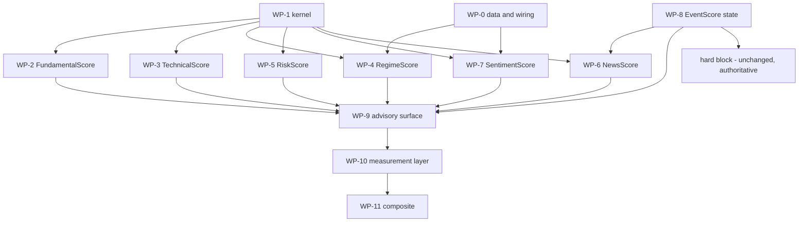

# Score engines — implementation plan

**Part of the score-engine design set: [`README.md`](README.md)** (master).
Siblings: [`FundamentalScore.md`](FundamentalScore.md),
[`TechnicalScore.md`](TechnicalScore.md), [`RegimeScore.md`](RegimeScore.md),
[`RiskScore.md`](RiskScore.md), [`NewsScore.md`](NewsScore.md),
[`SentimentScore.md`](SentimentScore.md), [`EventScore.md`](EventScore.md).

**What this document is.** The design set says *what* each engine is and *why*.
This says *in what order to build it*, *what each task produces*, *what proves it
done*, and *what must not be touched*. It is written from the eight documents
above, read end to end on 2026-09-17, with every existing-code anchor re-verified
at the definition site.

**What it supersedes, and what it repaired.** The master's §4 ("Wiring and
contracts") and §5 ("Phased plan") were **stubs** — the restructure of `68931f3`
left their bodies behind — and the master's §6 and §7 cited §3.7.x, §3.8.x,
§4.2, §5.2, §5.3 and §8.3, none of which exist any more. The wiring contracts are
§3-§8 below and the phase plan is §9; the master's §4 and §5 are now pointers to
them, and every dangling cross-reference in the master and in
[`FundamentalScore.md`](FundamentalScore.md) was repointed in the same pass. The
defects are recorded in the master's §3.3 — §14 of this document has the full
list of what the restructure dropped.

Status: **plan (2026-09-17). Nothing implemented.** No code has been written for
any engine, no gate has been added, and no weight in any document has been
measured.

---

## 0. How to use this document

**One workstream per engine, four cross-cutting.** `WP-0` is the data and wiring
prerequisites (nothing scores without it), `WP-1` is the shared arithmetic every
engine reuses, `WP-2`…`WP-8` are the seven engines, `WP-9`…`WP-11` are the
surface, the measurement layer and the composite.

**Every task carries four things.** The **deliverable** (a new module, a new
symbol in an existing module, a leaf, a config key); the **design anchor** (the
section of the engine document it implements); the **acceptance** (the observable
result, not "tests pass"); the **gate** (the config key that must default off).

**Three rules govern the whole plan and are not restated per task.**

1. **A test earns its place by failing.** Ground rule 4: each new test is proven
   failing under a targeted mutation of the code it guards — flip a direction
   sign, drop the coverage floor, remove the renormalisation, delete the band
   table. A test that cannot be made to fail is not a test.
2. **Nothing lands without a dark launch** (ground rule 10): one gate at a time,
   a labelled run on the same basket, `scripts/repro_check.py --evidence` diffed
   against the gate-off run, then `scripts/report_verify.py` and
   `scripts/verify_sweep.py` exiting 0 on `CONFIRMED`.
3. **A defect found while building is fixed on sight** (owner standing order 10)
   unless it would destroy user data or rewrite a decision contract the owner
   set; those two are asked about, not assumed.

**Sizes** are `S` (a day), `M` (a few days), `L` (a week or more) — relative,
from the documents' own "fix size" language where they give it, and marked
`[INFERENCE]` where they do not.

---

## 1. What is being built

### 1.1 The deliverable map

| # | Deliverable | New symbols | Gate | Prereq | Ready? |
| --: | --- | --- | --- | --- | --- |
| WP-0 | Data + wiring prerequisites | see §3 | — | — | **no** |
| WP-1 | Shared score kernel | `strategies/score_engine.py` | — (pure) | — | yes |
| WP-2 | `FundamentalScore` | `strategies/fundamental_score.py` | `enable_fundamental_score` | WP-1 | mostly |
| WP-3 | `TechnicalScore` | `strategies/technical_score.py` | `enable_technical_score` | WP-1 | mostly |
| WP-4 | `RegimeScore` | `strategies/regime_score.py` | `enable_regime_score` | WP-0.3-0.5, WP-1 | **no** |
| WP-5 | `RiskScore` | `strategies/risk_score.py` | `enable_risk_score` | WP-1 | mostly |
| WP-6 | `NewsScore` | `strategies/news_score.py` | `enable_news_score` | WP-1, WP-8 | **no** |
| WP-7 | `SentimentScore` | `strategies/sentiment_score.py` | `enable_sentiment_score` | WP-0.6, WP-1 | partly |
| WP-8 | `EventScore` state | `strategies/event_state.py` | `enable_event_state` | — | yes |
| WP-9 | The advisory surface | leaves + `run_card` block | per engine | WP-2…WP-8 | yes |
| WP-10 | The measurement layer | panel + IC/decile harness | `enable_score_panel_eval` | WP-2…WP-5 | partly |
| WP-11 | The composite | `strategies/trade_score.py` | `enable_trade_score` | WP-10 | **no** |

**Gate-name collisions to avoid, checked against `default_config.py`:**
`enable_factor_model` (:899) already means the **learned** advisory model
(`scripts/factor_model_train.py:7`, the qlib/finrl research artifact) and is not
free; `enable_factors` (:769) and `enable_regime` (:766) are documented **INERT**
(`.env.example:470-471`, asserted by `tests/test_gate_env_toggles.py:87-88`);
`enable_score_eval_rows` (:1048) already gates the IC harness and **is** consumed
(`scripts/strategy_quality_report.py:340`). The six engine gates above are
therefore new names, and WP-10 reuses `enable_score_eval_rows` rather than
inventing a second measurement switch.

**Note on the live configuration:** the owner's `.env` already turns on several
gates the documents describe as default-off (`ENABLE_SCORE_EVAL_ROWS`,
`ENABLE_GROWTH_SCORES`, `ENABLE_WEIGHTED_SENTIMENT_AGG`,
`ENABLE_CROWD_RATIO_BANDS` are `true`; `ENABLE_QUALITY_COMPOSITE` is `false`).
"Default-off" in this plan means the **shipped default**, which is what the
dark-launch protocol needs; it does not describe this deployment. A phase whose
producer is already on in `.env` must be diffed with the flag explicitly off, not
by assuming the default.

### 1.2 The dependency graph

**The critical path is WP-0 → WP-4 and WP-1 → WP-2 → WP-10.** RegimeScore cannot
start scoring until the market-level producers exist (§4.2 of its document says
so: *"five of the eight categories are computed from the analysed ticker's own
history — a RegimeScore built from those would be a second TechnicalScore under a
different name"*), and nothing may be weighted before WP-10 measures it.

### 1.3 Definition of done, per engine

An engine is done when **all six** hold:

1. Its document's §5 constraints are implemented as written, including the ones
   that restrict it (`TechnicalScore` sizes nothing; `RiskScore` never sizes;
   `NewsScore` reads no `sentiment.py` aggregate; `SentimentScore` reads no
   `news_relevance` function).
2. A `None`-everywhere input returns `score = None`, `coverage = 0` — never `0`,
   never `50` (each engine's verification section requires exactly this).
3. The printed block recomputes the printed score from its own attribution rows
   to within rounding.
4. The mutation tests of §0 rule 1 exist and fail before the fix.
5. The gate defaults off, the tool is absent from the toolset when off, and the
   gate-off run is byte-identical (the existing gate convention).
6. The score reaches no gate, no size, and no `SCORE_BANDS`; a test asserts it.

---

## 2. Invariants that bind every workstream

The master's seven cross-engine rules, each with the mechanism that enforces it.
An invariant without a mechanism is a comment.

| # | Rule (master §2) | Enforcement in this plan |
| --: | --- | --- |
| 1 | **`NA ≠ 0`** | WP-1's `combine` drops an absent component from both numerator and denominator and returns `coverage`; a test feeds a panel with one metric missing and asserts the score moves toward the mean of the present ones, never toward zero |
| 2 | **A score is not a rating** | no engine imports `decision_guardrail`; a test asserts the score appears in no `SCORE_BANDS` input and each engine carries its own band table |
| 3 | **One number, one producer** | every component row in §5 names its producer; a test asserts the score module imports no `sentiment`/`news_relevance`/`overlays` aggregate it should not (WP-6/WP-7) and that `EventScore`'s and `RiskScore`'s event keys are disjoint sets |
| 4 | **A composite never overrides a hard gate** | a test drives the executor's gate to `BLOCK` and asserts a maximal `TradeScore` changes nothing — the shape of the existing `risk_multiplier.combine` hard-flag test |
| 5 | **Measure, don't assume** | any value that can only be a constant is labelled a constant **in the output**, not only in the document: `fill_basis`, `trend_score (caller-supplied)`, the crowd bands |
| 6 | **No weight vector is invented** | every weight is the owner's, lives in one table per engine, is printed in `basis`, and a test asserts the printed vector equals the table used |
| 7 | **No `factor_score=NN` in prose** | a test in the shape of `tests/test_analyst_evidence_wiring.py` asserts no analyst prompt string requires a composite number; the score reaches the reader only through the structured leaf / `run_card` block |

**Four output types stay four** (master §1.4): score, scale, state, confidence. A
test asserts the regime sizing scale is not an input to `RegimeScore` and vice
versa.

**Direction is a property of the component, not of the engine** — with one
exception the whole set depends on: `RiskScore` is **inverted** (100 = low risk),
and a test asserts its alignment is inverted relative to its producers' native
loss sign.

---

## 3. WP-0 — the prerequisites

Nothing here is a score. Every item is either a producer that does not exist or a
binding that is on the wrong surface. **This workstream is the plan's critical
path** and is worth doing before any engine, because five engines read its
outputs.

### 3.0 The order

| # | Item | Blocks | Size |
| --: | --- | --- | --- |
| P0-1 | Structured SEC XBRL series (EPS / EBIT / D&A / equity) | WP-2 CAGR family, G4/G5 | M |
| P0-2 | The EODHD US panel (the validation universe) | WP-10 | M |
| P0-3 | Market-wide breadth from the panel already fetched | WP-4, WP-3 | M |
| P0-4 | VIX percentile (FRED) | WP-4 | S |
| P0-5 | VIX9D/VIX3M term structure | WP-4 | S |
| P0-6 | Short-interest percentile over the settlement series | WP-7 | S |
| P0-7 | The toolset bindings on the wrong surface | WP-7, WP-6 | S |
| P0-8 | The five remaining recorded defects | several | S-M |
| P0-9 | Vendor-capability probes (verify before designing on them) | WP-6, WP-7 | S |

### 3.1 P0-1 — a structured SEC XBRL series

**Why.** `FundamentalScore.md` §1.4 records that `annual_series` now stacks
revenue / net income / total assets / operating cashflow / ROA over 4 annual
periods, and that the CAGR family plus G-Score G4/G5 stay blocked on **EPS, EBIT,
EBITDA, FCF** and on the 5-period bar. `sec_edgar.get_financial_history:173` is
the only free source that clears it, and it does not feed the path.

**What exists, verified at the definition site.** `sec_edgar.py`:
`_TAG_MAP:56-65` holds **eight** labels over **eleven** candidate us-gaap tags
(Revenue ×2, NetIncomeLoss, NetCashProvidedByUsedInOperatingActivities,
PaymentsToAcquirePropertyPlantAndEquipment, Assets, Liabilities,
StockholdersEquity, CashAndCashEquivalentsAtCarryingValue);
`_COMPANYCONCEPT_URL:66` is `.../companyconcept/CIK{cik:010d}/us-gaap/{tag}.json`,
called **once per tag** in a nested loop (`:206-215`); the function returns a
**rendered markdown string** (`:255-273`) and discards its own structured
`by_tag` dict. So the CAGR path cannot consume it even though the values are
already in memory.

**Deliverable.** `sec_edgar.financial_history_series(ticker, years=15) -> dict`
returning the same `{label: {fiscal_end: value}}` structure the loop already
builds, plus the span; `get_financial_history` renders from it (one
implementation, two readers — ground rule 2). Extend `_TAG_MAP` with the tags the
CAGR family needs and that XBRL actually carries:
`EarningsPerShareDiluted`, `OperatingIncomeLoss`,
`DepreciationDepletionAndAmortization`, `GrossProfit`,
`NetCashProvidedByUsedInOperatingActivities` (present) — EBITDA is then
`OperatingIncomeLoss + D&A` and FCF is `OCF − capex`, both **derived in the
caller and labelled derived**, not fetched as a tag that does not exist.

**Two changes worth making in the same pass.** (a) Prefer the
`companyfacts` endpoint (`https://data.sec.gov/api/xbrl/companyfacts/CIK{cik}.json`)
— one request per company instead of one per tag (11 today), same JSON, and it
carries every tag at once, which is what makes the extension above cheap. The
SEC's published fair-access ceiling is **10 requests/second** per IP with a
descriptive `User-Agent`; the current `_UA:30` carries the placeholder contact
`research@example.com` and should name a real contact (§14 defect D-3).
(b) Keep the existing failure contract: a non-US ticker raises
`NoMarketDataError` and the caller treats it as `NA` — the series must **not**
fail a run for a foreign listing.

**Acceptance.** For a US filer, the series returns ≥5 annual periods for revenue,
net income, EPS, operating income and D&A with the span printed; for a non-US
ticker it returns `None`/raises the same `NoMarketDataError` the existing leaf
does and nothing downstream raises. `annual_series` consumes it and the G-Score
legs stop emitting "5-year ROA series unavailable (n=0)" where the data exists.

**Gate.** Extending a data adapter is not new behaviour: no gate, but the CAGR
factors built on it land behind `enable_fundamental_score`.

### 3.2 P0-2 — the EODHD US panel

**Why.** Owner decision Q4: the **full EODHD US panel** is the official
validation universe; the named basket is a development set labelled
`INSUFFICIENT_CROSS_SECTION` and may never produce authoritative weights
(`FundamentalScore.md` §0.5, master §7 Q4).

**What the vendor supports, checked 2026-09-17.** The bulk fundamentals endpoint
is stocks-only and needs the **Extended Fundamentals** plan (support-gated, not
on the public price list); it costs **100 API calls per whole-exchange request**
and **100 + N** when a `symbols` list is passed, with a **500-symbol** cap per
request and **JSON or CSV** output; paid plans are **100,000 calls/day** with a
**1,000 requests/minute** ceiling; the *snapshot* variant 404s on the generic
`US` code and needs `NASDAQ`/`NYSE`/`AMEX`/`BATS` individually. A single-ticker
fundamentals call is **10** calls.

**Deliverable.** `scripts/score_panel.py` (a script, not a strategy module): given
a date range and a universe, writes `data_cache_dir/panels/<date>.json` of
`{ticker: {metric: value}}` from the bulk endpoint, chunked to 500 symbols,
caching per date, never re-fetching a date that exists. It must **not** run in a
report path.

**Acceptance.** A panel for one trading date over the US universe exists on disk,
carries ≥ a few hundred names, records the call cost and the fetch timestamp, and
a second invocation makes zero network calls. `INSUFFICIENT_CROSS_SECTION` is the
label whenever the panel is below the cross-section floors — the label is a
tested output, not a comment.

**Gate.** `enable_score_panel_eval` (WP-10) for the *harness*; the script itself
is manual.

### 3.3 P0-3 — market-wide breadth, computed from data already fetched

**Why.** `RegimeScore.md` §1 marks market-wide A/D, new highs/lows and
percent-above-MA as ABSENT; §4 names the smallest honest producer, and it needs
**no new vendor**: `sector_breadth.multi_breadth:60` already takes a
`{name: closes}` map and returns per-key percentages, and the sector screens
already build that map in bulk
(`agents/utils/analysis_tools.py:3646-3748` over
`dataflows.sp500_universe.fetch_sp500_universe`).

**Deliverable.** `strategies/market_breadth.py::market_breadth(closes_by_name,
*, windows=(20,50,200)) -> dict` returning `{pct_above_<w>: 0-100, n,
advance_decline: int, new_highs: int, new_lows: int, coverage}` — the first three
from `multi_breadth`, the last three computed from the same map. `n`-gated the
way the sector path already is (`sector_screener.breadth_with_gate:511`): below
`n = 20` the row is `n/a`, not zero.

**Acceptance.** Over a synthetic map with known answers (3 of 5 names above the
200-day, 2 up on the day, 1 at a 52-week high) every key matches; an empty map
returns `None`, never 0. A real run prints the panel size beside the percentages.

**Note on the vendor alternative.** There is no free official US-universe breadth
API; third-party routes exist (Barchart's `getMomentum` exposes
`percentAbove200dMAtoday`; TheTradingTools publishes A/D and new-high/new-low
datasets) and are recorded in §15 as fallbacks only. The repo's own map is the
primary source, because it is the same data the sector screens already trust and
it needs no new vendor (ground rule 7).

### 3.4 P0-4 — VIX percentile

**Why.** `RegimeScore.md` §1: VIX exists only as a raw FRED level
(`dataflows/fred.py:68` alias `vix` → `VIXCLS`, leaf
`macro_data_tools.get_macro_indicators:9`, **news toolset only**), never as a
regime input.

**Deliverable.** A percentile rank of the latest `VIXCLS` value over its own
trailing history, reusing the existing shape (`regime.vol_percentile:49`), inside
the market-level regime path, plus binding the FRED read to the market surface.

**Acceptance.** A monotone synthetic series gives a percentile of 1.0 at the top
and 0.0 at the bottom; a 3-point history returns `None` (not a fabricated rank).

### 3.5 P0-5 — VIX term structure

**Why.** `RegimeScore.md` §1 and §4: the equity-IV slope
(`options_surface.term_structure_slope:152`) is **not** a VIX term structure, and
the document forbids substituting it silently.

**Sources, checked 2026-09-17.** FRED carries **VXVCLS** (Cboe 3-Month
Volatility, active; `VXOCLS` is the discontinued one) and **not** VIX9D; Cboe
publishes both as CSVs on its CDN
(`https://cdn.cboe.com/api/global/us_indices/daily_prices/VIX9D_History.csv`,
`.../VIX3M_History.csv`). VIX9D therefore needs the Cboe CSV, which is a **new
vendor-shaped dependency** and is why this item is listed separately from P0-4.

**Deliverable.** `dataflows/cboe.py::vix_term_structure() -> dict` reading the two
CSVs (cached under `data_cache_dir`, one fetch per day), returning
`{vix9d, vix3m, slope, state: contango|backwardation}` via the existing
`term_structure_slope` shape. If the CSVs are unreachable the key is `None` with
the reason printed — **never** the equity-IV slope under a VIX name.

**Acceptance.** Contango and backwardation fixtures map to the two states; an
unreachable source yields `None` and a printed reason.

### 3.6 P0-6 — short-interest percentile

**Why.** `SentimentScore.md` §1 marks short interest PARTIAL: a raw level with no
percentile or change basis, while the settlement series is already returned
(`yfinance_short_interest.get_short_interest_yfinance:37`,
`massive.get_short_interest_massive:485`).

**Cadence, checked 2026-09-17.** FINRA equity short interest is reported **twice
a month** (the 15th and the last business day settlement), published on the
**7th business day** after settlement, with an Equity API carrying **five rolling
years** and historical files back to 2014. Reg SHO **daily** short-sale volume is
posted by 18:00 ET of the trade date (a different measure — daily flow, not open
positions).

**Deliverable.** A percentile of current short % of float against the name's own
settlement series, beside the raw value and the series length. The direction
column states the sign explicitly: high short interest is **not** bullish
(`SentimentScore.md` §0.2 point 4).

**Acceptance.** A 6-settlement fixture gives a known percentile; a single
settlement returns `None` with the reason, not 0.5.

### 3.7 P0-7 — the toolset bindings on the wrong surface

Three bindings decide whether an engine can reach its own inputs. All three are
in `tradingagents/agents/toolsets.py`, verified:

| # | Today | Needed by | Action |
| --: | --- | --- | --- |
| P0-7a | `get_institution_holdings` is bound **only** at `:395` (`fundamentals_company_tools`); it also appears at `:105` in the module's import block, which is not a binding | `SentimentScore`'s institutional category (15%) | add it to `market_tools()`/the sentiment surface, or accept the category as unreachable and drop its weight. **Owner decision §13 Q4** |
| P0-7b | `get_analyst_revision_index` is bound only at `:393` (`fundamentals_company_tools`) | `NewsScore`'s analyst category (5%) | same choice, same decision (§13 Q4) |
| P0-7c | `get_market_breadth` is bound **only** to `news_tools()` (`:368`) | `TechnicalScore`'s breadth category, `RegimeScore` | bind to `market_tools()` as well — it is a market read |

**A fourth binding is a decision, not a fix:** `sentiment_analyst` binds **no
tools** and `analyst_toolset` raises `KeyError: 'sentiment'` (`toolsets.py:479`),
so every sentiment leaf reaches the engine only through the market or news
analyst. Whether a `sentiment_tools()` exists is §13 Q5.

### 3.8 P0-8 — the five recorded defects still open

From the master's §3.2 tail. Each is small, each has a named consequence, none is
a score. Fix on sight (standing order 10); the first is a real sizing bug.

| # | Defect | Evidence | Fix | Acceptance |
| --: | --- | --- | --- | --- |
| P0-8a | `events.position_mult_by_side`'s catalyst argument is inert | `strategies/events.py:42` uses `event_scale = catalyst if catalyst > 1 else 1.0`, while the only caller documents `catalyst` as `0..1` (`agents/utils/analysis_tools.py:2254`) and `catalyst.get_catalyst_scale` supplies ≤1 — so `event_scale` is **always 1.0** and the multiplier is only ever 1.0 (beat) / 0.5 (miss) | compare against the documented range (`catalyst <= 1`) or take a scale explicitly | a beat with a 0.25 catalyst scale produces a multiplier below the no-catalyst case; fails before the fix |
| P0-8b | `get_earnings_calendar`'s `look_back_days` names a **forward** window | `agents/utils/analyst_data_tools.py:33` vs `dataflows/finnhub.py:195-196` (`[curr_date, curr_date + look_back_days]`) | rename the parameter (and its callers) to a forward name; keep the value | the leaf's argument name matches the direction it queries; a small value truncates the forward window |
| P0-8c | `get_tail_risk` passes a **close-price series as an equity curve** to CDaR | `agents/utils/analysis_tools.py:4690` (`cdar(closes, …)`), `strategies/book_risk.py:174` | either feed it the weighted book or label the proxy in the output and refuse the name "CDaR" | the printed block says which series it is; `get_book_tail_risk`'s portfolio number is not confused with it |
| P0-8d | `book_risk.portfolio_cvar:28` and `book_risk.book_correlated_stress:128` re-implement the same cash-sleeve/equal-weight/normalise rules | `strategies/book_risk.py` ~50-60 and ~150-160 | extract the normalisation once (ground rule 2), both callers read it | a test changes the cash-sleeve rule in one place and both paths move |
| P0-8e | `get_macro_regime_read:6492` requires caller-supplied markers while the FRED leaves hold the same data | `macro_data_tools.get_macro_indicators:9`, `analysis_tools.get_credit_spread_read:4782` | derive the five markers from those two leaves when not supplied; a supplied value still overrides | with no arguments the label resolves from the run's own data; with arguments the override is labelled |

### 3.9 P0-9 — vendor-capability probes

Two plan items depend on a vendor capability nobody has verified in this repo,
and a probe is cheaper than a build that discovers the gap.

1. **EODHD `/sentiments` coverage** — `trading_graph._sentiment_factor_read:1178`
   hardcodes `source="eodhd"` (`:1235`) and returns `None` rather than falling
   back when EODHD has no coverage, while the leaf
   `analysis_tools.get_sentiment_lead_lag:6821` does fall back. Probe: how many
   names in the current basket return a non-empty sentiment series, and what the
   fallback order should be.
2. **The forward event calendars** (`EventScore.md` §4): FDA/clinical, court,
   investor day. Probe whether the existing moomoo economic-calendar adapter
   (`dataflows/moomoo.py:1758`) carries any of them before designing a new
   adapter on the `catalyst._calendar_window:394` pattern.

**Deliverable for both:** a recorded answer in the relevant engine document, not
code. A probe that finds nothing is a result — it moves the item to "ABSENT with
evidence".

---

## 4. WP-1 — the shared score kernel

**Why one module and not seven.** Seven engines need the same three operations:
align a raw value to a 0-100 favourable contribution, drop an absent component
from the denominator, and print the basis. Ground rule 2 (*one implementation per
computation*) and master rule 3 (*one number, one producer*) make seven copies a
defect by construction. The kernel is **three functions and no framework** — no
registry, no plugin table, no engine imports, no weights (weights are each
engine's own, master rule 6).

**Deliverable — `strategies/score_engine.py`**

| Symbol | Contract |
| --- | --- |
| `align(value, *, direction, band=None, lo=None, hi=None) -> float \| None` | `higher_better` / `lower_better` ramp, or a `band` lookup over the producer's own edges. `None` in → `None` out. Never returns a neutral 50 for a missing value |
| `combine(components, *, weights, min_coverage=3, bands=None) -> dict` | `{"score": 0-100 \| None, "coverage": present_weight/total_weight, "components": [...], "withheld": reason \| None, "basis": str}`; renormalises over present components; withholds below the floor **with its reason** — the semantics `factors._coverage_floor:245` and `quality_composite:256` already implement, extracted rather than re-derived |
| `band_label(score, bands) -> str` | the engine's own advisory band table (master rule 2 — nothing here touches `decision_guardrail.SCORE_BANDS`) |

**Non-goals, stated so they are not added later:** the kernel holds no weight
table, imports no engine, knows no ticker, and performs no I/O. Each engine's
module owns its component list, its directions, its band edges and its weights.

**Acceptance.**
1. `combine` on a synthetic panel with one component absent scores the mean of
   the present ones and reports `coverage` below 1 — mutation: substituting `0`
   for the absent component must fail the test.
2. `combine` with nothing present returns `score = None, coverage = 0` — never
   `0`, never `50`.
3. `align` on each of the six non-monotonic inputs (RSI, MFI, stochastic,
   StochRSI, RSI2, Williams %R, Bollinger %b, Elder thermometer) moves the mapped
   value the right way at the producer's own band edges — mutation: making one
   monotone must fail.
4. `basis` contains the weight vector actually used — mutation: changing a weight
   without changing `basis` must fail.
5. The withholding floor is tested from both sides (a name at the floor scores, a
   name below it is withheld with its reason).

**Gate.** None — a pure module with no caller is inert. Its behaviour is gated
where it is used.

---

## 5. The engines

Each workstream below follows the same shape: objective, prerequisites,
deliverable, component map (which producer each category reads), build order,
acceptance, and the decision that gates it.

### 5.1 WP-2 — `FundamentalScore`

**Objective.** The four category sub-scores and their composite, over the
existing 106-factor ledger, with the weight chain of `FundamentalScore.md` §3.2
and the status vocabulary of §3.1. **Advisory only** — owner Q1 keeps
`opportunity_score` `null` (`execution_contract.opportunity_score:240`, validated
at `:363-370`).

**Prerequisites.** WP-1; P0-1 for the CAGR family; nothing else — the document's
§2 ledger marks all 106 factors, and the sub-score metric sets in §3.1 are chosen
**only from factors already COMPUTED** so the first phase ships something real.

**Deliverable.**

| Symbol | What |
| --- | --- |
| `strategies/factors.py` — the shared core renamed, not forked | `category_scores(scores_by_ticker, *, directions, weights, min_coverage, sector_map, industry_neutral, min_peers)` — the existing `quality_composite:256` body, extracted so four sub-scores are thin wrappers (ground rule 2) |
| `strategies/fundamental_score.py` | `FQS` / `FGS` / `VS` / `FRS` wrappers with their own metric sets and band tables, plus `fundamental_score(...)` combining them over present sub-scores |
| `strategies/factor_schema.py` | the schema record of §3.2 (`factor`, `category`, `formula`, `direction`, `base_weight`, `sector_scope`, `normalization_method`, `supplier`, `availability`) |
| `dcf_confidence` | §3.4's four legs, returning a 0-1 score, the legs and the thresholds; **the DCF upside factor is scaled by it** |
| leaf `get_fundamental_score` + a `run_card` block | WP-9 |

**Build order** — the document's own §3.6 ranking, which is value ÷ effort, with
P0-1 slotted at rank 8:

1. `interest_expense` → interest coverage (#64, #98) — an alias with zero
   consumers; the single highest-value line in the ledger.
2. Level ROIC (#1) + invested-capital turnover (#84) — `invested_capital` is
   already built (`agents/utils/value_dip_tools.py:435-513`), only the division
   is missing.
3. Buyback yield (#92) + total shareholder yield (#94) — `share_buybacks` has no
   consumer; `scripts/value_screener.py` already promises it.
4. OCF yield (#28), FCF margin (#29), FCF/NI (#31) — three divisions.
5. The leverage family (#60, #63, #67, #71) — needs the EBITDA helper that is
   already inline at `strategies/ratios.py:162`.
6. Gross margin + EBIT-margin series + margin stability (#6, #8, #10, #11) —
   `dataflows/statement_parsing.py:841` already stores the value.
7. EV/FCF (#55).
8. P0-1, then the CAGR family (#14, #17, #18, #20, #23, #38, #90) and the G4/G5
   legs.
9. Normalized FCF yield (#42), FCF stability std (#37), cash-conversion
   stability (#39).
10. Asset growth numeric (#76), receivable/inventory days (#77, #78), WC/assets
    (#69), debt growth numeric (#70).

**Explicitly not in Phase A** (the document's own list): deferred revenue (#79,
no canonical key), debt-maturity risk (#100, no data), capital-employed turnover
(#85, no definition), Dechow-Dichev (unreachable as wired).

**Acceptance.** (a) A name with 3 of 7 metrics present scores on those 3 and
prints its coverage; (b) `basis` names the metric set, the floor, the weight
vector and whether the weights were equal or published; (c) the printed
sub-scores recompute the composite; (d) `dcf_confidence` moves the DCF upside
factor — a low-confidence DCF contributes less with no prose involved; (e)
nothing writes `opportunity_score`, and the reason string is present and stable.

**Gate.** `enable_fundamental_score` (new). The existing `enable_quality_composite`
continues to gate the pre-existing `quality composite` row and is not reused.

### 5.2 WP-3 — `TechnicalScore`

**Objective.** Nine category sub-scores and the composite over components that
mostly exist. The document's §0.1 answer stands: **no composite technical score
exists anywhere**, so this is a new aggregation, not a rename.

**Prerequisites.** WP-1; P0-3 for the breadth category; the small wiring fixes
below; the per-name RS legs.

**The direction problem comes first.** §0.3 lists six non-monotonic inputs whose
producers already disagree about which end is good. The composite **never ramps a
raw indicator** through a naive mapping: every non-monotonic input is
**band-mapped using the producer's own edges**, and the raw value prints beside
the mapped contribution.

| Input | Producer | Band source |
| --- | --- | --- |
| RSI | `swing.rsi:39`, `swing.rsi_band:118` | 45-70 `strong`, >70 `hot`, <40 `broken` |
| Stochastic K/D | `technical_factors.stochastic_oscillator:146` | `<20 oversold` |
| StochRSI | `technical_factors.stoch_rsi:283` | `<0.2` |
| RSI2 | `technical_factors.rsi2:315` | `<10` |
| Williams %R | `technical_factors.williams_r:338` | `-80..-100` |
| Bollinger %b | `value_dip.bollinger_pct_b:75` | `<=0` dip, `>1` extended |
| MFI | `technical_factors.mf_index:112` | `>80` overbought |
| Elder thermometer | `technical_factors.elder_thermometer:476` | `quiet` (`<0.8`) is the good dip read |

**Wiring the missing inputs** (each is small and each is a prerequisite for one
category):

| Missing | Smallest honest producer |
| --- | --- |
| MACD line / histogram **values** and slope | promote `value_dip._macd_hist:500` to public and surface the three series in `get_extended_indicators`; slope = last minus prior bar (the same delta `rule_eval.rule_signal_macd_hist_rising:103` already computes) |
| RSI slope | promote `value_dip._rsi_series:470` (already a full Wilder series) and reuse `relative_strength.slope_pct:49` |
| momentum 5D | `extended_indicators.roc:149` is already parameterised: `roc(closes, 5)` |
| ATR percentile (per-name vol percentile) | the loop already written for realized vol at `etf_risk.etf_risk_profile:163-172`, with `size.atr:131` in place of `_realized_vol:69` |
| OBV **value** (not just divergence) | return the cumulative OBV that `technical_factors.obv_divergence:396` already computes locally at `:404` and discards |
| per-name RS vs QQQ and the sector ETF | call `relative_strength.relative_strength_report:132` once per benchmark (it is benchmark-agnostic); the sector map exists (`sector_rank.sector_group_of:163`) |
| market-wide breadth | P0-3 |

**Deliverable.** `strategies/technical_score.py::technical_score(components, *,
weights=None) -> dict` over the already-computed component dicts — **no new
fetch** (all inputs are the run's OHLCV, loaded by `analysis_tools._ohlcv:236`),
plus the leaf and the `run_card` block.

**Acceptance.** (a) Each band row's mapped value moves the right way at the
producer's own edges — RSI 45-70 must not score lower than RSI 80; (b) coverage
drops by exactly the missing category's weight and the score moves toward the
mean of the present categories; (c) all-`None` returns `None`/0 coverage; (d) a
reader recomputing `Σw·s / Σw` from the printed attribution gets the printed
score; (e) `TechnicalScore` never touches `risk/sizing.py`.

**Gate.** `enable_technical_score`.

### 5.3 WP-4 — `RegimeScore`

**Objective.** The environment, not the name. **Prerequisites first, and they are
the whole workstream** — the document's §5.1 ordering is binding:

| Order | Item | Why first |
| --: | --- | --- |
| 1 | Market-level trend on SPY/QQQ/IWM | without it the engine measures the name, not the environment (`get_regime_read` reads the analysed ticker's own closes) |
| 2 | Market-wide breadth (P0-3) | the data is already fetched for the sector screens |
| 3 | VIX percentile (P0-4) | turns a raw level into a regime input |
| 4 | VIX term structure (P0-5) | the equity-IV slope is not a substitute |
| 5 | The canonical-path decision (§13 Q1) | until one path is named, a score is a third label for one word |
| 6 | The score | only then is there something to weight |

**Deliverable.** `strategies/regime_score.py::regime_score(...)`, one producer
named per component, plus the two-path disagreement output: when
`get_regime_read`'s label and `get_regime_state`'s four axes disagree, **both are
printed with their names and neither is reconciled silently** (the failure mode
the document's verification section names).

**Acceptance.** (a) The label moves when the trend moves — with `vol_pct == 0.5`,
a strong positive and a strong negative trend must not produce the same label
(this is the regression for the already-fixed defect 1); (b) a regime score with
no market data returns `None`, never a neutral 50; (c) the score never appears in
a directional field (no "bullish because RegimeScore 68"); (d) the sizing scale
is not an input to the score and vice versa.

**Gate.** `enable_regime_score`. Note `enable_regime` (`:766`) is **inert** and
must not be revived as the gate.

### 5.4 WP-5 — `RiskScore`

**Objective.** A 0-100 risk composite, **inverted** (100 = low risk), over the
eight categories whose components all exist. The document's §0.1 answer stands:
no `risk_score|RiskGrade|risk_band` producer exists anywhere.

**The conventions are pinned first** (§0.3), because three incompatible ones
already ship:

| Quantity | Pinned convention | Producers that differ |
| --- | --- | --- |
| Tail loss | **positive loss as a fraction of book equity** | `book_risk.cvar:18` (negative), `book_correlated_stress:128` / `stress_loss:123` (positive), `min_cvar_weights` (positive, `book_risk.py:713`), executor `tail.ESResult.value_pct` (`tail.py:56`) |
| Drawdown | **positive magnitude** | `evaluate.max_drawdown:108` / `portfolio_drawdown:100` (positive), `regime_state.regime_drawdown:146` (negative + band), `signald/engine.py:115` → `state.py:75` (negative, emitted `gate.py:865`) |
| Correlation | **largest-cluster share of book** (a labelled proxy) | `risk_governor.default_limits:20` (% of book), `mandate.py:51-52` (dollar notional), `config.cluster_cap_pct:109` at `gate.py:369` (cluster) |

**The alignment happens in the score, visibly — never by changing a producer**,
which would break that producer's other readers. Every component row prints its
raw value with units and sign beside its aligned contribution.

**Deliverable.** `strategies/risk_score.py::risk_score(components) -> dict`; a
`net_beta` producer in the executor's book builder (`sum(w_i · beta_i)`, with
`etf_risk._beta:38` as the per-name beta — the field is `None` today and a frozen
dataclass cannot be assigned post-hoc); the book-level components either in the
executor or in a book-mode of the same function (§13 Q3).

**Acceptance.** (a) A known negative CVaR and a known positive `stress_loss`
align to the same favourable direction; (b) a missing correlation input *raises*
coverage-weighted uncertainty and never lowers the score; (c) no-data returns
`None`; (d) the value appears in no `GATE_PRECEDENCE` check and no
`risk_multiplier` input; (e) the score reads `book_context.measured_book_drawdown:102`
and **not** `regime_state.regime_drawdown:146` (opposite signs); (f) the printed
contributions recompute the printed score.

**Gate.** `enable_risk_score`.

### 5.5 WP-6 — `NewsScore`

**Objective.** *What new information arrived, and how material is it?* — and it
**ships last**: five of nine categories are ABSENT and the largest weight
(materiality, half of 20%) has no producer.

**Prerequisites.** WP-1; WP-8 (materiality may be EventScore's number, §13 Q6);
P0-7b for the analyst-revision category.

**Build order** (the document's own value ÷ effort):

| Order | Item | Why |
| --: | --- | --- |
| 1 | **Novelty** (15%) | known recipe (similarity to the previous stories about the firm), data present (article timestamps from every vendor; the normaliser `sentiment._normalise_headline:604` already exists for syndication dedupe), sign known (stale news reverses) |
| 2 | **Materiality** (half of 20%) | the largest weight has no producer; derivable as `|expected/implied move| × event-class weight` from `catalyst.implied_move_from_history:111` plus the print-day volume ratio — or read from EventScore (§13 Q6) |
| 3 | **Persistence / volume acceleration** (5%) | `sentiment.mention_volume:43` and `sentiment.decayed_weight:91` already exist; this is wiring, not building |
| 4 | **Corporate-event typing** (10%) | extend `sec_edgar._FORM_LABELS:36` and add a keyword classifier over `get_news`, **printing its basis** |
| 5 | **Guidance change** | needs a source the engine does not have; do not fake it from the EPS estimate |
| 6 | **Fundamental impact** (20%) | needs an estimate history (`analyst_revisions.estimate_change_index:176` documents exactly this absence); the honest answer today is `NA` |

**The boundary is enforced by naming** (§0.3): the engine reads the news pipeline
(`news_relevance`, `events`, `text_factors`, SEC form typing, the revision index)
and **no `sentiment.py` aggregate**. Where the two engines share a source, they
must not share a number.

**Acceptance.** (a) A repeated headline within the window scores lower than a
first-seen one; (b) relevance alone cannot raise the composite — the two are
independent inputs; (c) no `sentiment.py` aggregation function is imported by the
news path; (d) the five absent categories print `NA` **with a reason**, never 0;
(e) with the five fed `None` the score is `None` at 0% coverage.

**Gate.** `enable_news_score`.

### 5.6 WP-7 — `SentimentScore`

**Objective.** *How is the market positioned around it?* The headline output is
**not** the score but the **quadrant** — `Sign(dSentiment) × Sign(abnormal
return)` over {confirm-up, confirm-down, diverge-up, diverge-down} — because the
owner's rule is *"don't assume positive sentiment is bullish"*.

**Prerequisite zero — pin the unit.** The news-sentiment route carries **two
scales behind one name**: EODHD/Alpha Vantage deliver −1..1, **GDELT delivers
−100..100** (`gdelt.get_news_sentiment_gdelt:278`, `_sentiment_points_gdelt:250`,
routed at `interface.py:488-492`) and the category is advertised as −1..1
(`interface.py:187`, `news_data_tools.get_news_sentiment:110`). A GDELT-sourced
`sma_7d` is therefore ~100× an EODHD one. GDELT's own documentation confirms the
scale: tone runs **−100 (extremely negative) to +100 (extremely positive)**, with
most values in the **−10..+10** band. The fix is a normalisation **plus a stated
source**, because the distributions differ even after dividing by 100 — a test
asserts a GDELT series and an EODHD series over the same window produce
comparable `sma_7d`/`innovation`, or the code refuses to mix them.

**The four holes** (§0.1), each with a producer that already exists:

| Hole | Producer |
| --- | --- |
| 20-day momentum (`Sentiment_today − Sentiment_20d`) | add the delta beside `sma_7d` in `sentiment.daily_sentiment_sma:501`, calendar-reindexed and `None`-safe |
| Acceleration | surface `sentiment.sentiment_velocity:25` (OLS slope/day, `window=5`) — it has no production caller today |
| Per-source breadth | per-day `mean(s>0)` plus a per-host breakdown from the rows `aggregate_weighted_sentiment:616` already holds (`_article_url:612` gives the host) |
| Institutional | bind `get_institution_holdings` to the sentiment/market surface (P0-7a) and use the period-over-period Δ in % of float, z-scored |

**Also in scope, as recorded defects:** `_sentiment_factor_read:1178` hardcodes
`source="eodhd"` (`:1235`) and returns `None` instead of falling back, and its
`rank_ic` is a **single-name self-correlation** (`:1216-1230`), not the
cross-sectional IC the confirmation check implies. The quadrant replaces it.

**Acceptance.** (a) The scale test above; (b) four fixtures produce four distinct
quadrant labels; (c) `mention_volume` (attention) and the tone aggregate enter as
**separate** components and are never summed; (d) the gated producers
(`enable_weighted_sentiment_agg`, `enable_crowd_ratio_bands`) are exercised in
the test so a default-off flag cannot hide a broken path; (e) the crowd bands stop
being hardcoded 40/60 and become a percentile of the name's own persisted
baseline, or stay labelled constants.

**Gate.** `enable_sentiment_score`. `enable_sentiment_factor` (`:815`) keeps
gating the existing sizing multiplier and is a **different object**.

### 5.7 WP-8 — `EventScore`

**Objective.** *Is a high-impact event happening right now?* — occurrence and
imminence. The owner gave **no weight table**, and the document explains why that
is coherent: every existing producer is a multiplier, a day-count or a boolean,
so there is nothing to weight yet. **This plan does not invent weights.**

**Deliverable, in three layers** (the document's §5):

| Layer | What | Status |
| --- | --- | --- |
| 1 | `imminence(days_until, horizon) -> clamp(1 − days/horizon, 0, 1)` over `next_earnings.days_until`, `macro_imminence.min_days`, `fed_imminence.days_until`, `opex_status.days_to_next` | new, mechanical, **no new fetch** |
| 2 | The window flags (`in_opex_week`, `post_opex_unwind`, `catalyst_window`) and the **hard block**, printed as a structured event state `{families, imminence, hard_block, coverage: 4/7}` | exists; the block stays **authoritative** |
| 3 | A 0-100 score | only if the owner wants one (§13 Q7) — it needs a per-family severity weight and a normalisation that do not exist |

**The block must not move.** `catalyst.build_catalyst_snapshot:219` sets
`hard_block` **only** on earnings (`catalyst.py:284-288`, default 5 days,
`default_config.py:793`); macro, Fed and OPEX never set it. The executor's 17
`GATE_PRECEDENCE` checks (`TradingExecution/signald/contracts.py:42`, verified:
mandate, sleeve_capital, house_drawdown, house_cvar, correlation_stress,
vol_regime, market_regime, knife_guard, concentration, liquidity, cost, wash,
shortability, data, time, halt, approval) contain **no event check**, so the
engine's snapshot is the only event fail-closed path and **no score may gate on
itself**.

**Acceptance.** (a) The imminence scalar is monotone and bounded — 0 days → 1,
≥ horizon → 0, `None` → `None` (never 0); (b) a macro-only window does not block;
(c) with one family absent, coverage drops by that family and the state still
renders; (d) `EventScore`'s and `RiskScore`'s event components are **disjoint key
sets**; (e) no event path reaches `GATE_PRECEDENCE` through a score.

**Gate.** `enable_event_state`. Note `enable_events` (`:770`) is already **on by
default** and gates the existing PEAD/catalyst sizing — a different object.

---

## 6. WP-9 — the advisory surface

**Objective.** Get the numbers to the reader **without letting them become
prose** (owner Q5: a bare `factor_score=NN` in a sentence "creates an apparent
objective ground truth").

**Deliverable.**

| Surface | Shape |
| --- | --- |
| Tool leaves | one per engine, bound to the toolset its engine's document names, printing the score, the coverage, the per-component raw value **with units and sign**, the aligned contribution, the band label and the basis string |
| `run_card` block | one additive key per engine (`fundamental_score`, `technical_score`, `regime_score`, `risk_score`, `news_score`, `sentiment_score`, `event_state`) with `status` (`ADVISORY`/`RESEARCH_ONLY`/`VALIDATED`), `confidence`, `coverage`, `basis` — the assembly points are `reporting._run_card_evidence:729` and its siblings |
| The no-prose rule | narrative states quality in words; a test in the shape of `tests/test_analyst_evidence_wiring.py` asserts no analyst prompt string requires a composite number |
| `opportunity_score` | stays `null`; gains a producer-owned `opportunity_score_reason` (`execution_contract.py:240-252`, validation at `:363-370`) |

**Acceptance.** (a) With every gate off, no engine tool exists in any toolset and
the run output is byte-identical; (b) with a gate on, the block appears and its
attribution recomputes the score; (c) the reason constant is present and stable
when the `opportunity_score` key is added; (d) `scripts/report_verify.py` exits 0
on a run whose report quotes a score.

---

## 7. WP-10 — the measurement layer

**Objective.** Nothing gets a weight until it has been measured. Owner Q4: the
full EODHD US panel is the validation universe; the named basket is
`INSUFFICIENT_CROSS_SECTION` and may never produce authoritative weights.

**Prerequisites.** P0-2; at least WP-2 (the most complete engine) to measure.

**The harness already exists** — `alpha_health.score_evaluation_rows:440` returns
IC + ICIR, deciles + monotonicity, coverage and stability over any
`{date: {ticker: score}}` panel, gated by `enable_score_eval_rows` (`:1048`,
consumed by `scripts/strategy_quality_report.py:340` and
`scripts/repro_check.py:77`). What is missing is **a caller that builds a
fundamental panel** and the discipline around it.

**Deliverable.** `scripts/score_panel_eval.py`: build the panel (P0-2), run the
existing rows, then apply the existing multiple-testing machinery that is already
in the repo and unused on fundamentals — `evaluate.purged_cpcv_splits`,
`deflated_sharpe`, `pbo_flag`, `reality_check`, `spa` — and emit, per factor and
per sub-score: IC, rank IC, ICIR, decile spread, monotonicity, turnover,
persistence, sector and regime robustness, redundancy against the other factors,
and the OOS split.

**The redundancy matrix is the gate on the weight tables.** `TechnicalScore` puts
**50%** of its weight on trend + momentum + relative strength, which are
correlated by construction (the evidence ledger: trend filters, MA rules and
TSMOM harvest **one latent factor**); `FundamentalScore`'s FCF-yield /
price-FCF / normalized-FCF-yield / earnings-yield cluster is the same problem. The
pairwise correlation matrix over the panel is what turns the owner's weights from
a hypothesis into a measured starting point.

**Acceptance.** (a) A panel below the cross-section floors reports
`INSUFFICIENT_CROSS_SECTION` and yields **no weight vector** — the label is a
tested output, and dropping it must fail a test; (b) a synthetic panel with a
planted predictive factor produces a high rank IC and a monotone decile spread,
and pure noise produces neither; (c) the redundancy matrix is emitted with the
factor names; (d) `metric_reconcile`/`disagreement_flag` fire on a synthetic
two-vendor disagreement, proving the confidence leg can fail.

**Gate.** `enable_score_eval_rows` (existing) for the harness; the panel script is
manual.

---

## 8. WP-11 — the composite and the gate boundary

**Objective.** Combine the engines — **last**, and only over measured inputs.

**Three objects, three names, and they must not share one** (master §1.4):

| Object | Definition | Status |
| --- | --- | --- |
| `TradeScore` | `0.40·F + 0.25·T + 0.15·R + 0.20·K` over four engines | the **decision** composite sketch; weights withdrawn by the owner as production weights, awaiting its own name (§13 Q2) |
| the research allocation | `35 / 20 / 15 / 15 / 7.5 / 7.5` over Fundamental / Technical / Regime / Risk / News / Sentiment | the **research** allocation; EventScore has no weight in it |
| `OpportunityScore` | a separate **validated** 0-100 measurement | stays `null` (owner Q1) |

**The gate-order conflict stays flagged, not resolved.** The owner's first diagram
puts the hard gates **before** sizing; his staged diagram puts them **after**. The
engine implements **gates-before-sizing** (the verdict feeds
`strategies/risk/sizing.py:144`) and this plan keeps it, because a gate *after*
sizing must unwind a size it has already authorised. If the staged order is
wanted, that is a contract change, not a diagram fix (§13 Q8).

**What the composite may never do.** It never overrides a hard gate: 17
fail-closed checks live in `GATE_PRECEDENCE`, the risk governor never reads a
score, and `risk_multiplier.combine` zeroes the soft product when a hard flag
fires. The acceptance case is `F 92 / T 85 / R 78 / K 35` → *"high quality, strong
setup, favourable regime, high risk → NO NEW RISK"* — which the repo already
implements.

**Deliverable.** `strategies/trade_score.py` (advisory, printed, gated by
`enable_trade_score`), plus the promotion ladder for any fitted vector:
`RESEARCH_ONLY → VALIDATED → CONTRACT_MIGRATION → PRODUCTION`, each step
evidenced, none automatic (owner Q2).

**Acceptance.** (a) A maximal `TradeScore` changes nothing when the executor's
gate is `BLOCK`; (b) the composite reaches no `SCORE_BANDS`, no
`opportunity_score`, no sizing input; (c) the printed weights are the weights
used; (d) an unvalidated vector is labelled `RESEARCH_ONLY` and is not
promotable by configuration alone.

---

## 9. The phases

Six phases. Each is **default-off**, each flips **one gate at a time** under the
dark-launch protocol, and each has an exit criterion that is an observable, not a
feeling. A phase that cannot state its exit criterion does not start.

### Phase 0 — the ground (WP-0 + WP-1)

**Entry:** none. **Deliverables:** P0-1…P0-9 and `strategies/score_engine.py`.

**Exit criteria.**
- The SEC series returns ≥5 annual periods for a US filer and degrades cleanly
  for a non-US ticker.
- A breadth read over a real panel prints its `n`; a synthetic map matches its
  known answers.
- VIX percentile and (if the Cboe CSVs resolve) the VIX9D/VIX3M slope are
  available with `None` + reason when they are not.
- The five recorded defects (P0-8) are fixed with failing-first tests.
- The kernel's five acceptance tests pass, including the three mutations.
- **Suites unchanged:** engine **4402 passed / 5 skipped**, executor **1105**,
  web **149** (the baselines at `0ce42b3`; new tests raise the count and the plan
  records the new number in the same commit).

### Phase A — the kernel in production, on one engine (WP-2, WP-3)

**Entry:** Phase 0. **Why these two:** `FundamentalScore`'s valuation category is
the most complete (13.25 of 21.25) and `TechnicalScore`'s components all exist —
so both can ship a real, coverage-printed score without a single new vendor.

**Exit criteria.**
- `get_fundamental_score` and `get_technical_score` exist, gated off, and the
  gate-off run is byte-identical to the current run.
- The four sub-scores print, with coverage and basis, on the named basket.
- The band rows are tested at their producer's own edges; the coverage floor is
  tested from both sides.
- `dcf_confidence` scales the DCF upside factor.
- Dark launch: gate on, same basket, `scripts/repro_check.py --evidence` diff
  reviewed; `report_verify.py` and `verify_sweep.py` exit 0 on `CONFIRMED`.

### Phase B — the environment, the risk, the event state (WP-4, WP-5, WP-8)

**Entry:** Phase 0 (P0-3/4/5) and Phase A (the kernel proven on two engines).

**Exit criteria.**
- `RegimeScore` reads **one named producer per component**, prints the two-path
  disagreement rather than reconciling it, and returns `None` with no market data.
- `RiskScore`'s three pinned conventions are asserted at the boundary (a negative
  CVaR and a positive `stress_loss` align the same way); the drawdown resolver is
  single; `net_beta` has a producer.
- `EventScore`'s imminence scalars are monotone and bounded; the hard block is
  untouched and still fires only on earnings; the event keys are disjoint from
  `RiskScore`'s.
- The `position_mult_by_side` sizing bug (P0-8a) is fixed before any of this is
  wired into a report.

### Phase C — measure, don't assume (WP-10)

**Entry:** Phase A (and preferably B). **This is the phase that turns weights
from hypotheses into measured starting points, and the one most likely to
invalidate a design assumption** — including the possibility that a category
carries no incremental information and should be dropped.

**Exit criteria.**
- The EODHD panel exists for the validation window, with its cost and coverage
  recorded.
- Per-factor IC / rank IC / ICIR / decile spread / monotonicity / turnover /
  persistence are emitted, with the OOS split and the multiple-testing checks.
- The redundancy matrix is emitted; the 50% trend+momentum+RS block in
  `TechnicalScore` and the FCF-yield cluster in `FundamentalScore` are reported
  with their pairwise correlations.
- Any panel below the floors is labelled `INSUFFICIENT_CROSS_SECTION` and
  produces no weight vector.
- **A written finding per engine**: which categories survived, which are
  redundant, which should be dropped, and what the measured weights are.

### Phase D — the remaining engines (WP-6, WP-7)

**Entry:** Phase B (EventScore exists) and Phase C (the measurement discipline).
`NewsScore` ships last by the owner's own ordering; `SentimentScore` needs its
scale pinned first.

**Exit criteria.**
- The GDELT/EODHD scale test passes or the code refuses to mix the two.
- The confirmation quadrant produces four distinct labels.
- `NewsScore`'s absent categories print `NA` with reasons and the composite
  reports its coverage.
- No cross-engine number: the news path imports no `sentiment.py` aggregate and
  the sentiment path imports no `news_relevance` function.

### Phase E — the composite (WP-11)

**Entry:** Phase C, with at least one validated vector. **Never automatic.**

**Exit criteria.**
- `TradeScore` (or its successor name) prints its weights, its status and its
  coverage, and reaches no gate, no size and no `opportunity_score`.
- The hard-gate test passes: a maximal composite changes nothing on a `BLOCK`.
- The promotion ladder is documented and enforced by a test that an unvalidated
  vector cannot be promoted by configuration.

---

## 10. Sequencing, parallelism and the collision map

**Parallel-safe.** After Phase 0 and the kernel, these share no files and can run
concurrently: WP-2 (fundamental), WP-5 (risk), WP-8 (event state), and WP-3's
component-wiring subset. WP-4 and WP-6 depend on Phase 0 items; WP-7 depends on
P0-6/P0-7.

**The shared-file collision map.** These files are read by several workstreams and
must have **one owner at a time**; a concurrent edit is a merge hazard, not a
conflict to resolve later:

| File | Touched by | Rule |
| --- | --- | --- |
| `tradingagents/agents/toolsets.py` | WP-2…WP-8 (every leaf binding) + P0-7 | **one owner per phase**; all leaf bindings for a phase land in one commit |
| `tradingagents/default_config.py` | every workstream (its gate) | gates added **one per commit**, with the registry test updated in the same commit |
| `tradingagents/agents/utils/analysis_tools.py` | WP-3, WP-4, WP-5 (leaves) | serialize; the file is large and every leaf edit races |
| `tradingagents/reporting.py` | WP-9 (the `run_card` blocks) | serialize — one additive block per commit |
| `tradingagents/strategies/factors.py` | WP-2 (the shared core) | **frozen during Phase A** except for the rename, which lands first, alone |
| `tradingagents/graph/trading_graph.py` | WP-4, WP-5, WP-8 (folds) | serialize |

**Integration owner.** One named owner per phase owns the gate flip and the
dark-launch diff; sibling workstreams hand their module to that owner rather than
flipping a gate themselves.

---

## 11. Verification and acceptance

**Consolidated from every document's verification section, plus the master's §6.
A run is not done until all of these hold.**

### 11.1 Structural (every engine, every phase)

| # | Requirement | Test shape |
| --: | --- | --- |
| 1 | `NA ≠ 0` | a panel with one component absent renormalises and reports coverage; mutation: substituting `0` must fail |
| 2 | A no-data run returns `None`, never `0` and never `50` | all-`None` fixture per engine |
| 3 | The printed attribution recomputes the printed score | recompute from the block's own rows |
| 4 | `basis` contains the weight vector actually used | mutation: change a weight, `basis` must change |
| 5 | The score reaches no gate, no size, no `SCORE_BANDS` | grep + a `BLOCK`-gate test |
| 6 | The gate-off run is byte-identical | existing gate convention; `scripts/repro_check.py` |
| 7 | Direction is pinned per component | inverting an alignment moves the score the other way; `RiskScore` is inverted relative to its producers' loss sign |
| 8 | The five polarity conflicts stay declared (RSI, MFI, stochastic, the elder thermometer, support-proximity) | mutation: making one monotone must fail |
| 9 | Score ≠ scale ≠ state ≠ confidence | the regime scale is not an input to the score and vice versa |
| 10 | No score in prose | the `test_analyst_evidence_wiring.py` pattern |

### 11.2 Per-engine specifics

Each engine's own verification list is binding and is reproduced in its document
(`TechnicalScore.md` §6, `RegimeScore.md` §6, `RiskScore.md` §6,
`NewsScore.md` §6, `SentimentScore.md` §6, `EventScore.md` §6). Three are worth
naming here because they are the ones a build is most likely to skip:

- **`RegimeScore`:** the two paths are tested **for disagreement**, not merged —
  the failure mode to prevent is silent reconciliation.
- **`SentimentScore`:** the gated producers are exercised **in the test**, so a
  default-off flag cannot hide a broken path.
- **`EventScore`:** `hard_block` fires only on earnings, pinned by a test — until
  the extension is decided (§13 Q7).

### 11.3 Run-level acceptance

| Check | Command | Expected |
| --- | --- | --- |
| Engine suite | `py -3.12 -m pytest tests -q --timeout=900` | baseline 4402 + the new tests; 5 skipped |
| Executor suite | `py -3.12 -m pytest tests -q` (in `TradingExecution`) | baseline 1105 |
| Web suite | `py -3.12 -m pytest tests -q` (in `trading_web`) | baseline 149 |
| Report verification | `py -3.12 scripts/report_verify.py --report-dir reports/<TREE>` | exit 0 on `CONFIRMED` |
| Verification sweep | `py -3.12 scripts/verify_sweep.py --tree reports/<TREE> --json` | no new `SUSPECT` |
| Repro diff | `py -3.12 scripts/repro_check.py --evidence` | gate-off identical; gate-on diff reviewed line by line |
| Live smoke | a production `batch.py` run on the named basket, `TRADINGAGENTS_ANALYST_FORCED_TOOLS` **popped** | the new block prints; no meta-statement flags |

---

## 12. Risk register

| # | Risk | Why it is real | Mitigation |
| --: | --- | --- | --- |
| R1 | **A score becomes a signal by accident** — someone reads `TechnicalScore 78` as "buy" | the repo's history is a funnel over a single score; a number in a report acquires authority | master rule 2 and 4; the band tables are advisory; the `BLOCK`-gate test; `opportunity_score` stays `null`; no score in prose |
| R2 | **Double-counting.** Trend + momentum + RS are one latent factor; the FCF-yield family overlaps | `TechnicalScore` puts 50% of its weight on correlated inputs; `FundamentalScore` §1.5 makes the same point about the 106 | the redundancy matrix in Phase C is a **gate** on the weight tables, not a report |
| R3 | **A partial engine printed as a whole one.** `NewsScore` at 40% coverage reads like a score | five of nine categories are ABSENT | coverage is a **printed, tested output**; `NA` never becomes 0; the status vocabulary carries `ADVISORY`/`RESEARCH_ONLY` |
| R4 | **The two regime paths silently reconcile** | they share no inputs, scales or labels and both are bound to the market analyst | the disagreement is printed with both names; a test asserts it |
| R5 | **A vendor-shaped assumption is wrong** (EODHD coverage, Cboe CSVs, FINRA cadence) | each of P0-2/P0-5/P0-6 depends on one | P0-9 probes before the build; an unreachable source yields `None` + reason, never a substitute |
| R6 | **The market-level regime work is mistaken for a refinement** | `RegimeScore` cannot score without it, and it is the largest single block in WP-0 | it is on the critical path in §1.2 and item 1 of WP-4's order |
| R7 | **A gate is flipped for several engines at once** | the dark-launch protocol exists because gate interactions are not obvious | one gate per commit; one owner per phase; `repro_check --evidence` |
| R8 | **The plan's own sizes are wrong** | sizes are relative and some are `[INFERENCE]` | sizes order work, they do not schedule it; the exit criteria are what a phase is judged by |
| R9 | **A fitted weight vector leaks into production** because it improves in-sample | McLean & Pontiff: published predictors decay ~26% out-of-sample, ~58% post-publication | the promotion ladder is enforced by a test; `RESEARCH_ONLY` is not promotable by configuration |
| R10 | **The composite becomes the thing that decides** | it is the most convenient single number in the set | master rule 4, the `GATE_PRECEDENCE` boundary, and the acceptance case `F92/T85/R78/K35 → NO NEW RISK` |

---

## 13. Decisions the owner must make

Ordered by what each one blocks. Each carries the recommendation already made in
the engine document; a recommendation is not a decision.

| # | Decision | Blocks | Recommendation on record |
| --: | --- | --- | --- |
| Q1 | **Which regime path is canonical — A, B, or a new market-level C?** | WP-4's score (not its producers) | **C**: market-level inputs reusing B's four-axis vocabulary — A is name-level and B's sizing fold is off by default |
| Q2 | **Do `TradeScore` (4 engines) and the six-engine research allocation need different names?** | WP-11's module name | different objects, different names: the four-score is a decision composite, the six are a research allocation |
| Q3 | **Is `RiskScore` per-name or per-book?** | WP-5's function shape | the owner's table mixes both; report both, feed the composite only from the book-level ones |
| Q4 | **Do the mis-homed leaves move, or does the category drop?** — `get_institution_holdings` (`toolsets.py:395`), `get_analyst_revision_index` (`:393`) | WP-7's 15% institutional category, WP-6's 5% analyst category | move the bindings; dropping them silently redistributes weight the owner set |
| Q5 | **Does a `sentiment_tools()` toolset exist?** | WP-7 entirely | yes — today `sentiment_analyst` binds **no tools** and `analyst_toolset` raises `KeyError: 'sentiment'` |
| Q6 | **Is materiality a news property or an event property?** | WP-6's 20% category | it is arguably EventScore's (it owns the expected move); if so NewsScore **reads** that number rather than building a second one (master rule 3) |
| Q7 | **Does the owner want a 0-100 `EventScore`, or the structured state?** And: **may macro/Fed/OPEX hard-block?** | WP-8 layer 3 | the state; and **no** to the extension without an explicit decision — it is a fail-closed behaviour change that would start rejecting trades the engine currently takes |
| Q8 | **Gate order: before sizing (as implemented) or after (as the staged diagram shows)?** | nothing yet; it is a contract change if the staged order is wanted | keep gates-before-sizing; a gate after sizing must unwind a size it already authorised |
| Q9 | **Which sign for news coverage?** — `mention_volume` as neglected-firm evidence (low coverage → higher returns) vs the owner's "volume acceleration" (high = good) | WP-6's persistence category (5%), WP-7's attention row | decide explicitly; the two readings have opposite signs and the evidence supports the neglected-firm one |
| Q10 | **Does the score size, or only inform?** — `sentiment_factor_scale:570` is already a sizing multiplier | WP-7's boundary | only inform; the multiplier stays where it is and is a different object |
| Q11 | **Is the intraday horizon in scope?** — `market_session.opening_range:72` and `momentum.intraday_pullback:325` need intraday bars while the rest of the engine is daily | WP-3's horizon statement | state one horizon for the score; keep the intraday leaves as leaves |

---

## 14. Defects found while writing this plan

Recorded in the master's §3.3. None is a code defect; all are documentation or
hygiene, and the first is the reason this document exists.

| # | Defect | Evidence | Consequence |
| --: | --- | --- | --- |
| D-1 | **The master's §4 and §5 were stubs.** The restructure of `68931f3` left "Wiring and contracts" as two sentences and "Phased plan" as one paragraph that stopped mid-sentence | `README.md:291-304` at `0ce42b3` — §5's paragraph ended at *"…if they land"* and the next line was a `---` | the design set had **no wiring contract and no phase plan**, which is exactly what an implementation plan needs. §3-§8 and §9 of this document are their replacement, and the master's §4/§5 are now pointers to it |
| D-2 | **Both the master and `FundamentalScore.md` cited sections that no longer exist** (repointed in the same pass). The master's §6 cites §3.7.1/3.7.3/3.7.4/3.7.5/3.7.6, §3.8.2, §3.8.4 and §4.2; its §7 cites §5.2/§5.3 and "§6 Phase C/D"; its §1.4 cites §8.3. `FundamentalScore.md`'s §0.5 cites "§8", its §3.1 cites §6 Phase C/D and §5.2/§5.3 | `README.md` headings end at §7 + appendices; `FundamentalScore.md` headings end at §3.6 + appendices | a reader following a cross-reference lands nowhere. The pre-split document (`git show 68931f3^:docs/design_fundamental_factor_weight_model.md`) had §3.7 (the four-score architecture, ~340 lines), §3.8 (news/sentiment/event), §4 (decisions and refusals), §5 (wiring, with §5.1-§5.3), §6 (Phases A-E), §8 (the decision record + §8.3 open questions) |
| D-3 | **The SEC `User-Agent` carries a placeholder contact.** `dataflows/sec_edgar.py:30` sends `TradingAgentsResearch/1.0 (…; contact: research@example.com)` | `sec_edgar.py:28-30` — the comment states a descriptive UA with a contact is required; `example.com` is not a deliverable address | the SEC's fair-access policy asks for a reachable contact; a non-deliverable one is the kind of thing that gets an IP throttled, and the ceiling (10 req/s) is published |
| D-4 | **The per-tag fetch pattern is 11 requests where 1 would do.** `sec_edgar.get_financial_history:173` loops `_TAG_MAP` and calls `companyconcept` once per tag | `sec_edgar.py:206-215`; the `companyfacts` endpoint returns every tag in one payload | not a correctness bug, but it is 11× the requests against a 10 req/s ceiling for the same data, and it is the reason the tag extension in P0-1 is expensive as written |
| D-5 | **`enable_factor_model` is not a free name.** Three documents (`design_qlib_integration.md:217`, `design_finrl_integration.md:251`, `implementation_plan_finrl.md:109`) describe it as "the score" gate, and `scripts/factor_model_train.py:7` consumes it for the **learned** advisory model | `default_config.py:899`, `scripts/factor_model_train.py:7` | a plan that reused it for the deterministic composite would silently couple two different objects; the six engine gates in §1.1 are new names for this reason |

---

## 15. Appendix — external sources this plan depends on

Checked 2026-09-17. Every one of these is a **dependency**, not a preference: if
it is unavailable, the item that needs it is `NA` with a printed reason, never a
substitute.

| Item | Source | Shape | Limits |
| --- | --- | --- | --- |
| P0-1 multi-year statements | SEC EDGAR XBRL — `https://data.sec.gov/api/xbrl/companyfacts/CIK{cik:010d}.json` (all tags, one call) or `.../companyconcept/.../{tag}.json` (one tag per call, what the repo uses today) | JSON; annual 10-K FY rows; coverage starts at the filer's XBRL adoption (~2009-2011 for large filers) | descriptive `User-Agent` with a contact **required**; published fair-access ceiling **10 requests/second** per IP |
| P0-2 validation panel | EODHD bulk fundamentals | stocks only; JSON or CSV; **500 symbols max** per request; **100 calls** per whole-exchange request, **100 + N** with a `symbols` list | needs the **Extended Fundamentals** plan (support-gated); paid plans **100,000 calls/day**, **1,000 req/min**; the *snapshot* variant 404s on the generic `US` code (use `NASDAQ`/`NYSE`/`AMEX`/`BATS`); ETFs and funds not supported |
| P0-3 market breadth | **the repo's own** `sector_breadth.multi_breadth:60` over the S&P map it already fetches | `{name: closes}` → per-key percentages | no new vendor (ground rule 7). Third-party fallbacks if the in-repo path proves insufficient: Barchart `getMomentum` exposes `percentAbove200dMAtoday`; TheTradingTools publishes A/D and new-high/new-low datasets |
| P0-4 VIX percentile | FRED `VIXCLS` (already aliased at `dataflows/fred.py:68`) | daily level series | — |
| P0-5 VIX term structure | Cboe CDN CSVs: `https://cdn.cboe.com/api/global/us_indices/daily_prices/VIX9D_History.csv`, `.../VIX3M_History.csv`; FRED `VXVCLS` (3-month, active) | daily levels → slope → contango/backwardation | VIX9D is **not** on FRED; FRED's discontinued 3-month series is `VXOCLS`, not `VXVCLS` |
| P0-6 short interest | FINRA equity short interest (settlement series, 5 rolling years via the Equity API; historical files back to 2014) and Reg SHO daily short-sale volume | bi-monthly **positions** vs daily **flow** — different measures | reported on the 15th and last business day settlements, published the **7th business day** after; Reg SHO daily files posted by 18:00 ET of the trade date; batch downloads capped at 7 calendar days |
| P0-9a EODHD `/sentiments` coverage | EODHD | per-name daily sentiment series | unverified in this repo — probe first (P0-9) |
| P0-9b forward event calendars | moomoo economic-calendar adapter (`dataflows/moomoo.py:1758`) as the pattern | forward calendar rows | no vendor category exists in `dataflows/interface.py` `VENDOR_METHODS:405` for FDA/clinical, court or investor-day events — probe before designing |
| Expected move (EventScore §7 Q3) | practitioner standard: annualized IV ÷ ~16 for one day, or the ATM straddle price | pins which of the two existing producers is canonical | the repo has both (`options_surface.implied_move_pct:42`, `catalyst.implied_move_from_history:111`) under one name |

---

## Related documents

- Master: [`README.md`](README.md) — the seven engines, the composite and its gate
  rules, the cross-engine contracts, the defect ledger, the decision record.
- Per engine: [`FundamentalScore.md`](FundamentalScore.md),
  [`TechnicalScore.md`](TechnicalScore.md), [`RegimeScore.md`](RegimeScore.md),
  [`RiskScore.md`](RiskScore.md), [`NewsScore.md`](NewsScore.md),
  [`SentimentScore.md`](SentimentScore.md), [`EventScore.md`](EventScore.md).
- The owner's specification of record, verbatim:
  [`../ScoreWeight/fundamental.md`](../ScoreWeight/fundamental.md),
  [`../ScoreWeight/market.md`](../ScoreWeight/market.md),
  [`../ScoreWeight/news_sentiment.md`](../ScoreWeight/news_sentiment.md).

