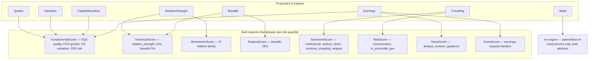

# Secondary scores — the eight-engine proposal against the tree

**Part of the score-engine design set: [`README.md`](README.md)** (master design).
Siblings: [`ScoreUniverse.md`](ScoreUniverse.md) — this document is to
`Strategies/secondary_score.md` what that one is to `Strategies/other_score.md` —
and [`MASTER_PLAN.md`](MASTER_PLAN.md) (the set-wide work order).

*Source proposal (owner's file, read-only):* [`../../Strategies/secondary_score.md`](../../Strategies/secondary_score.md),
2,433 lines — eight proposed engines with an exhaustive formula inventory, plus a
cross-engine **normalization**, **directionality** and **double-counting** layer.
**This document never restates the proposal's formulas.** It is the tree's account
of them: what already exists, under what name, what is missing, and what must not
be built twice.

**Status: a survey and a plan (2026-09-29). Its six decisions were answered by the
owner the same day — the resolutions are §9, and they change the disposition of all
eight proposed engines.** Nothing here is implemented by writing it. This document
adds no gate, no leaf, no `default_config.py` key and no engine module, and it
proposes none for addition by itself. Every build item is in §8; the items the
answers unblocked are `SEC-14`-`SEC-18`, and the one question the answers *raised*
rather than settled is `SC-D7`.

---

## 0. How to read this

### 0.1 The verdict vocabulary

Reused verbatim from [`ScoreUniverse.md`](ScoreUniverse.md) §5, so the two
survey documents read the same way:

| Verdict | Meaning |
| --- | --- |
| **PRESENT** | built as described, reachable by a reader |
| **PARTIAL** | some legs exist |
| **ABSENT** | nothing in the tree |
| **ELSEWHERE** | a different built object already computes the quantity |

One addition this document needs and the survey did not: **UNWIRED** — the
producer is built and tested but no production caller reads it, so no engine and
no analyst sees it. `TechnicalScore.md` §1 already uses the word for exactly this
state, and it is the state of a whole module here (§4.4). A dated `BUILT <date>`
or `MET <date>` annotation is used only where a row's own evidence is the date it
landed, matching `MASTER_PLAN.md` §4.1.

### 0.2 What the proposal is

It is a **pasted third-party analysis** — the owner's file, not a repo-authored
spec. It cites two commercial methodologies as its models
(`qscoring.com/methodology`, `investwithattention.com/methodology`), which is why
its §"Cross-engine normalization" is the most orthodox part of it: that pipeline is
standard index-factor practice, verified against published methodology guidance on
2026-09-29 (§5.4). Its formula inventory is otherwise an *expansion of a tier that
is already named in this set*, not a new frontier (§1).

### 0.3 What this document is not

* **Not a tenth score library.** `Strategies/scores/` already carries nine
  per-system libraries and `docs/scores/` one engine document per built engine.
  The proposal's eight engines are not a new family (§1.1).
* **Not a spec for new engines.** Its closing diagram lists a 20-engine universe
  (adding Flow, Options, AI Adoption, AI Threat), but its *formula inventory*
  covers only eight. That mismatch is recorded, not resolved here: whether any
  becomes an engine is `UNIV-NEWENGINE` / owner decision D4 (§9).
* **Not a second `ScoreUniverse.md`.** That document ledgers
  `Strategies/other_score.md`'s **32 survey sections**. This one ledgers
  `Strategies/secondary_score.md`'s **8 engines × their formula families**. Where
  the two overlap they are cross-cited, never duplicated.

---

## 1. The proposal in one table

Its own §"Primary/Secondary Report" assignment, reproduced as a claim to test:

| Proposed engine | Its primary report | Its secondary report | Composite weight it proposes |
| --- | --- | --- | --- |
| QualityScore | Fundamentals | — | `0.25 prof + 0.20 CF + 0.20 BS + 0.15 stab + 0.10 growth + 0.10 cap-eff` |
| CapitalAllocationScore | Fundamentals | News | `25 buyback + 20 div + 15 debt + 15 M&A + 10 R&D + 15 cap-eff` |
| MoatScore | Fundamentals | News | `20 pricing + 20 switching + 15 network + 15 scale + 15 cost + 15 durability` |
| ValuationScore | Fundamentals | Market | `25 intrinsic + 20 FCF + 15 earnings + 15 EV + 10 peer + 10 growth-adj + 5 div` |
| RelativeStrengthScore | Market | — | `25 RS21 + 25 RS63 + 25 RS126 + 25 RS252` |
| BreadthScore | Market | — | `20 MA-part + 20 AD + 15 NHNL + 15 vol + 15 sector + 15 dispersion` |
| CrowdingScore | Market | Sentiment | `20 own + 20 short + 15 opt + 15 mom + 10 val + 10 analyst + 10 factor` |
| EarningsScore | Fundamentals | News | `25 surprise + 25 revision + 15 growth + 10 accel + 10 guidance + 10 qual + 5 consistency` |

### 1.1 Where it sits in the 24-name universe

`README.md` §"the spec set has grown" counted the owner's hierarchy as **9 core,
11 secondary, 4 meta** (24 named systems). Seven of the eight proposed engines
match a name in the **secondary** tier — Quality, CapitalAllocation, Moat,
RelativeStrength, Breadth, Crowding, Earnings. The eighth, **Valuation**, is a
**core** engine that already has its own document
([`ValuationScore.md`](ValuationScore.md)) recording it as **designed, not built**.

So the proposal:
* adds **no new name** to the 24;
* omits four of the eleven secondary names it otherwise expands — **Flow,
  Options, AI Adoption, AI Threat**;
* is a formula-level expansion of a tier, which is precisely the form
  `ScoreUniverse.md` §8 Q7 asks about (`UNIV-NAMES`: do the tree's names follow the
  survey, or do the survey's names stand as families?).

**This matters because of the count, not the names.** `README.md` records that
"none of the 11 secondary or 4 meta names has a library". The proposal supplies
formula inventories for seven of them. It does not supply the thing the set's
convention regards as a prerequisite for an engine — and per D4 no system becomes a
tenth engine automatically.

### 1.2 What is genuinely new in it

Three contributions. Everything else is a restatement of a formula family the tree
or a sibling document already specifies.

1. **A cross-sectional normalization contract stated once** — winsorize → peer or
   market normalize → direction transform → **[0,100]** → subscore → engine score,
   with four named normalization methods (percentile, z, robust z, winsorization),
   an explicit z→0-100 affine map (`50 + 16.667z`, clipped ±3), and a per-metric
   direction flag. §5.
2. **An explicit double-counting exclusion matrix** — a table saying which engine
   must not duplicate which quantity. §6.
3. **A correlation / overlap layer** — a ρ matrix between engines, then
   hierarchical grouping, residualized scores, correlation-adjusted weights, PCA or
   constrained optimization, so the composite does not become "FundamentalScore plus
   three other ways of measuring FundamentalScore". §7.

### 1.3 It was unprocessed

A case-insensitive grep for `secondary_score` across the whole repo returns **zero
matches** (verified 2026-09-29). No document in `docs/`, no `CHANGELOG.md` entry and
no `Strategies/index.md` line references it. It is the one input to this design set
that had no account. This document is that account.

---

## 2. The dedup map



Every arrow is a **dedup obligation**, not a wiring plan: the proposed engine's
quantity is already scored inside the target. Building any proposed engine as a
second producer of the same quantity breaks the set's invariant 8 (one quantity,
one authoritative producer) and invariant 17 (no engine enters by adjacency), both
in `README.md` §2.1 and both restated as D4
(`MASTER_PLAN.md` §2.1: *"individual engines measure dimensions of evidence"* —
the test for adding one is `1 − |Corr(SurveyScore, ExistingScores)|`, not "it
produces a number").

---

## 3. The formula ledger

Method: every row was located by symbol in the working tree; `reaches analyst how`
means a bound `@tool` in `agents/toolsets.py` / `agents/utils/*.py`, a score-engine
leg supplied as text, or nothing. ABSENT is stated explicitly rather than guessed.
All eight engines share one header fact, so it is said once:

> **No proposed engine has a module, a `docs/scores/*.md` engine document, or an
> `ENGINE_GATES` / `ENGINE_SECTIONS` row.** `quant_scorecard.ENGINE_GATES` holds
> exactly nine keys — `fundamental, technical, momentum, regime, risk, sentiment,
> news, event, trade` (verified live 2026-09-29). There is no
> `strategies/quality_score.py`, `capital_allocation_score.py`, `moat_score.py`,
> `valuation_score.py`, `relative_strength_score.py`, `breadth_score.py`,
> `crowding_score.py` or `earnings_score.py`.

### 3.1 QualityScore — verdict: **ELSEWHERE** (FQS) + **PARTIAL**

| formula family | producer | reaches analyst how | note |
| --- | --- | --- | --- |
| ROE / ROA / ROIC / NOPAT / invested capital / ROCE | `strategies/ratios.py::return_on_capital:304` → `compute_ratios` keys `roic`/`roce`/`return_on_capital` (:834-836) | `get_ratios` (`analysis_tools.py:8193`, bound in `fundamentals_company_tools`) | FQS panel factors too |
| gross / operating / EBIT / EBITDA / net / FCF margins | `compute_ratios:588` (:810, :853-856) | `get_ratios` | GP/A (Novy-Marx) is separate: `quantitative_scores.gross_profitability:299` |
| FCF, FCF/NI, CFO/NI, CFO/EBITDA | `compute_ratios` `fcf_margin`/`fcf_to_net_income`/`ocf_to_net_income`/`ocf_to_ebitda` (:810-813) | `get_ratios` | |
| accrual ratio | `strategies/normalized.py::accruals_ratio:62`; `strategies/earnings_quality.py::earnings_quality_verdict:24`, `::dechow_dichev_aq:118` | `get_earnings_quality:8433`, `get_earnings_quality_verdict:3901` | |
| margin / FCF / cash-conversion stability | `compute_ratios` `gross_margin_stability`/`operating_margin_stability`/`fcf_stability`/`cash_conversion_stability` (:857-871) | `get_ratios` | **`roic_stability` is refused (`None`, :866)**; revenue volatility `σ(Δln Rev)` **ABSENT** |
| D/E, net debt, ND/EBITDA, interest coverage, CFO/debt, current, quick | `compute_ratios` (:787-802, :823-830) | `get_ratios`, `get_balance_sheet_health` | |
| revenue / EPS / FCF CAGR | `strategies/capex_quality.py::_cagr:52`; `quantitative_scores.growth_metrics` | `get_capex_quality`, `get_analyst_verdict` | explicit **ΔROIC / margin-expansion factor ABSENT** |
| incremental ROIC (ΔNOPAT/ΔIC) | `strategies/capex_quality.py::capex_quality_read:126` | `get_capex_quality` | **incremental margin and incremental FCF margin ABSENT** |
| Quality composite | `strategies/fundamental_score.py::quality_subscore:210` (FQS) | scorecard block (`ENGINE_SECTIONS['fundamental']`), never a tool | `combine()` composite is `RESEARCH_ONLY`, equal weights |

**Duplication:** the whole profitability/margin/efficiency block **is** FQS, scored
through `factor_schema`. A `QualityScore` engine would be an alias for
`FundamentalScore.quality_subscore`, not a new engine.

### 3.2 CapitalAllocationScore — verdict: **PARTIAL** / largely **ABSENT**

| formula family | producer | reaches analyst how | note |
| --- | --- | --- | --- |
| buyback yield / gross / net / share-count reduction | `ratios.shareholder_yield:370` → `buyback_yield`/`shareholder_yield`/`net_issuance_yield` (:839-841); `get_share_buyback_authorization:50` | `get_ratios`; `get_share_buyback_authorization` | `universe_factors._buyback_yield:824` and `_dilution_rate:776` are **UNWIRED** — a second producer of the same quantity (§4.3) |
| SBC intensity / SBC-to-FCF | `ratios.sbc_adjusted_fcf:443` → `sbc`/`sbc_to_revenue`/`sbc_adjusted_fcf`/`sbc_to_fcf` (:848-851) | `get_quality_factors` (`quant_formula_tools.py:199`) | **buyback/SBC coverage ABSENT** |
| dividend yield / payout / coverage / CAGR | `ratios` dividend yield; `strategies/capital_income.py::indicated_yield:55`; `moomoo_extra_tools.get_dividends:162` | `get_ratios`, `get_dividends` | FCF-payout, coverage and dividend CAGR **ABSENT** |
| debt reduction / net-debt reduction / debt-funded buybacks | **ABSENT** | — | — |
| M&A: acquisition intensity/growth/ROIC, goodwill growth/intensity | **ABSENT** | — | no goodwill or acquisition-spend producer |
| R&D intensity | `quantitative_scores.growth_metrics` (`rd_intensity`, G-Score G6) | via G-score | R&D efficiency (`ΔRev/R&D`) and R&D return **ABSENT** |
| ROIC spread / economic profit | **ABSENT** as combined numbers | — | level ROIC and incremental ROIC exist separately; `universe_factors._reinvestment_rate:542` is **UNWIRED** |
| Capital-allocation composite | **ABSENT** | — | — |

### 3.3 MoatScore — verdict: **ABSENT** as a datum (hybrid only)

| formula family | producer | note |
| --- | --- | --- |
| pricing power: GM persistence, margin premium, ΔRev/ΔVol | **ABSENT** | `ratios` has a GM *stability* σ, not persistence; no peer margin median → no margin premium |
| switching costs: NRR / GRR / customer concentration | **ABSENT** | no cohort/churn or customer-revenue feed |
| network effects: user/engagement growth, ARPU | **ABSENT** | no user/engagement feed |
| scale: `ln(Revenue)` | **ABSENT** | `strategies/size.py` is **position sizing**, not a size factor; `universe_factors._size_factor:345` is a market-cap cross-sectional factor and is **UNWIRED** |
| cost advantage vs peer median margin | **ABSENT** | `peer_universe.resolve_growth_medians:380` produces medians for `roa`/`cfo`/`var_roa`/`var_sales_growth`/`rd`/`capex`/`ad` — **not margins** |
| market-share durability | **ABSENT** | no industry-revenue denominator |
| ROIC / margin / excess-return persistence | **ABSENT** | no per-year ROIC-vs-WACC history producer |
| qualitative legs: patents, loss of moat | `dataflows/patentsview.py::get_patent_activity:57`; `strategies/value_dip.py::decline_driver_check:952` | `get_patent_activity:13224`, `get_decline_driver_check` — both advisory, "never a gate" |

`ScoreUniverse.md` §19 marks Moat **PARTIAL**; `MASTER_PLAN.md` marks
**UNIV-MOAT NOT-FEEDABLE as a datum** — the moat legs are qualitative, and the only
route is a parsing/model project. The proposal's own suggested shape
(*"a hybrid structural score… the LLM can provide evidence while deterministic
calculations provide the backbone"*) is the **only** shape this tree can build, and
it is exactly the architecture `is_moat`-class reads already use.

### 3.4 ValuationScore — verdict: **PRESENT** in producers, **ELSEWHERE** in the composite

| formula family | producer | reaches analyst how |
| --- | --- | --- |
| P/E, P/B, P/S, P/CF, P/FCF, EV/Sales, EV/EBITDA, EV/EBIT | `ratios.compute_ratios:588` (`ev_ebit`/`ev_ebitda`/`ev_sales`/`pe`/`pb`/`ps`/`p_cf`/`p_fcf`); `quantitative_scores.enterprise_value:241`, `acquirers_multiple:260` | `get_ratios`, `get_analyst_verdict` |
| earnings yield, Tobin's Q | `quantitative_scores.earnings_yield:251` (EBIT/EV), `tobins_q:269` | `get_analyst_verdict` — note the equity `EY = EPS/Price` differs |
| forward P/E, PEG | `strategies/etf_valuation.py::etf_valuation:80`; `value_dip_tools._forward_peg_read:659` | forward earnings yield **ABSENT** |
| FCF yield / EV-FCF yield | `strategies/value_dip.py::fcf_yield:155`; `compute_ratios` `fcf_yield`, `ev_to_fcf` | `get_fcf_yield`, `get_ratios` |
| DCF family (PV, Gordon TV, EV, equity, FV/share, upside) | `strategies/dcf.py::compute_dcf:71`, `terminal_value_gordon:56`, `wacc_from_beta:28` | `get_dcf_valuation:3060` |
| cyclical / capex-fade / scenario DCF | `cycle_dcf.py`, `normalized_fcf.py`, `scenario_dcf.py` | `get_normalized_cycle_dcf`, `get_normalized_fcf_dcf`, `get_scenario_dcf` |
| reverse DCF / implied growth | `strategies/reverse_dcf.py::reverse_dcf:90`, `implied_growth_for_fcf:202` | `get_reverse_dcf:3148` |
| earnings power value | `strategies/fundamental_floors.py::earnings_power_value:75` | `get_value_floors` |
| CAPE | `strategies/cape.py::cape_ratio:59` (VAL-16, BUILT 2026-09-28) | `get_cape_ratio` |
| historical percentile / z of a multiple; margin of safety; conformal band | `value_dip.valuation_z_read:122`; `normalized.margin_of_safety:120`; `conformal.rolling_band` | `get_valuation_z_score`, `get_margin_of_safety:5197`, `get_valuation_band` |
| peer-relative (multiple vs peer median) | `peer_universe.sector_medians_for:430`, `_panel_from_fin:101` | `get_company_peers`, `get_composite_rank` |
| **exit-multiple TV** / **residual income** / **SOTP** | **ABSENT** | VAL-18 SOTP/NAV is `NOT-FEEDABLE` (no segment fair values) |
| Valuation composite | `fundamental_score.py::valuation_subscore:220` (VS), scaled by `dcf_confidence` | scorecard block — **the only assembled valuation score** |

**This engine already has a document and an owner decision.** `ValuationScore.md`
records *designed, not built*, and D2 answered the boundary: *"calculate valuation
once, attribute it twice"* — `FundamentalScore` **consumes** `ValuationScore`'s
number through its `w_V` weight, so the multiples must not reach the composite
through two independent-looking paths. The proposal's §4.16 composite is that
engine's job, already specified, and its migration order is `VAL-8` first
(`MASTER_PLAN.md` §10).

### 3.5 RelativeStrengthScore — verdict: **ELSEWHERE** (MomentumScore R + TechnicalScore)

| formula family | producer | reaches analyst how | note |
| --- | --- | --- | --- |
| 5.1 absolute returns 5/21/63/126/252D | `momentum_score` `P` leg (`extended_indicators.roc`); `factors.momentum_multihorizon:418` | engine text | **10D window ABSENT** |
| 5.2 relative return vs benchmark | `relative_strength.rs_series:33`; `rotation.relative_rotation:43` (ratio form) | `get_relative_rotation:11555` | a plain per-window `R_stock − R_bench` return has no general producer |
| 5.3 RWR / relative momentum | `relative_strength.rs_series:33`, `slope_pct:49`; `sector_breadth.rrg_heading:286` | `get_relative_strength:610` | ratio/slope forms exist; `RM_n` is not emitted as a labelled return |
| 5.4 sector-relative | `relative_strength.relative_strength_vs_sector:276` | `get_relative_strength` prints `vs_sector_etf=` | owner decision TECH-19: the SPDR ETF is the primary reference |
| 5.5 industry-relative | **ABSENT** as `R_stock − R_industry` | — | `MOM-6` records it as **DECLINED in writing** (`MomentumScore.md`: no per-name industry return series) |
| 5.6 peer-relative (stock − median peer return) | **ABSENT** | — | `peer_universe.sector_medians_for:430` is valuation multiples only |
| 5.7 alpha / 5.8 information ratio | `evaluate.alpha:920`, `tracking_error:869`, `information_ratio:892` | `get_strategy_quality` | `statistical.capm_decomposition:328` returns beta/systematic/idiosyncratic, no α |
| 5.9 / 5.10 up-market RS, down-market capture | `evaluate.capture_ratio:1132`; `etf_risk.py:191-196` | `get_strategy_quality`, `get_return_decomposition` | the uptrend-only conditional form is not isolated |
| 5.11 relative drawdown | **ABSENT** | — | `evaluate.max_drawdown:222` is per-series only |
| 5.12 trend confirmation | `technical_factors.sma_legs:1050`; `technical_depth.moving_average_depth:218` | engine text | the `MA50/MA200` ratio itself was **retired** with `golden_cross` (`RETIRED_COMPONENTS`) |
| 5.13 RS composite | `momentum_score` `R` family (weight 0.15); `technical_score` `relative_strength` category (12%) | engine text | no standalone object, and **none is wanted** — see below |

**Duplication is near-total.** The proposal's `RSScore = 25/25/25/25` over four
horizons is a second producer of the quantity `MomentumScore`'s `R` leg already
scores and `TechnicalScore`'s `relative_strength` category already weights (12%).
D7 settled the ownership matrix: *"the 12-1 month return, multi-horizon returns,
relative momentum and momentum acceleration → MomentumScore"*.

### 3.6 BreadthScore — verdict: **PRESENT** in one shared producer, **ELSEWHERE** as legs

| formula family | producer | note |
| --- | --- | --- |
| A/D ratio (adv/dec) | **ABSENT** | `market_breadth.market_breadth:114` emits `ad_ratio = (adv−dec)/n` deliberately — the survey's ratio is a third meaning it never emits |
| advance-decline line | `market_breadth.advance_decline_line:278` (REG-5) | cumulative over the shared S&P panel |
| % above SMA 20/50/200 | `market_breadth.market_breadth:114`; `sector_breadth.multi_breadth:165` | **100D ABSENT** |
| new highs / lows, 52-week pair | `market_breadth.market_breadth:114` | the `NH/(NH+NL)` ratio is not emitted (only the 52w differential) |
| up/down volume, volume breadth | **ABSENT** | nothing in `market_breadth.py` / `breadth_depth.py`; `MarketScore.md` row 100 says so |
| McClellan oscillator / summation index | `sector_breadth.mcclellan_read:213`, `msi_zone:307` | per **sector**; a market-wide MO is ABSENT |
| breadth thrust (Zweig) | `technical_depth.zweig_breadth_thrust:400` | scored as `technical_score`'s `zweig_thrust` leg (TECH-14, MET) |
| sector / industry breadth | `sector_breadth.multi_breadth:165`; `sector_rank.constituent_breadth:664` | n-gated |
| breadth dispersion | `alpha_health.cross_sectional_dispersion:119`; `factor_dispersion.factor_score_dispersion:105` (**UNWIRED**) | producer exists |
| BreadthScore composite | **ABSENT** as an engine | feeds `RegimeScore`'s breadth leg (15%) and `TechnicalScore`'s `breadth` (5%) |

**One producer, read twice** — `market_breadth.py` is the single source, which is
exactly the resolution D1 gave (`MarketScore` §7 Q1/Q2 `[ANSWERED]`): shared
producers are computed once and read twice with each reader's dependency named.
The proposal's own footnote — *"this score should primarily feed RegimeScore"* —
agrees with the tree.

### 3.7 CrowdingScore — verdict: **PARTIAL**, spread across SentimentScore and RiskScore

| formula family | producer | note |
| --- | --- | --- |
| institutional ownership | vendor passthrough `moomoo_extra_tools.get_institution_holdings:238` | prints share of float + Δ; **no computed ratio**, and no peer percentile |
| ownership HHI | `liquidity_risk.ownership_hhi:130` | 0-10000 scale, holder-based; `get_ownership_concentration:8585` |
| top-10 ownership | **ABSENT** | — |
| ETF ownership | **ABSENT** | `UNIV-ETFFLOW` is `NOT-FEEDABLE` |
| short interest, ΔSI | `short_interest.short_interest_percentile:35`; `market_position_tools.get_short_interest:222` | percentile is name-relative, not cross-sectional |
| days to cover | `massive.get_short_interest_massive:485` | **printed only**, never a scored field |
| utilization / borrow cost | **ABSENT** | no securities-lending data in the chain |
| put/call OI concentration | `options_surface.put_call_oi_concentration:34` | **PCR-volume and options/float ABSENT** |
| IV percentile | `options_surface.iv_percentile:15` | `RiskScore` component; **IV-rank min-max ABSENT** (`UNIV-IVRANK`: no per-day IV history) |
| valuation crowding / momentum crowding | **ABSENT** as composites | inputs exist (`ratios`, `factors.momentum:24`) |
| analyst consensus / target upside / estimate dispersion | `consensus.weighted_consensus:32`, `agreement_score:14`; `universe_factors._price_target_read:199`, `_forecast_dispersion:122` (**UNWIRED**) | SentimentScore's `analyst` category carries the revisions leg |
| crowded-factor exposure | **ABSENT** | `factors.fama_french_5_factor:518` is built with **no reader** (§4.5) |
| Crowding composite | **ABSENT** as an engine | legs live in `SentimentScore` (institutional 15 / options 10 / short 5 / extreme_crowding 5) and `RiskScore` (concentration 10 / iv_percentile / gex) |

**Two named traps.** (a) `SentimentScore`'s `extreme_crowding` is **attention**
crowding — a different quantity from positioning crowding. (b) `RiskScore.md` §0.3
already states **correlation ≠ crowding**. The proposal's own framing agrees:
*"CrowdingScore should not automatically mean bad… store it as intensity, not
direction."* Any CrowdingScore must therefore be a **consumer** of the two engines'
legs, never a second producer — the rule `ScoreUniverse.md` §6.2 states for
colliding systems.

### 3.8 EarningsScore — verdict: **PARTIAL**, spread across four engines

| formula family | producer | note |
| --- | --- | --- |
| EPS growth / revenue growth | `statement_parsing.sane_eps_yoy:1032`, `sane_revenue_yoy:1048` | FundamentalScore growth subscore |
| EPS surprise | `events.surprise_score:17`; `catalyst.last_earnings_surprise:77` | `get_earnings_surprise:1714`; magnitude not separated from direction |
| revenue surprise | **ABSENT** | — |
| beat rate / weighted beat rate | **ABSENT** | `get_earnings_surprise_history` prints ~6 prints, no rate arithmetic |
| surprise consistency | **ABSENT** | (`universe_factors._earnings_persistence:476` is a different quantity, and **UNWIRED**) |
| EPS estimate revision (7/30/60/90D) | `analyst_revisions.revision_ratio:79`, `estimate_change_index:176` | 3-4 quarter history is `NOT-FEEDABLE` (NEWS-16) |
| revenue estimate revision | **ABSENT** | — |
| up-revision ratio / revision breadth | `analyst_revisions.revision_ratio:79` → `revision_index:289` | `get_analyst_revision_index` |
| EPS acceleration | `universe_factors._earnings_acceleration:419` | **UNWIRED** — producer exists, no importer outside its tests |
| revenue / margin acceleration, operating leverage | **ABSENT** | no `%ΔEBIT / %ΔRevenue` producer |
| earnings quality (CFO/NI, FCF/NI, accruals) | `earnings_quality.earnings_quality_verdict:24`, `dechow_dichev_aq:118` | `get_earnings_quality:8433`, `get_earnings_quality_verdict:3901` |
| guidance surprise / revision | `benzinga_tools.get_guidance_revisions:35` (gate off); `news_score.guidance_change_score` | no computed guidance-vs-consensus surprise |
| ERM / ESM (weighted revision / surprise momentum) | **ABSENT** | `revision_index:289` assembles legs but is not the `w1>w2>w3` composite |
| EarningsScore composite | **ABSENT** | — |

Note: `Strategies/scores/news_score.md:618` also defines an `EarningsScore`
formula, not implemented. So the proposal's eighth engine collides with a section of
an **already-built** engine's library as well as with four engines' legs.

---

## 4. Shared producers and the one-producer checks

The proposal's formula inventory exposes four places where the tree already has —
or is about to have — **two producers of one quantity**. These are the rows worth
fixing, because invariant 8 is violated by a duplicate, not by a missing engine.

### 4.1 `market_breadth.py` — one producer, read twice

`market_breadth:114` (and its `advance_decline_line:278`) is the single
market-wide breadth source. It is read by `RegimeScore`'s breadth leg (15%) and by
`TechnicalScore`'s `breadth` category (5%), and an opt-in string of
`get_sector_rotation_screen`. That is the D1 pattern, and it is correct as-is.

### 4.2 `ratios.compute_ratios` — the single producer for the quality / valuation / capital families

Nearly every row in §3.1, §3.2 and §3.4 resolves to `compute_ratios:588` or to a
module that feeds it. A proposed engine that recomputed any of them would be a
second producer.

### 4.3 The buyback-yield collision (**UNIV-DILOWN**, open)

`ratios.shareholder_yield:370` renders `buyback_yield` / `shareholder_yield` /
`net_issuance_yield` (:839-841) **and** `universe_factors._buyback_yield:824` +
`_dilution_rate:776` compute the same quantity with no reader. `ScoreUniverse.md` §8
Q2 / `MASTER_PLAN.md` `UNIV-DILOWN` asks which survey section owns dilution
(§18/§24/§25) and buyback yield (§18/§26). **Do not build a third.** The proposal's
§2.1 families land on this exact collision.

### 4.4 `universe_factors.py` — 11 producers, deliberately unwired

The whole module is underscore-private with only `tests/test_universe_factors.py`
importing it: `_size_factor:345`, `_earnings_acceleration:419`,
`_earnings_persistence:476`, `_reinvestment_rate:542`, `_economic_sensitivity:615`,
`_block_flow:685`, `_dilution_rate:776`, `_buyback_yield:824`,
`_forecast_dispersion:122`, `_price_target_read:199`, `_insider_ratio:275`.

This is **not a defect**, and the proposal is the strongest argument for why: each
producer's docstring names its `MASTER_PLAN.md` item and the module's own policy is
that *"a later round promotes each producer to a public name with its leaf in the
same change."* Eleven of the proposal's formula families (§1 size, §3.5 earnings
acceleration, §4.2/4.3 target upside + dispersion, §7.15 estimate dispersion, §2
buyback/dilution, §6 economic sensitivity) are **already built** and merely await
their leaf. Promoting one without its leaf fails
`tests/test_calc_agent_wiring.py` — which is the point of the underscore.

### 4.5 `fama_french_5_factor` — built, no reader

`strategies/factors.py::fama_french_5_factor:518` is public and `__all__`'d,
referenced **only** in `tests/test_strategies_tier1_formulas.py` (3 tests), and no
module assembles its `excess_returns` + five-factor panel. `ScoreUniverse.md` §11
records it as "built, no reader". The proposal's **§7.16 crowded-factor exposure**
is the first family in either survey that would give it one — and it cannot, until
a factor-exposure panel exists.

---

## 5. The normalization layer

This is the proposal's most valuable section and the one where the tree's state
moved most recently. Both facts below were verified live on 2026-09-29.

### 5.1 What the proposal prescribes

```
x → winsorize → peer/market normalize → direction transform → [0,100] → subscore → engine score
```

with four named methods — cross-sectional percentile (`100·(rank−1)/(N−1)`), z
(`clip(50 + 16.667z, 0, 100)`), **robust z** (`(x − median)/(1.4826·MAD)`), and
winsorization at 1/99 or 5/95 — plus a per-metric **direction flag**
(`lower_better → 100 − score` or `z → −z`).

### 5.2 What the tree already has

| primitive the proposal names | producer | state |
| --- | --- | --- |
| winsorization | `cross_section.winsorize:31`, default `lower_q=0.01, upper_q=0.99` | PRESENT — parameterised, so 5/95 is a setting |
| cross-sectional z | `cross_section.cross_sectional_z:70` (`{z, mean, std}`, refuses < 2 obs or zero σ) | PRESENT — "the repo has **one** z implementation" |
| **robust z (median/MAD)** | `ratios.robust_z:268` + `ratios.MAD_SCALE = 1.4826`; reached through `cross_sectional_z(robust=True)` | **PRESENT** — built, in `__all__`; *no engine passes `robust=True`*, so no score moves |
| industry-neutral z | `cross_section.industry_neutral_z:111` (winsorize → demean by the caller's group → z) | PRESENT, **UNWIRED to any RS/quality read** |
| percentile / rank | `factors.percentile_rank:59`; `cross_section.centered_rank:140` (`2·RankPct − 1`); `factors.category_scores:258` (percentile × 100, tie-aware, direction by a `−1` sign on the z *before* ranking) | PRESENT |
| z → [0,100] affine map | `momentum_score.Z_CENTER = 50.0`, `Z_SCALE = 16.667`, `Z_WINSOR_LIMIT = 3.0` | **PRESENT for one engine** (see §5.3) |
| direction-aware mapping | `score_engine.align:69` (`direction="lower_better"` → `1 − frac`) | PRESENT as the kernel — but **no per-factor inversion table** (`MarketScore.md` row 134) |
| dispersion / agreement | `factor_dispersion.factor_score_dispersion:105`; `strategies/consensus.py::agreement_score:14` | PRESENT (dispersion **UNWIRED**) |
| market residualization | `cross_section.residualize_returns:201` | PRESENT |

### 5.3 The one declared contract, and what it does not cover

`MOM-2` is **answered**: `momentum_score.normalize_component(values, method=...)`
declares `§48` primary (`z → clip ±3 → 50 + 16.667z`) with `§49` (percentile rank)
as the declined alternative, and the constants live in one named place
(`docs/scores/MomentumScore.md` §3, `CHANGELOG.md` 2026-09-27).

What it **does not** cover, and what the proposal's §"Cross-engine normalization"
therefore still asks for:

* It is **one engine's** contract, not a shared one. Nothing binds
  `FundamentalScore`, `TechnicalScore`, `NewsScore`, `SentimentScore`,
  `RegimeScore`, `RiskScore` or `EventScore` to it; each maps through its own
  declared band/ramp edges via `score_engine.align`.
* The proposal's transform is **cross-sectional** (it needs a universe); this tree
  scores **one ticker at a time**, so the panel is the only place a cross-sectional
  normalization can run (`scripts/score_panel.py`). `MomentumScore` resolves this
  by requiring a caller-supplied `reference={member: [values]}` and falling back to
  the name's own declared band. That is the honest resolution and it should be the
  shared rule, not a MomentumScore-only one.
* There is **no declared per-factor direction table** and no declared
  universe/winsor-quantile policy. Direction is re-declared at every call site.

### 5.4 What the web check found (2026-09-29)

Cross-checked against published methodology guidance rather than remembered:
MSCI- and S&P-family factor methodologies **winsorize** (5th/95th or 1st/99th
percentiles, or cap standardized values at ±3), compute the **cross-sectional z
within the investable universe at each rebalance date**, apply **polarity** to
lower-is-better metrics, and average the standardized factors; the **robust**
median/MAD form with the **1.4826** consistency constant is the standard answer when
outliers are material; and a **percentile rank scaled to 0-100** is the standard
answer when the output is meant to be a *relative rank* rather than a deviation
from average. Sector/industry neutralization is the usual optional extra step,
applied **within** the peer group.

**Consequence:** the proposal's normalization section is orthodox and the tree's
primitives cover it. The remaining work is **declaration, not computation** — and
the one fundamental choice, *relative rank* (percentile) vs *standardized
deviation* (z), is precisely the ambiguity `MOM-2` resolved for one engine. The
proposal's own closing note names the same fork.

### 5.5 What a shared contract would still have to declare

Each row is a question, not a proposal. None may be answered by a default invented
here.

| Must declare | Today |
| --- | --- |
| the **universe** a percentile/z is taken over | per-caller; the panel (`score_panel.py`) is the only cross-sectional source |
| **winsorization** quantile vs ±3σ-after-standardization | `cross_section.winsorize` 1/99; `momentum_score` ±3σ. Both appear in published practice |
| **transform** (percentile vs z vs robust z) | `momentum_score` declares z; everything else does not declare at all |
| **direction** per factor | `align(direction=…)` at each call site; **no table** |
| **missing-value policy** | already correct and uniform: absent is `None`/not-in-dict, **never 0 and never a neutral 50** (`score_engine.align`, `combine`) |
| **coverage floor** | `score_engine.coverage_floor:45` + `combine(min_coverage=…)`; the fractional form was fixed 2026-09-28 (verified: 1-of-4 with `min_coverage=0.5` now withholds at floor 2) |
| **sector-neutral step** | `cross_section.industry_neutral_z` exists and is **unwired**; `FundamentalScore.md` records that the 0-100 percentile stays peer-wide while the z is sector-demeaned, and the band was renamed "peer median" for it |

### 5.6 Two latent defects in the primitives

Both were reproduced live on 2026-09-29. **Neither is fixed here** — each is
recorded, and fixing the first is a one-line change to a widely-used kernel that
deserves its own failing-first test.

1. **`align`'s band path is not clamped; its ramp path is.** Reproduced:
   `align(75, band=[(70, 120)]) → 120.0` and `align(75, band=[(70, -5)]) → -5.0`,
   while `align(75, lo=0, hi=100) → 75.0` (clamped by
   `max(0.0, min(100.0, …))`). A declared band table can therefore emit a
   contribution outside 0-100 straight into `combine`'s weighted mean. Every
   declared band table in the tree is currently in range, so this is **latent, not
   live**; it is the same class as the survey's other "clamp a ramp but not a band"
   finding.
2. **No per-factor direction table.** `score_engine.align` takes a `direction`
   argument per call, and `MarketScore.md` row 134 records the gap as
   *"no per-factor inversion table"*. The proposal's §Directionality is a request
   for exactly that table; the repo's answer today is to re-declare the sign at
   each site.

### 5.7 The answered default, and what it costs

`SC-D2` (§9) settles §5.1's fork: **winsorize → sector-neutralize → percentile
rank** is the default for a stock-level score; z is kept as a diagnostic; and
sector-neutralisation is **metric-specific**, never on market breadth itself.

Three of the four steps are cheaper than the prescription sounds, and one is more
expensive:

1. **The winsorize step is already the repo's** — 0.01/0.99 in the shared core. The
   owner deferred the exact quantile to existing methodology, so nothing moves.
2. **The percentile step is already the repo's** for every built engine:
   `factors.category_scores:269` maps the composite to 0-100 as a *tie-aware
   percentile × 100*. "Percentile is the default" is therefore already true where it
   counts; z is already only the intermediate standardisation.
3. **The per-factor declaration already exists**: `factor_schema`'s
   `normalization_method` and `sector_scope` sit on every factor record and are
   validated non-empty (`:111-112`, `validate_schema:576`) — but
   `normalization_method` is read by **nothing**, and `_spec:128-145` gives every
   factor the same value (`"winsorised-z"`). So "metric-specific" is a *values*
   change **plus** a *reader*. → `SEC-14`.
4. **The sector-neutralize step costs the most, because it is not switched on at
   all.** No production caller passes `industry_neutral`/`sector_map`, and the
   percentile that produces 0-100 is **peer-wide, not within-sector**. The owner's
   step 2 is implemented-but-unreached (`SEC-15`), and step 3's reference set is the
   open half of the same item. `FundamentalScore.md` §4.4 C6 records the divergence
   and was corrected in this pass to state the production behaviour.

**One engine is now in question rather than settled.** `MomentumScore`'s `MOM-2`
ratified `z` as its production default on 2026-09-27 — precisely what SC-D2 declines
to make universal — while SC-D2 makes percentile the default for a stock-level
score. That is `SC-D7` / `SEC-19`: one named constant (`momentum_score.py:462`, with
the percentile path already implemented), but an **owner-ratified** one, so it is
asked rather than taken.

---

## 6. The double-counting matrix

The proposal supplies its own exclusion table. Mapped against this set's
invariants:

| Proposal says the engine must not duplicate | What the tree already scores there | The rule it would break |
| --- | --- | --- |
| Quality ≠ valuation, momentum | FQS is profitability only; VS is the valuation leg inside `FundamentalScore` | invariant 8 |
| CapitalAllocation ≠ basic profitability | `ratios` ROIC/ROCE belong to FQS | invariant 8; **UNIV-DILOWN** is the live version of this |
| Moat ≠ short-term margins | `ratios` margin stability is FQS's; moat has no producer | — |
| Valuation ≠ growth quality | FGS is the growth leg; D2 says VS is *consumed*, not re-derived | D2 |
| RelativeStrength ≠ fundamental growth | MomentumScore `R` + TechnicalScore `relative_strength` 12% | D7 |
| Breadth ≠ individual stock fundamentals | RegimeScore breadth 15% + TechnicalScore breadth 5%, one producer | D1 |
| Crowding ≠ generic volatility | SentimentScore's 4 positioning legs + RiskScore's concentration/IV/GEX | invariant 8; `RiskScore.md` §0.3 correlation ≠ crowding |
| Earnings ≠ long-term fundamental quality | FundamentalScore growth/quality, NewsScore `analyst_revision`, EventScore surprise | invariant 8 |

**The matrix is right, and the tree already implements it as ownership.** Every row
that says "do not duplicate" corresponds to an engine that owns the quantity today.
The proposal's eight engines are therefore, on this tree, **seven legs of built
engines plus one engine that already has a document** (§1.1). Building any of them
as an engine would double-count — which is why D4 requires an orthogonality test,
not a name match, before any system becomes an engine.

---

## 7. The correlation / overlap layer

### 7.1 What the proposal wants

A `ρ_ij = Corr(S_i, S_j)` matrix over all engines, then one of: hierarchical factor
grouping, residualized scores, correlation-adjusted weights, PCA / factor
decomposition, or constrained optimization — explicitly so that `TradeScore` does
not become *"FundamentalScore + three different ways of measuring
FundamentalScore."*

### 7.2 What exists

| need | producer | state |
| --- | --- | --- |
| pairwise redundancy over a metric set | `alpha_zoo.redundancy_screen:581`; `scripts/score_panel.py::redundancy_matrix` (measured: **2,006 pairs over 64 metrics**) | PRESENT |
| cross-metric dispersion | `factor_dispersion.factor_score_dispersion:105` (`MaximumPossibleStd` declared as 50) | **UNWIRED** |
| cross-category disagreement | `technical_score.technical_disagreement:624` | PRESENT |
| market residualization | `cross_section.residualize_returns:201` | PRESENT |
| factor-model decomposition | `strategies/eigen_rotation.py`; `strategies/statistical.py::correlation_matrix:203`, `variance_inflation_factor:656` | PRESENT |
| per-factor IC / rank IC / ICIR / decile spread / monotonicity / turnover / OOS | `scripts/score_panel_eval.py`, `strategies/alpha_health.py::score_evaluation_rows:627` | PRESENT (Phase C) |

So the **measurement** half of the proposal's layer exists — the panel already
computes exactly the pairwise redundancy a ρ-matrix needs, and the eval harness
already reports the ladder.

### 7.3 Why the owner's D6 answer supersedes the weighting half

D6 answered this question before the proposal was written: *"a meta layer exists —
as a **LAYER**, not a tenth or eleventh engine. Agreement, model consensus,
dispersion and conviction are **meta-properties of the scorecard, not new evidence
engines.**"* The owner's formulas are `Agreement = |Σwᵢxᵢ/Σwᵢ|`,
`Dispersion = √(Σwᵢ(xᵢ − x̄)²/Σwᵢ)`, `AgreementScore = 100·e^(−k·Dispersion)`, with
`Conviction` a separate object.

That is a **narrower and cheaper** answer than the proposal's
correlation-adjusted-weights / PCA route, and it is the operative one:

* the composite keeps its **weighted mean** (D3 — *"you are building a
  research/audit-oriented quantitative engine, not merely an opaque ranking
  model"*), so weights are not to be optimized by correlation;
* engines **publish separately** and never collapse into one number (invariant 17
  and the D1 rationale);
* **coverage shrinks toward 50 rather than deflating** (D5), which is the
  honest-readability principle the *"three ways of measuring fundamentals"* worry is
  really about.

The residual, genuinely-useful half of the proposal is therefore **the redundancy
measurement as a printed diagnostic** — which the panel already produces and no
engine yet consumes. That is a plan item (§8, `SEC-7`), and it is a diagnostic, not a
weight change.

---

## 8. The plan

Item kinds and the D/I ordering follow `MASTER_PLAN.md` §0.1-§0.2 so the rows can be
lifted into that plan verbatim. **No row here starts without its §9 answer, and no
row proposes a new engine.**

| id | kind | item | D | I | verification |
| --- | --: | --- | --: | --: | --- |
| **SEC-1** | `DOC` | Register `Strategies/secondary_score.md` as processed by this document; list it in `README.md` and `MASTER_PLAN.md` Appendix A. *(done in this pass)* | 1 | 1 | the two links resolve |
| **SEC-2** | `DOC` | Correct the four stale **robust-z** ledger rows this document found (§Appendix B). *(done in this pass)* | 1 | 1 | each row carries a dated marker and the evidence |
| **SEC-3** | `WORK` | Declare the **cross-sectional normalization contract** once, as a table — universe, winsor rule, transform, direction — reusing `momentum_score.normalize_component` and `cross_section.*`, with `method=` the only switch. Extends `MOM-2` from one engine to a shared declaration. | 4 | 5 | one declaration consumed by ≥2 engines; no engine's number moves while it declares what it already did |
| **SEC-4** | `WORK` | A **per-factor direction table** (`MarketScore.md` row 134's gap), replacing per-call-site `direction=` arguments with one declared source and a test that every declared factor has a sign. | 3 | 3 | a factor with no sign fails the test |
| **SEC-5** | `WORK` | **Clamp `align`'s band path** so a declared band table cannot emit outside 0-100; failing-first test with `band=[(70, 120)]`. Latent today — one line, one kernel, wide blast radius. | 1 | 2 | the reproduced `120.0` becomes `100.0` and every existing engine's number is unchanged |
| **SEC-6** | `WORK` | Promote the **`universe_factors`** producers the proposal's families name, **each with its leaf in the same change** (`_earnings_acceleration`, `_earnings_persistence`, `_forecast_dispersion`, `_price_target_read`, `_dilution_rate`/`_buyback_yield` — the last only after **UNIV-DILOWN**). | 3 | 3 | a leaf prints each; `test_calc_agent_wiring.py` green |
| **SEC-7** | `WORK` | Consume the **redundancy / dispersion diagnostics** an engine-side reader can print (the panel already computes 2,006 pairs) — a diagnostic beside the engine scores, never a weight change. | 3 | 3 | the printed block carries the pair count and the flags; no composite moves |
| **SEC-8** | `WORK` | **Publish the per-engine coverage floor and the fractional-floor policy** as one declared rule across engines (`score_engine.coverage_floor` is already the one implementation). | 2 | 2 | two engines report the same floor for the same declared shape |
| **SEC-9** | `WORK` | `ValuationScore`'s build and the `VS` cutover: **already owned by `VAL-8`/`VAL-9`/`VAL-11`/`VAL-20`** under D2. This document adds nothing and must not duplicate it. | — | — | (cross-reference only) |
| **SEC-10** | `DECISION` → **ANSWERED 2026-09-29** | The eight engines' engine-vs-leg question — **no speculative promotion**; the panel decides, and *one* of the eight survives as an engine candidate (`SC-D1`, §9.1). | 1 | 5 | `SC-D1` |
| **SEC-11** | `DECISION` → **ANSWERED 2026-09-29** | Flow, Options, AI Adoption, AI Threat — **candidates, out of the current build** (`SC-D6`). | 1 | 2 | `SC-D6` |
| **SEC-12** | `DECISION` → **ANSWERED 2026-09-29** | `MoatScore` — **build the hybrid**; the LLM evidence layer never manufactures a quantitative input (`SC-D4`). | 2 | 3 | `SC-D4` |
| **SEC-13** | `DECISION` → **ANSWERED 2026-09-29** | The normalization default — **winsorized, sector-neutralized percentile rank**, with z as a diagnostic (`SC-D2`). | 2 | 5 | `SC-D2` |
| **SEC-14** | `WORK` | Give `factor_schema.normalization_method` a **reader**, and vary its values. The field is declared and validated on **every** factor record and read by **nothing** on the scoring path; `sector_scope` is the precedent — it *is* consumed, for the `NA`/weight rule. SC-D2's "metric-specific policy" is exactly this field. | 3 | 4 | a factor whose declared method differs from `winsorised-z` scores differently, and `validate_schema` still passes |
| **SEC-15** | `WORK` | Make the **sector-neutral step reachable in production**, and settle the ranking stage: the percentile becomes **within-sector** (the library's §22, and SC-D2's step 3) or the peer-wide percentile stands as the declared policy with the band label kept. Today no caller passes `industry_neutral`/`sector_map` at all. | 3 | 4 | a production caller enables the step and the `basis` string names it |
| **SEC-16** | `WORK` | Build the **promotion test**'s missing half — `IncrementalValue = Performance(Existing) − Performance(Existing + S_i)` over the cached panels, beside the redundancy matrix that already exists. This is SC-D1's prerequisite for promoting anything. | 3 | 4 | a panel run prints both halves for a candidate |
| **SEC-17** | `WORK` | `MoatScore`'s **deterministic backbone**: build the six reachable rows (ROIC persistence, ROIC − WACC spread, gross- and operating-margin premium, incremental margins, FCF durability) and record the four with no source (market-share durability, pricing power, retention/NRR, competitive concentration) as declined — so the hybrid has a defined backbone to attach its evidence layer to. | 4 | 3 | each built row has a producer + an `NA` test; the four are named in the module |
| **SEC-18** | `WORK` | `EarningsScore`'s **residualized** family: `f(EPSSurprise, RevenueSurprise, EstimateRevisions, GuidanceRevision, RevisionBreadth, SurprisePersistence)`, explicitly excluding the growth/margin/ROIC/FCF variables `FundamentalScore` already carries. SC-D1's classification depends on it being residual, and two legs have no producer today (`§3.8`). | 3 | 3 | the family is declared, and its overlap with FGS is **measured on the panel**, not asserted |
| **SEC-19** | `DECISION` | **`SC-D7`** — does `MomentumScore` move off its owner-ratified `z` default to the percentile default, or is it the declared exception? One named constant; it rewrites a ratified choice. | 1 | 4 | an owner sentence |

**Ordering.** `SEC-1`/`SEC-2` are this pass. `SEC-5`, `SEC-14` and `SEC-15` are the
proposal's genuinely-new contribution made real — they make the existing engines
declarative rather than changing any number. `SEC-16` is the gate SC-D1 named, and
nothing may be promoted before it exists. `SEC-3`/`SEC-4` are the declarations
themselves. `SEC-6`-`SEC-8` are ordinary Phase-2-class work. `SEC-17`/`SEC-18` build
the two surviving candidates. `SEC-19` is the one open question. **No row above
creates an engine.**

---

## 9. Owner decisions — **all six answered 2026-09-29**

The owner's framing, which the six resolutions follow from: the eight-engine
inventory is **a discovery universe, not a commitment to build eight engines** — the
gates already in this set (D4 above all) decide which candidates survive. `SC-D7`
was raised by the answers rather than settled by them.

| # | Decision | **Resolution (owner, 2026-09-29)** |
| --- | --- | --- |
| **SC-D1** | Which of the eight becomes an engine | **Run the redundancy test first; promote nothing speculatively** — conditional promotion. The test is upgraded from this document's single `1 − \|Corr\|` screen to two, because *"is this score different?" is not the same question as "does this score add information?"*: `Novelty_i = 1 − max_j \|ρ(S_i, S_j)\|` over **all existing engines**, **and** `IncrementalValue_i = Performance(Existing) − Performance(Existing + S_i)` on the out-of-sample panel. Promotion is a function of `(Novelty, Coverage, DataQuality, Stability, IncrementalPredictiveValue)` — never of novelty alone |
| **SC-D2** | The normalization fork | **Winsorized, sector-neutralized percentile rank is the default for a stock-level score** — `winsorize → sector-neutralize → percentile rank` — with **z kept as a diagnostic / research** normalization (time-series deviations, factor exposures, anomaly detection, cross-sectional research), explicitly **not** the universal production default. **Sector-neutralization is metric-specific, not universal**: needed for the multiple / margin / leverage / growth families, and explicitly **never** for market breadth itself. The shape is four switches — `winsorization: default`, `percentile: default`, `sector-neutral: metric-specific`, `z-score: optional` — *"rather than one normalization operation forced onto every engine."* The winsor quantile is deferred to the repo's existing methodology (0.01/0.99), which stands |
| **SC-D3** | `CrowdingScore` | **A consumer/composite object, not an independent producer engine** — it is *"almost definitionally a cross-engine synthesis"*. Removed from the engine-candidate list. `FlowScore` / `OptionsScore` are **not** to be manufactured merely to support it: that is the D4 principle |
| **SC-D4** | `MoatScore` | **Build the hybrid**, boundary stated: a deterministic backbone plus an LLM evidence layer, where *"`LLM Evidence ≠ MoatScore` until you explicitly define how the evidence maps to deterministic inputs."* The LLM explains and challenges the moat; it never manufactures a `UNIV-MOAT` quantitative input. The library's own suggestion was the same shape |
| **SC-D5** | Dilution and buyback yield | **`CapitalAllocationScore`, not `QualityScore`** — with the conceptual split stated: QualityScore answers *how good is the economic business*, CapitalAllocationScore answers *how effectively does management deploy the capital that business produces*. `UNIV-DILOWN` is thereby **answered** |
| **SC-D6** | Flow, Options, AI Adoption, AI Threat | **Keep all four in the candidate universe and out of the current build** unless the SC-D1 test promotes them. The two AI systems are further framed as **conditional specialized overlays** rather than universal engines — high relevance to software / IT services / content / BPO / some financial services, low to utilities and parts of industrials and commodities |
| **SC-D7** | *(raised by SC-D2, still **open**)* | `MomentumScore`'s `MOM-2` choice — `z` as the primary, `NORMALIZATION_METHOD = "z"`, **owner-ratified 2026-09-27** — is a stock-level score using z as its *production* default, which is what SC-D2 declines to make universal. Does that engine move to the percentile default, or is it the declared exception? It is **one named constant** (`momentum_score.py:462`; `PERCENTILE_METHOD` already exists, `normalize_component(method=...)` already accepts it, so the library's own §49 is the "one-line change" its docstring claims) — but it rewrites an owner-ratified choice, so it is asked rather than taken |

### 9.1 The eight, reclassified

The owner's pre-matrix disposition, now the operative classification:

| Proposed score | Disposition | Why |
| --- | --- | --- |
| QualityScore | **Factor/component of `FundamentalScore`** unless SC-D1 proves incremental | it *is* FQS (§3.1) |
| CapitalAllocationScore | **Candidate independent engine** | moderate overlap with `FundamentalScore`; owns dilution/buyback by SC-D5 |
| MoatScore | **Hybrid candidate** (SC-D4) | a qualitative datum with a deterministic backbone |
| ValuationScore | **Factor/component of `FundamentalScore`** unless residualized | D2 already made `FundamentalScore` *consume* it |
| RelativeStrengthScore | **Factor/component of Technical/Momentum** unless SC-D1 proves incremental | `MomentumScore`'s `R` + `TechnicalScore`'s 12% (§3.5) |
| BreadthScore | **`RegimeScore` component** | one shared `market_breadth` producer (§3.6) |
| CrowdingScore | **Consumer/composite — not an engine** (SC-D3) | crosses sentiment / risk / options / flow |
| EarningsScore | **Candidate engine**, revision/surprise-focused and **residualized against `FundamentalScore`** | it must not repeat `RevenueGrowth`, `EPSGrowth`, margins, ROIC or FCF; make it `f(EPSSurprise, RevenueSurprise, EstimateRevisions, GuidanceRevision, RevisionBreadth, SurprisePersistence)` — which is *more* orthogonal than the proposal's own §8.24 composite |

So **exactly one of the eight is a candidate independent engine**
(`CapitalAllocationScore`), one improves by residualization (`EarningsScore`), one
is a hybrid (`MoatScore`), one is a consumer object (`CrowdingScore`), one is a
component of a built engine (`BreadthScore`), and three are factors of engines that
already exist unless the panel says otherwise.

### 9.2 What each resolution changes in the tree today

Verified against the working tree on 2026-09-29, not inferred.

* **SC-D1** — the *novelty* half of the promotion test is **runnable now**:
  `alpha_zoo.redundancy_screen:581` and `scripts/score_panel.py::redundancy_matrix`
  already produce the pairwise correlation matrix (measured: **2,006 pairs over 64
  metrics**). The *incremental-value* half is **not**: `scripts/score_panel_eval.py`
  carries no ablation / add-one-score / baseline-comparison machinery (zero matches
  for `incremental|ablation|baseline|drop_one`), so
  `Performance(Existing) − Performance(Existing + S_i)` has no producer. → `SEC-16`.
* **SC-D2** — the *declaration already exists and is a placeholder*.
  `strategies/factor_schema.py` carries `sector_scope` and `normalization_method` on
  **every** factor record (`:111-112`), `validate_schema:576` asserts both are
  non-empty, and `_spec:128-145` fills them with `"ALL"` / `"winsorised-z"` for every
  factor — i.e. **declared uniformly and read by nothing on the scoring path**.
  `sector_scope` *is* consumed (the `NA`/weight rule); `normalization_method` has no
  reader outside the schema and its tests. "Metric-specific policy" is therefore a
  field whose values must vary **and** whose reader must exist. → `SEC-14`.
  Separately, the **sector-neutral step is unreachable in production** — no caller
  passes `industry_neutral` or `sector_map`, and the literal `industry_neutral=True`
  occurs once in the whole tree, in `tests/test_category_scores.py:154-160` — and the
  0-100 percentile is **peer-wide, not within-sector**. That is the divergence
  `FundamentalScore.md` §4.4 C6 records, corrected there this pass. → `SEC-15`.
* **SC-D5** — **no data moves.** No `FundamentalScore`/FQS factor is a
  buyback / dilution / share-count quantity (greps for `buyback|dividend` and `share*`
  over `factor_schema.py` return only an insider-activity row), so the tree already
  complies; the rendered producer is `ratios.shareholder_yield:370` with the leaf
  `get_ratios`. SC-D5 **assigns an owner** for the eventual `CapitalAllocationScore`
  and closes `UNIV-DILOWN`; it requires no migration. `MASTER_PLAN.md` §9's
  `UNIV-DILOWN` row is marked answered in this pass.
* **SC-D3 / SC-D6** — deferrals: no code, no row beyond `SEC-10`/`SEC-11`'s
  reclassification. One datum worth naming for `FlowScore`: its core input is
  `NOT-FEEDABLE` — ETF net flow (`UNIV-ETFFLOW`) — so that deferral rests on data,
  not appetite. `OptionsScore`'s inputs largely exist (`options_surface.*`) but
  overlap `RiskScore` and `CrowdingScore`, so it faces the strongest redundancy test
  of the four.
* **SC-D4** — the one resolution that **cannot be executed as written**. Of the ten
  rows in the owner's deterministic backbone, **four have no reachable source** —
  market-share durability, pricing-power proxies, retention / NRR and competitive
  concentration (§3.3, Appendix A) — while the other six are ABSENT-or-partial but
  buildable from data already fetched (ROIC persistence, ROIC − WACC spread, gross-
  and operating-margin premium, incremental margins, FCF durability). So the backbone
  must either build those six **and** drop or replace the four, which is a decision
  the hybrid cannot be built around. → `SEC-17`.

---

## 10. Verification and acceptance

**This document's acceptance is that its claims are true of the tree**, not that
anything is built. What was verified by execution on 2026-09-29, not by reading:

| claim | how it was checked | result |
| --- | --- | --- |
| `ENGINE_GATES` has nine keys and no proposed engine | executed | `['event','fundamental','momentum','news','regime','risk','sentiment','technical','trade']` |
| `align`'s band path is unclamped, ramp path clamped | executed | `band=[(70,120)] → 120.0`; `band=[(70,-5)] → -5.0`; `lo=0,hi=100 → 75.0` |
| `combine`'s fractional floor is not vacuous | executed | 1-of-4 with `min_coverage=0.5` → `score None`, `floor 2`, `WITHHELD` |
| the robust-z primitive exists | executed | `ratios.MAD_SCALE == 1.4826`; `cross_sectional_z(robust=True)` returns median `3.0`, scale `1.4826`, unbounded z |
| the proposal was unprocessed | repo-wide grep | zero matches for `secondary_score` before this document |
| the normalization constants are one engine's, not shared | read + grep | `Z_CENTER`/`Z_SCALE`/`Z_WINSOR_LIMIT` appear only in `momentum_score` |

**No test file is added or changed by this document.** The engine suite was
**6,249 passed, 6 skipped** at the last full run and no code changed here; the doc
rows corrected in `SEC-2` are prose, and the four affected documents have no test
that parses them (`tests/` machine-checks only `docs/api_reference.md`,
`docs/gate_registry.md` and `docs/design_risk_calculations_agent_wiring.md`).

---

## 11. What this document does not do

* It does not restate any of the proposal's ~200 formulas — they are in
  `Strategies/secondary_score.md`, which is the owner's file and is not edited.
* It does not add, rename or design an engine.
* It does not re-open `MOM-2` (answered), D1-D9 (answered), `VAL-*`, `MKT-*`,
  `UNIV-MOAT`, `UNIV-ETFFLOW`, `UNIV-IVRANK`, `EVT-3` or `EVT-7` (recorded).
* It does not promote any `universe_factors` producer without its leaf.
* It does not change a weight, a gate, a composite member or a printed number.
* It does not resolve SC-D1..SC-D6 — those are the owner's.

---

## Appendix A — the families this tree should decline, with the reason

Recorded so a future reader does not re-derive the same conclusion. Each is a
proposal family whose input does not exist in the provider chain, corroborated by
`MASTER_PLAN.md` §5.1's probe (eighteen of twenty-one absent-producer rows were
`REPO_SIDE` or `FEEDABLE_NOW`; the rest turned on a definition, a store or an
entitlement — and nothing in this appendix is a "buy a vendor" row).

| Proposal family | Why declined |
| --- | --- |
| §4.14 SOTP / NAV / liquidation | no segment **fair values** anywhere in the chain (`VAL-18` `NOT-FEEDABLE`) |
| §4.12 residual income | needs a book-value + cost-of-equity series; the nearest producer is `fundamental_floors.earnings_power_value:75` |
| §4.11 exit-multiple TV | no exit-multiple producer |
| §7.5 ETF ownership, §7.9 utilization, §7.10 borrow cost | no creations/redemptions, no securities-lending feed (`UNIV-ETFFLOW` `NOT-FEEDABLE`) |
| §7.2 institutional-ownership percentile, §7.4 top-10 ownership | no per-name institutional ratio is even computed (the vendor row is passed through as text) |
| §7.12 IV-rank (min-max over history) | the options surface is a **snapshot**; no per-day IV history (`UNIV-IVRANK`) |
| §6.7/§6.8 up-down volume, market-wide McClellan | no panel-wide volume-by-direction source; the per-sector form exists |
| §8.4/§8.11 revenue surprise, revenue estimate revision | no revenue consensus in any tier (`NEWS-2`) |
| §8.6/§8.8 beat rate, weighted beat rate | ~6 prints from the sole vendor; a rate over 6 prints is declared precision the coverage cannot support |
| §2.5 acquisition ROIC / goodwill, §2.6 R&D efficiency and return | no acquisition-spend, goodwill-by-deal or `ΔRev/R&D` producer |
| §1.3 revenue volatility `σ(Δln Rev)` | ABSENT; the margin/FCF stability legs exist |
| §3.2 NRR / GRR / customer concentration, §3.3 network effects | no cohort, churn, user or engagement feed |
| §3.7 market share | no industry-revenue denominator |

## Appendix B — document drift found and corrected while writing this

Four sibling documents carried a ledger row asserting a robust-z / median-MAD
standardiser was **absent from the tree**, with an evidence sentence that is now
false (`FundamentalScore.md`: *"zero occurrences of `1.4826` or a MAD helper in
`tradingagents/`"*; `MarketScore.md` row 132: *"no MAD-based robust z"*;
`NewsScore.md` row 91: *"the MAD form is absent, grep `median_absolute` = 0"*;
`RegimeScore.md` row 76: *"No median/MAD robust-z producer"*).

The producer is `strategies/ratios.py::robust_z:268` with
`MAD_SCALE = 1.4826:123`, exposed through `cross_section.cross_sectional_z(robust=True)`
— built, in `__all__`, and **used by no engine**. So the verdict moves from ABSENT
to *built and unwired*, and in `NewsScore.md`'s case the row's own grep test was the
defect: it searched for a helper name (`median_absolute`) that was never going to
exist rather than for the quantity. Each row is corrected in place with a dated
marker keeping the old reading, per the set's convention. This is the same defect
class `MASTER_PLAN.md` §0.3 defines — a document presenting as open what the tree
has since built — and it is why `SEC-2` is Phase-0 work.

**One index omission found, and only half corrected here.** `MASTER_PLAN.md`'s
Scope paragraph omitted `MomentumScore.md` and the owner's `momentum_score.md`
from the document register — that sentence is corrected in this pass
(`MASTER_PLAN.md:14-16`). `README.md`'s engine table still omits them, because its
`Readiness` cell for an eighth engine is a claim about the engine's status and
belongs to whoever owns that table, not to this document. Recorded so the next
reader of the set finds it rather than re-deriving it.

**Two further findings came out of the answered decisions; one is corrected in
place.**

1. **`FundamentalScore.md` §4.4 C6 asserted a production behaviour the tree does not
   have.** It read *"the engine demeans by sector at the z stage"* — true of the
   capability, false of the path: `category_scores` takes the step as
   `industry_neutral=False, sector_map=None` (`factors.py:264-265`), and none of its
   three callers (`scripts/value_screener.py:2532`,
   `analysis_tools._quality_composite_row:5276`, `fundamental_score._subscore:128`)
   passes either. The literal `industry_neutral=True` occurs **once** in the tree, in
   `tests/test_category_scores.py:154-160`. Corrected in place with a dated marker —
   and the corrected reading *widens* the divergence C6 exists to record, because the
   sector stage is not dropped late, it is never entered. → `SEC-15`.
2. **`MASTER_PLAN.md` §10's `MOM-1`..`MOM-6` rows read as an open queue** while all
   six landed on 2026-09-27 (`strategies/momentum_score.py`, `MomentumScore.md`, and
   the dated `CHANGELOG.md` entry). Annotated there rather than re-planned. `MOM-2`'s
   **default** is separately re-opened by `SC-D7`, which is a different question from
   whether the row is done.
